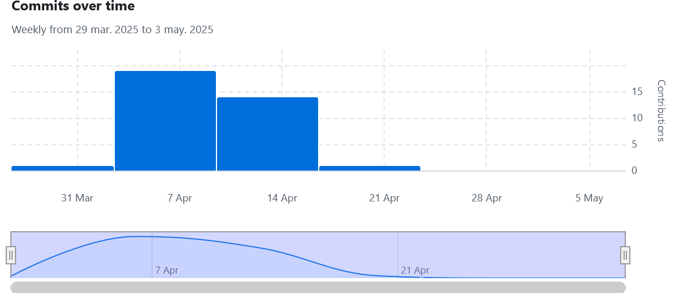
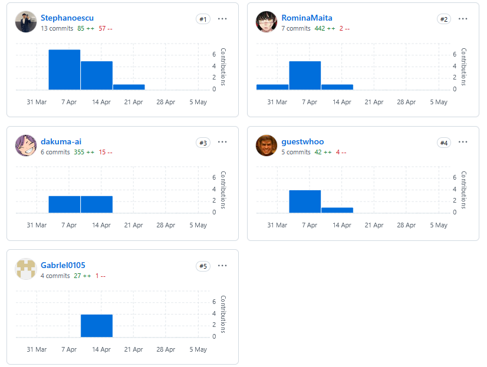
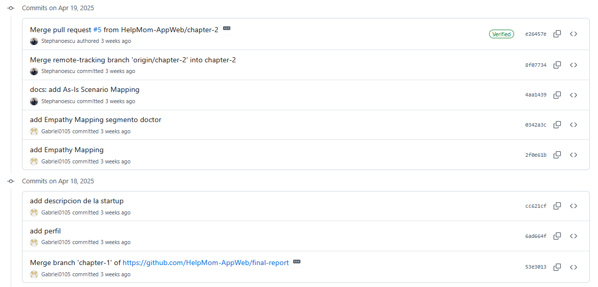
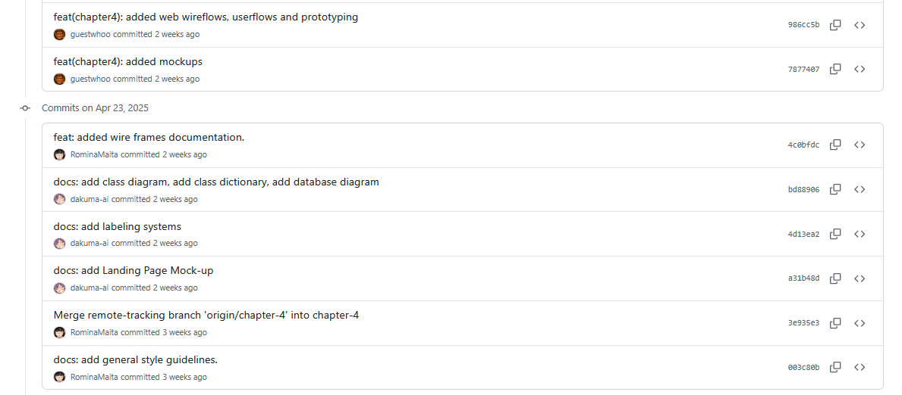
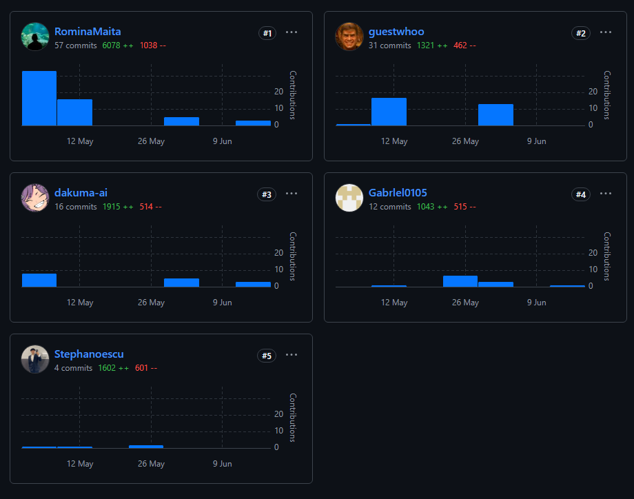
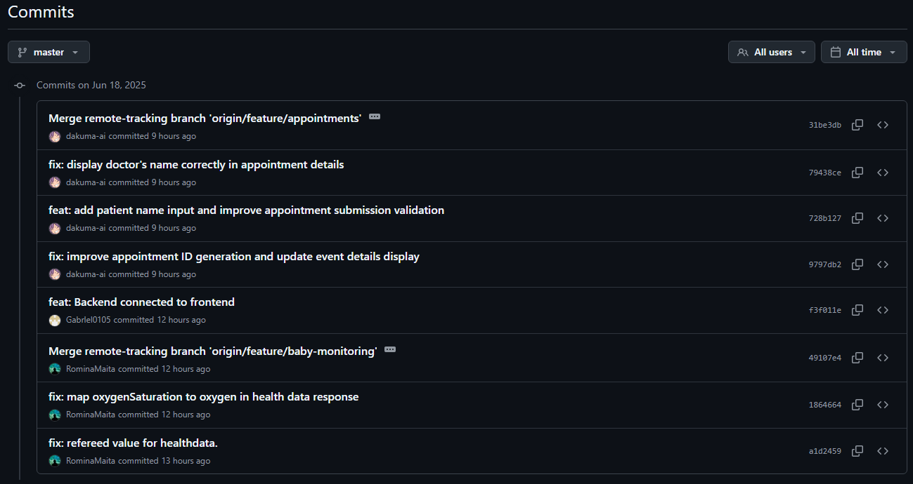

# UNIVERSIDAD PERUANA DE CIENCIAS APLICADAS

## Carrera: Ingeniería de Software
## Aplicaciones Web - Presencial
## PROFESOR: Ángel Augusto
## Sección: 1ASI0730
## INFORME TB2
## START UP: WebExperts
## PRODUCTO: HelpMom

### INTEGRANTES:
<table>
  <thead>
    <tr>
      <th style="background-color: #333; color: #fff;">Apellidos y Nombres</th>
      <th style="background-color: #333; color: #fff;">Código de Alumno</th>
    </tr>
  </thead>
  <tbody>
    <tr>
      <td>Reyes Menacho, Camila Asuncion</td>
      <td>u201921442</td>
    </tr>
    <tr>
      <td>Rivera Ayala, Gabriel Alejandro</td>
      <td>u202223279</td>
    </tr>
    <tr>
      <td>Espinoza Cueva, Stephano Jose</td>
      <td>u202218590</td>
    </tr>
    <tr>
      <td>Mamani Marca, Gabriel Cristian</td>
      <td>u202220659</td>
    </tr>
    <tr>
      <td>Maita Falckenheiner, Romina Guadalupe</td>
      <td>u202213765</td>
    </tr>
  </tbody>
</table>

--- 

Ciclo 2025-01

# Registro de versiones del informe

| Versión | Fecha      | Autor                                                                          | Descripción de modificación                                                                                                                                                       |
|---------|------------|--------------------------------------------------------------------------------|-----------------------------------------------------------------------------------------------------------------------------------------------------------------------------------|
| TB1     | 2025/04/23 | Camila Reyes. Gabriel Rivera. Stephano Espinoza. Gabriel Mamani. Romina Maita  | Realizamos los capítulos 1, 2, 3, 4 y 5 según la rúbrica de manera conjunta y eficiente.                                                                                          |
| TP      | 2025/04/26 | Camila Reyes. Gabriel Rivera. Stephano Espinoza. Gabriel Mamani. Romina Maita  | Realizamos correcciones con respecto al primer entregable y se avanzó con el Sprint 2, donde incluimos la finalización del Landing Page y la primera versión del Web Application. |
| TB2     | 2025/06/18 | Camila Reyes. Gabriel Rivera. Stephano Espinoza. Gabriel Mamani. Romina Maita  | Realizamos correcciones sobre el trabajo parcial y se agregó la documentación de las entrevistas de validación y                                                                  |                                                                                                                                                                                   |

# Project Report Collaboration Insights

Repositorio de este informe en GitHub: https://github.com/HelpMom-AppWeb/final-report

Entrega TB1:

Para cada sección del informe se asignó un responsable, el cual se encargó de realizar la investigación y redacción de la sección. Se realizó una reunion para discutir los avances y se asignaron tareas a cada miembro del equipo. Se utilizó el canal de discord para comunicarnos y resolver dudas.

Analíticos de colaboración:

Algunos commits realizados por los integrantes del equipo:

Entrega TP:

Para la realización de la Single Page Application, después de organizarnos a través de reuniones y el uso de WhatsApp, se asignaron la elaboracion de cada Bounded Context a cada integrante.

Analíticos de colaboración:

Algunos commits realizados por los integrantes del equipo:

Entrega TB2:
Para la realización del informe final, se asignaron las secciones del informe a cada integrante del equipo. Se realizaron reuniones diarias para discutir los avances y se utilizó el canal de discord para comunicarnos y resolver dudas.

Analíticos de colaboración:

Algunos commits realizados por los integrantes del equipo:

# Contenido

## Tabla de Contenidos
### [Registro de versiones del informe](#registro-de-versiones-del-informe)
### [Project Report Collaboration Insights](#project-report-collaboration-insights)
### [Contenido](#contenido)
### [Student Outcome](#student-outcome-1)
### [Capítulo I: Introducción](#capc3adtulo-i-introduccic3b3n-1)
- [1.1. Startup Profile](#11-startup-profile)
    - [1.1.1. Descripción de la Startup](#111-description-de-la-startup)
    - [1.1.2. Perfiles de integrantes del equipo](#112-perfiles-de-integrantes-del-equipo)
- [1.2. Solution Profile](#12-solution-profile)
    - [1.2.1 Antecedentes y problemática](#121-antecedentes-y-problemática)
    - [1.2.2 Lean UX Process](#122-lean-ux-process)
        - [1.2.2.1. Lean UX Problem Statements](#1221-lean-ux-problem-statements)
        - [1.2.2.2. Lean UX Assumptions](#1222-lean-ux-assumptions)
        - [1.2.2.3. Lean UX Hypothesis Statements](#1223-lean-ux-hypothesis-statements)
        - [1.2.2.4. Lean UX Canvas](#1224-lean-ux-canvas)
- [1.3. Segmentos objetivo](#13-segmentos-objetivo)

### [Capítulo II: Requirements Elicitation & Analysis](#capc3adtulo-ii-requirements-elicitation--analysis-1)
- [2.1. Competidores](#21-competidores)
    - [2.1.1. Análisis competitivo](#211-análisis-competitivo)
    - [2.1.2. Estrategias y tácticas frente a competidores](#212-estrategias-y-tácticas-frente-a-competidores)
- [2.2. Entrevistas](#22-entrevistas)
    - [2.2.1. Diseño de entrevistas](#221-diseño-de-entrevistas)
    - [2.2.2. Registro de entrevistas](#222-registro-de-entrevistas)
    - [2.2.3. Análisis de entrevistas](#223-análisis-de-entrevistas)
- [2.3. Needfinding](#23-needfinding)
    - [2.3.1. User Personas](#231-user-personas)
    - [2.3.2. User Task Matrix](#232-user-task-matrix)
    - [2.3.3. User Journey Mapping](#233-user-journey-mapping)
    - [2.3.4. Empathy Mapping](#234-empathy-mapping)
    - [2.3.5. As-is Scenario Mapping](#235-as-is-scenario-mapping)
    - [2.4. Ubiquitous Language](#24-Ubiquitous-language)
### [Capítulo III: Requirements Specification](#capc3adtulo-iii-requirements-specification-1)
- [3.1. To-Be Scenario Mapping](#31-to-be-scenario-mapping)
- [3.2. User Stories](#32-user-stories)
- [3.3. Impact Mapping](#33-impact-mapping)
- [3.4. Product Backlog](#34-product-backlog)

### [Capítulo IV: Product Design](#capc3adtulo-iv-product-design-1)
- [4.1. Style Guidelines](#41-style-guidelines)
    - [4.1.1. General Style Guidelines](#411-general-style-guidelines)
    - [4.1.2. Web Style Guidelines](#412-web-style-guidelines)
- [4.2. Information Architecture](#42-information-architecture)
    - [4.2.1. Organization Systems](#421-organization-systems)
    - [4.2.2. Labeling Systems](#422-labeling-systems)
    - [4.2.3. SEO Tags and Meta Tags](#423-seo-tags-and-meta-tags)
    - [4.2.4. Searching Systems](#424-searching-systems)
    - [4.2.5. Navigation Systems](#425-navigation-systems)
- [4.3. Landing Page UI Design](#43-landing-page-ui-design)
    - [4.3.1. Landing Page Wireframe](#431-landing-page-wireframe)
    - [4.3.2. Landing Page Mock-up](#432-landing-page-mock-up)
- [4.4. Web Applications UX/UI Design](#44-web-applications-uxui-design)
    - [4.4.1. Web Applications Wireframes](#441-web-applications-wireframes)
    - [4.4.2. Web Applications Wireflow Diagrams](#442-web-applications-wireflow-diagrams)
    - [4.4.3. Web Applications Mock-ups](#443-web-applications-mock-ups)
    - [4.4.4. Web Applications User Flow Diagrams](#444-web-applications-user-flow-diagrams)
- [4.5. Web Applications Prototyping](#45-web-applications-prototyping)
- [4.6. Domain-Driven Software Architecture](#46-domain-driven-software-architecture)
    - [4.6.1. Software Architecture Context Diagram](#461-software-architecture-context-diagram)
    - [4.6.2. Software Architecture Container Diagrams](#462-software-architecture-container-diagrams)
    - [4.6.3. Software Architecture Components Diagrams](#463-software-architecture-components-diagrams)
- [4.7. Software Object-Oriented Design](#47-software-object-oriented-design)
    - [4.7.1. Class Diagrams](#471-class-diagrams)
    - [4.7.2. Class Dictionary](#472-class-dictionary)
- [4.8. Database Design](#48-database-design)
    - [4.8.1. Database Diagram](#481-database-diagram)

### [Capítulo V: Product Implementation, Validation & Deployment](#capc3adtulo-v-product-implementation-validation--deployment-1)
- [5.1. Software Configuration Management](#51-software-configuration-management)
    - [5.1.1. Software Development Environment Configuration](#511-software-development-environment-configuration)
    - [5.1.2. Source Code Management](#512-source-code-management)
    - [5.1.3. Source Code Style Guide & Conventions](#513-source-code-style-guide--conventions)
    - [5.1.4. Software Deployment Configuration](#514-software-deployment-configuration)
- [5.2. Landing Page, Services & Applications Implementation](#52-landing-page-services--applications-implementation)
    - [5.2.1. Sprint 1](#521-sprint-1)
        - [5.2.1.1. Sprint Planning 1](#5211-sprint-planning-1)
        - [5.2.1.2. Sprint Backlog 1](#5212-sprint-backlog-1)
        - [5.2.1.3. Development Evidence for Sprint Review](#5213-development-evidence-for-sprint-review)
        - [5.2.1.4. Testing Suite Evidence for Sprint Review](#5214-testing-suite-evidence-for-sprint-review)
        - [5.2.1.5. Execution Evidence for Sprint Review](#5215-execution-evidence-for-sprint-review)
        - [5.2.1.6. Services Documentation Evidence for Sprint Review](#5216-services-documentation-evidence-for-sprint-review)
        - [5.2.1.7. Software Deployment Evidence for Sprint Review](#5217-software-deployment-evidence-for-sprint-review)
        - [5.2.1.8. Team Collaboration Insights during Sprint](#5218-team-collaboration-insights-during-sprint)

### [Conclusiones](#conclusiones-1)
- [Conclusiones y recomendaciones](#conclusiones-y-recomendaciones)

### [Bibliografía](#bibliografc3ada-1)
### [Anexos](#anexos-1)

# Student Outcome
ABET – EAC - Student Outcome 5
Criterio: La capacidad de funcionar efectivamente en un equipo cuyos miembros
juntos proporcionan liderazgo, crean un entorno de colaboración e inclusivo,
establecen objetivos, planifican tareas y cumplen objetivos.
En el siguiente cuadro se describe las acciones realizadas y enunciados de
conclusiones por parte del grupo, que permiten sustentar el haber alcanzado el logro
del ABET – EAC - Student Outcome 5.

| Criterio específico| Acciones realizadas                                                                                                                                                                                                                                                                                                                                                                                                                                                                                                                                                                                                                                                                                                                                                                                                                                                                                                                                                                                                                                                                                                                                                                                                                                                                                                                                                                                                                                                                                                                                                                                                                                                                                                                                                                                                                                                                                                                                                                                                                                                                                                                                                                                                                                                                                                                                                                                                                                                                                                                                                                                                                                                                                                                                                                                                                                                                                                                                                                                                                                                                                                                                                                                                                                                                                                                                                                                                                                                                                                                                                                                                                                                                                                                                                                                                                                                                                                                                                                                                          | Conclusiones                                                                                                                                                                           |
|----|------------------------------------------------------------------------------------------------------------------------------------------------------------------------------------------------------------------------------------------------------------------------------------------------------------------------------------------------------------------------------------------------------------------------------------------------------------------------------------------------------------------------------------------------------------------------------------------------------------------------------------------------------------------------------------------------------------------------------------------------------------------------------------------------------------------------------------------------------------------------------------------------------------------------------------------------------------------------------------------------------------------------------------------------------------------------------------------------------------------------------------------------------------------------------------------------------------------------------------------------------------------------------------------------------------------------------------------------------------------------------------------------------------------------------------------------------------------------------------------------------------------------------------------------------------------------------------------------------------------------------------------------------------------------------------------------------------------------------------------------------------------------------------------------------------------------------------------------------------------------------------------------------------------------------------------------------------------------------------------------------------------------------------------------------------------------------------------------------------------------------------------------------------------------------------------------------------------------------------------------------------------------------------------------------------------------------------------------------------------------------------------------------------------------------------------------------------------------------------------------------------------------------------------------------------------------------------------------------------------------------------------------------------------------------------------------------------------------------------------------------------------------------------------------------------------------------------------------------------------------------------------------------------------------------------------------------------------------------------------------------------------------------------------------------------------------------------------------------------------------------------------------------------------------------------------------------------------------------------------------------------------------------------------------------------------------------------------------------------------------------------------------------------------------------------------------------------------------------------------------------------------------------------------------------------------------------------------------------------------------------------------------------------------------------------------------------------------------------------------------------------------------------------------------------------------------------------------------------------------------------------------------------------------------------------------------------------------------------------------------------------------------------|----------------------------------------------------------------------------------------------------------------------------------------------------------------------------------------|
| Trabaja en equipo para proporcionar liderazgo en forma conjunta | TB1:  - Romina Maita:  En esta entrega logre hacer uso de mi liderazgo para organizar tareas.  - Mamani Marca Gabriel:   Ayude a organizar y repartir temas a cada miembro del equipo.Tambien,ayude en resolver cualquier duda de mis compañeros  - Stephano:   ayude con la organización de los temas para cada integrante y ayude en puntos que faltaba en el informe      Reyes Menacho, Camila Asuncion   Aporte en el apartado de entrevistas y análisis de estas.   Rivera Ayala Gabriel:  Apoyé a mis compañeros a investigar las necesidades de nuestros usuarios, brindé soporte y priorizé la colaboración y comunicación.   TP:   Gabriel Mamani: Durante el desarrollo del proyecto, mantuve una presencia constante en las llamadas grupales, donde participé activamente en las discusiones y ofrecí mi perspectiva en la mejora del informe y ayude en la implementacion del chat a la aplicacion frontend     Romina Maita: Para esta segunda entrega alcancé el logro del outcome ya que durante reuniones vía discord o zoom organicé y asigne tareas a mis compañeros además de ayudarlos a corregir errores en código y estar constantemente pendiente del trabajo.      Stephano Espinoza: El desarrollo del proyecto fue una experiencia integral que combinó esfuerzos técnicos y colaborativos. Durante el proceso, mantuve una participación activa en las reuniones, contribuyendo en las discusiones y ofreciendo mi visión para mejorar el informe. Además, ayudé con la implementación de la "LISTA DE RECETAS", se me asignaron diversas tareas, lo que me ayudó a poder hacerlo todo de una manera buena y activa, y así poder reforzar lo aprendido en cursos anteriores. Esta experiencia me permitió consolidar mis habilidades en la construcción de interfaces dinámicas y componentes modulares usando Vue.js, fortaleciendo mi competencia en el desarrollo front.     Camila Reyes: En esta entrega tuvimos reuniones cosntantes y nos mantuvimos al tanto del trabajo del otro para llegar a nuestras metas a tiempo. Mejoramos el informe y desarrollamos el inicio del frontend de nuestro proyecto    TB2:  Romina Maita: Durante este sprint trabaje en equipo y lideré el sprint, asignando tareas, fechas límite y estando pendiente del progreso de cada intengrante. También apoyé en código a cada uno en caso no sabian hacer alguna función, me presentaba en llamada vía discord para ayudar. Además, constantemente actualizaba las tareas pendientes en Trello.    Gabriel Mamani: Apoyé en el sprint 3 y colaboré con algunas correcciones del informe, además de optimizar el frontend y realizar el backend para el chat,donde el doctor y paciente podrá tener comunicación. También,realice la coneccion del backend con la base de datos y posteriormente el frontend con el backend     Stephano Espinoza: el proyecto afianzó mis conocimientos en el desarrollo de aplicaciones web. La colaboración activa con mi equipo, a través de reuniones tanto presenciales como virtuales, fue clave para impulsar mi participación y mejorar mi desempeño en la creación.   Camila Reyes: Este proyecto me ayudó a mejorar mucho en el desarrollo web. Usamos Discord para comunicarnos diariamente, Trello para organizar las tareas y siempre nos apoyamos entre todos cuando alguien necesitaba ayuda. Fue un trabajo en equipo donde cada uno aportaba lo que sabía.    Gabriel Rivera: Este proyecto fue clave para fortalecer mi capacidad de trabajo en equipo. La comunicación constante con mis compañeros y la organización conjunta a través de herramientas como Discord y Trello me permitieron desarrollar una colaboración más efectiva. Aprendí a coordinar tareas, a escuchar diferentes perspectivas y a contribuir activamente al avance del proyecto, lo que mejoró mi habilidad para adaptarme y aportar dentro de un entorno colaborativo. | En conclusion la realizacion de este informe no fue facil puesto que el equipo no se comunica. En este punto se entiende el ambiente, dado que cada miembro recien se esta conociendo  |
| Crea un entorno colaborativo e inclusivo, establece metas, planifica tareas y cumple objetivos. | TB1:   Romina Maita:  Establecímetas y organicé los puntos por capítulo que le tocaban a cada integrante.   Mamani Marca Gabriel:  Despues de realizar comunicacion constante ya  sabiamos el tema que ibamos a escoger y el enfoque que ibamos a tomar relacionado al mismo, hubo colaboración constante, sin embargo creo que debimos organizarnos mejor  Stephano:  tambien tuve una buena comunicación con mis compañeros de equipo ya que tuvimos una buen planificación     Camila:  En esta entrega se escogió la problemática a resolver teniendo en cuenta su relevancia en la sociedad actual.     TP:   Gabriel Mamani: En esta entrega tuvimos reuniones en grupo de las cuales se designaron las actividades para cada uno, por lo cual me toco actualizar los diagramas c4,user stories e implementar el apartado de chat entre usuarios a la aplicacion web      Romina Maita: Durante el desarrollo de este segundo entregable establecí metas y fechas límites para el progreso del trabajo con la finalidad de hacer el trabajo con tiempo.   Stephano Espinoza:      Esta experiencia me permitió consolidar mis habilidades en la construcción de interfaces dinámicas y componentes modulares usando Vue.js, fortaleciendo mi competencia en el desarrollo front.  Camila Reyes: Esta entrega implemente las citas medicas, o "appointments" donde los doctores pueden crear y editar las citas medicas, mientras que los pacientes pueden ver las citas que tienen planeadas      TB2:  Romina Maita: Coordiné con el grupo los objetivos a alcanzar y las tareas que se debían lograr para dicho objetivo, estuve al pendiente del avance de cada integrante y apoyándolos en cada aspecto ya sea frontend, backend o reporte. Considero que esto generó que el grupo sea más ordenado.    Gabriel Mamani: Coordiné mejoras en la vista de "i18n" para una visualización clara y detallada. En equipo, monitoreamos los avances en cada bounded context y realicé el video  de "about the project" para tener una buena presentación del proyecto y que el usuario conozca el plan de negocio de HelpMom    Stephano Espinoza: Mi involucramiento en este proyecto contribuyó significativamente a mi expertise en aplicaciones web. Las dinámicas de equipo, marcadas por reuniones constantes y participativas, potenciaron mi rol y mi capacidad para contribuir eficazmente en cada etapa del desarrollo.    Camila Reyes: Gracias al apoyo de mi equipo mejore mi conocimiento de programacion. Las constantes reuniones y el feedback entre nosotros hicieron que el proyecto saliera adelante y que yo ganara más confianza en mis habilidades.    Gabriel Rivera: Gracias a la interacción constante con mis compañeros, logré consolidar mis habilidades de programación. Las reuniones periódicas y el intercambio de retroalimentación fueron esenciales para el avance del proyecto, reforzando mi participación y permitiéndome evolucionar como desarrollador dentro de un equipo comprometido.                                                                                                                                                                                                                                                                                                                                                                                                                                                                                                                                                                                                                                                                                                                                                                                                                                                                                           
|                                                                                                                                                                                        |

