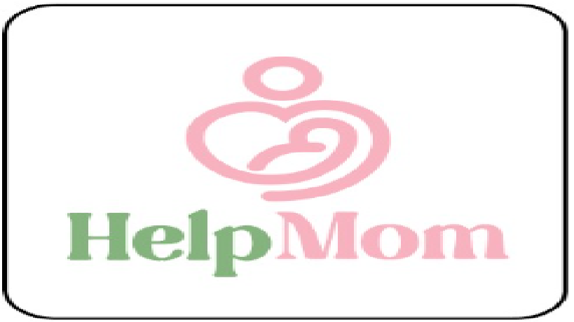
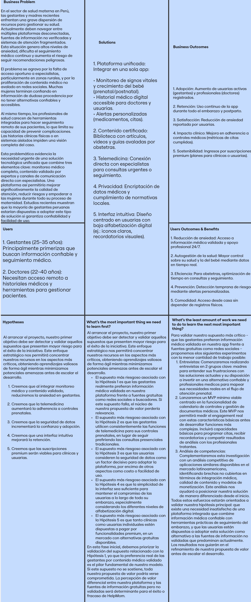

# Capítulo I: Introducción

## 1.1. Startup Profile
A continuación, se brindará información sobre a qué se dedica nuestra empresa, WebExpert.
### 1.1.1. Descripción de la Startup
  WebExpert es una startup que se dedica principalmente al desarrollo de software. Fue creada por cinco estudiantes de la Universidad Peruana de Ciencias Aplicadas (UPC) con la visión de generar un impacto social positivo. El objetivo de WebExpert es ayudar a personas que estén en situación de dependencia, tales como mujeres embarazadas, personas de la tercera edad y personas con movilidad reducida. Asimismo, WebExpert se compromete a ofrecer una aplicación web accesible,intuitiva y centrada solo en lo que necesita el usuario. También, se busca mejorar significativamente la calidad de vida de los usuarios,brindándoles autonomía,seguridad y acceso oportuno a ayuda personalizada.

- Misión: Desarrollar soluciones tecnológicas accesibles y eficientes que ayuden a las personas en situación de dependencia, mediante plataformas intuitivas y con facil uso
- Visión: En un futuro cercano, WebExpert se destacará como una empresa líder en desarrollo de soluciones tecnológicas que ayuden a las personas que más lo necesitan.Asimismo, se le reconocerá por su compromiso con la accesibilidad,innovación social y la mejora continua de la calidad de vida de las personas en situación de dependencia.
- Logo de la Startup:

  

 - Logo de la aplicacion web

  

### 1.1.2. Perfiles de integrantes del equipo

| Nombre | Descripción |
|:-----|:-----|
|   Gabriel Rivera | Soy estudiante de Ingeniería de Software. Me interesa el aprendizaje continuo en todo lo relacionado al desarrollo de aplicaciones interactivas. He desarrollado proyectos en C++, Python, HTML y CSS. Actualmente estoy aprendiendo a realizar aplicaciones web usando el framework Angular y Vue. Me considero una persona trabajadora y apoyaré a mis compañeros a realizar un buen trabajo. |
|  Stephano Espinoza | Soy estudiante de la carrera Ingenieria de Software. Me interesa mucho el aprendizaje relacionado al desarrollo de paginas web. He desarrollado proyectos con lenguajes como, HTML, CSS, C++. Ahora quiero ampliar mis conocimeientos sobre todo en Front-End. Me considero una persona trabajadora y comunicativa.  |
|  Camila Reyes | Soy una estudiante de ingeniería de software, mi segunda carrera. Combino mi experiencia previa con creatividad e interes por la tecnología para contribuir al proyecto.
|  Gabriel Mamani | Soy estudiante de sexto ciclo de la carrera de Ingeniería de Software.Durante el camino aprendí lenguajes como c++,python y java.Tambien,aprendi sobre motores de base de datos como MySQL  y MongoDB.En mis tiempos libres estudio otras tecnologías,juego y veo futbol. |
|  Romina Maita | Soy estudiante a tiempo completo, me apasiona programar y me gustaría especializarme en Data Science o Desarrollo de Videojuegos en un futuro.  |

## 1.2. Solution Profile
En este punto del informe, se presentará información detallada sobre nuestro producto de software, incluyendo su nombre, descripción y el modelo de monetización.

__Product Name__: Se decidió llamar a nuestro producto “HelpMom”, un nombre compuesto por dos palabras en inglés: “Help” (ayuda) y “Mom” (mamá). Esta combinación refleja claramente el propósito principal de la plataforma: brindar apoyo integral a las madres durante el embarazo y los primeros meses de vida del bebé.

__Product Desciption__: HelpMom es una plataforma cuya función principal es permitir que madres gestantes y primerizas reciban atención médica directa de profesionales especializados. Además, se genera un historial médico virtual que se actualiza con cada consulta, facilitando un seguimiento continuo del estado de salud de la madre y el bebé.

__Monetización__:  
HelpMom funciona mediante un modelo de suscripción mensual o anual. Se ofrecen dos planes diseñados para adaptarse a diferentes niveles de necesidad y acompañamiento durante el embarazo y el posparto:

- **Plan Básico**:  
  Dirigido a madres que requieren organización básica sin seguimiento médico avanzado.
  - Recordatorios inteligentes de citas médicas prenatales y postnatales
  - Alertas para controles y vacunas
  - Consejos semanales personalizados según la etapa del embarazo
  - No ofrece acceso a especialistas ni análisis de datos médicos.

- **Plan Cuidado Integral**:  
  Pensado para una maternidad segura y acompañada por expertos. Incluye todo lo del Plan Básico, más:
  - Chat 24/7 con doctores y matronas
  - Subida y análisis del historial médico para un seguimiento avanzado
  - Informes personalizados sobre tendencias de salud (presión, glucosa, peso, etc.)
  - Recordatorios de citas y medicamentos con alertas prioritarias

### 1.2.1 Antecedentes y problemática

| Elemento        | Descripción  |
|-----------------|--------------|
| **Who (Quién)** | Padres, madres gestantes y obstetras que necesitan monitorear el crecimiento y salud del bebé (antes y después del nacimiento). |
| **What (Qué)**  | Plataforma digital que permite el seguimiento del crecimiento del bebé (prenatal y posnatal), visualización de signos vitales, historial médico, y administración de medicamentos o suplementos por parte del doctor.  |
| **Where (Dónde)** | En clínicas, hospitales, consultorios médicos y desde el hogar (acceso remoto mediante app o plataforma web).   |
| **When (Cuándo)** | Durante el embarazo (fase prenatal) y después del nacimiento (fase posnatal), especialmente en los primeros meses o años de vida del bebé. |
| **Why (Por qué)** | Actualmente, el seguimiento del desarrollo del bebé puede estar disperso en diferentes sistemas o registros físicos. Hay falta de centralización y acceso en tiempo real a la información médica, lo que dificulta una atención más precisa, continua y personalizada. Además, las madres primerizas no tienen experiencia en cuidado pre y post natal, de manera que esta plataforma les facilitaría estar pendientes de los cuidados respectivos. |
| **How (Cómo)** | Mediante el desarrollo de una plataforma tecnológica que conecte a los doctores con los pacientes, permitiendo registrar y consultar datos médicos, administrar tratamientos y hacer seguimiento del desarrollo del bebé en tiempo real.    |
| **How Much (Cuánto)** | La plataforma es accesible a través de una suscripción mensual dependiendo de la cantidad de características disponibles para cada plan.  |

### 1.2.2 Lean UX Process.

El proceso Lean UX que adoptamos está orientado a maximizar la eficiencia en el desarrollo de nuestro producto, enfocándose en principios fundamentales como la validación continua, el pensamiento crítico y la acción rápida. A partir de esta filosofía, hemos estructurado nuestro propio enfoque Lean UX, basado en cuatro componentes esenciales: definición de problemas, formulación de suposiciones, creación de hipótesis y desarrollo de un lienzo estratégico.

#### 1.2.2.1. Lean UX Problem Statements.
Nuestra página web está diseñada con la finalidad de proporcionar tranquilidad, control e información confiable a madres y padres que desean acompañar de forma segura y activa el desarrollo de sus bebés, desde el embarazo hasta los primeros años de vida. En esta etapa, muchas familias enfrentan ansiedad, dudas constantes y la necesidad de tomar decisiones informadas sobre la salud y el bienestar de sus hijos, pero no siempre cuentan con herramientas accesibles o actualizadas.

HelpMom es una innovadora startup que combina tecnología de punta, como pulseras inteligentes (IoT) diseñadas especialmente para bebés, con una aplicación móvil que ofrece seguimiento en tiempo real de signos vitales, consejos actualizados por expertos, chat médico 24/7 y recordatorios personalizados para el cuidado infantil.

El desafío principal que enfrentamos es generar confianza en madres y padres primerizos o con experiencia limitada, para que integren el uso de tecnología como una herramienta aliada en el cuidado de sus bebés. A pesar de la precisión de nuestra solución, muchas familias pueden sentirse abrumadas por la tecnología o dudar de su fiabilidad en temas tan delicados como la salud infantil. Esto puede dificultar la adopción inicial y limitar el impacto positivo que HelpMom puede generar.

¿Cómo podríamos lograr que madres y padres confíen en HelpMom como una solución confiable, intuitiva y segura para acompañar el desarrollo de sus bebés, integrando tecnología y atención médica en su día a día de forma natural?

#### 1.2.2.2. Lean UX Assumptions.

### Business Assumptions
- Creemos que nuestras usuarias tienen la necesidad de:
  recibir atención médica accesible, confiable y continua durante el embarazo y el posparto, además de orientación organizada para el seguimiento de su salud y la del bebé.

- Estas necesidades se pueden satisfacer con:
  una plataforma digital que conecte directamente a las gestantes y madres primerizas con profesionales de salud, y les proporcione herramientas inteligentes de acompañamiento médico y educativo.

- Nuestras usuarias iniciales son (o serán):
  mujeres gestantes o madres primerizas con acceso a smartphones, que buscan orientación médica, seguimiento personalizado y recordatorios de salud para ellas y sus bebés.

- El valor principal que una usuaria quiere obtener de nuestro servicio es:
  tranquilidad y seguridad mediante una atención médica confiable y personalizada desde su hogar.

- Las usuarias también pueden obtener estos beneficios adicionales:
  ahorro de tiempo en desplazamientos, acceso a contenidos educativos según su etapa, mejor planificación de citas y controles, y soporte profesional en momentos críticos.

- Adquiriremos a la mayoría de nuestras usuarias a través de:
  estrategias de marketing digital dirigidas a comunidades de madres, recomendaciones en centros de salud y redes sociales con enfoque en bienestar materno.

- Ganaremos dinero mediante:
  planes de suscripción mensual o anual, así como por la oferta de servicios adicionales dentro del plan premium (consultas especializadas, análisis avanzados, etc.).

- Nuestra competencia principal en el mercado será:
  aplicaciones genéricas de salud o seguimiento de embarazo que no integran servicios médicos en tiempo real.

- Les superaremos debido a:
  nuestra propuesta centrada en la combinación de atención médica en vivo, asesoría personalizada y recordatorios automatizados dentro de una sola plataforma.

- El mayor riesgo para nuestro producto es:
  la desconfianza inicial de las usuarias hacia la atención médica digital o una baja tasa de conversión de la prueba gratuita al plan de pago.

### User Assumptions
- ¿Quién es la usuaria?
  Mujeres embarazadas o que han dado a luz recientemente, preocupadas por su salud y la de su bebé, que valoran el acompañamiento médico y educativo.

- ¿Dónde encaja nuestro producto en su vida?
  Encaja en su rutina diaria como una herramienta de seguimiento, planificación médica y consulta rápida para resolver dudas, obtener orientación y recibir alertas relevantes.

- ¿Qué problemas resuelve nuestro producto?
  Incertidumbre sobre el cuidado prenatal y postnatal, falta de acceso inmediato a especialistas, olvidos en controles médicos y desinformación sobre el desarrollo del embarazo.

- ¿Cuándo y cómo se utiliza nuestro producto?
  Se usa de forma recurrente durante el embarazo y en los primeros meses de vida del bebé, tanto para consultas médicas como para recibir recordatorios, alertas y contenidos personalizados.

- ¿Qué características son importantes?
  Chat con especialistas, recordatorios automáticos de citas, recomendaciones semanales personalizadas, visualización del historial médico, facilidad de navegación y seguridad de datos.

- ¿Cómo debería verse y comportarse nuestro producto?
  Debe ser visualmente cálido y tranquilizador, con una interfaz amigable, accesible para todo nivel tecnológico, y con navegación clara y rápida.

- El valor principal que una usuaria quiere obtener es:
  sentirse acompañada médica y emocionalmente, sin la necesidad de trasladarse a centros de salud para resolver cada duda o consulta.

- Las usuarias también pueden obtener estos beneficios adicionales:
  organización de su agenda médica, reducción del estrés, empoderamiento mediante información clara y monitoreo activo de su salud y la de su bebé.

- El mayor riesgo para la usuaria es:
  que la plataforma no le brinde confianza en los profesionales o que no logre cumplir sus expectativas en cuanto a facilidad de uso o respuesta rápida.

#### 1.2.2.3. Lean UX Hypothesis Statements.

- Creemos que lograremos una mayor adopción inicial y retención de nuevas usuarias si ofrecemos una prueba gratuita de 14 días con acceso parcial a las funcionalidades del Plan Cuidado Integral. Al permitir que las madres exploren el valor del acompañamiento médico profesional sin compromiso, validando sus necesidades antes de la suscripción, se aumentará la conversión a planes pagos al finalizar el periodo de prueba.

- Creemos que aumentaremos la satisfacción del usuario y reduciremos las cancelaciones si los planes están claramente diferenciados y alineados con las necesidades reales de cada perfil de madre (primeriza, con embarazo de alto riesgo, etc.). Mediante entrevistas y análisis del comportamiento de usuarias, se podrán ajustar los contenidos y funcionalidades clave de cada plan para maximizar su percepción de valor.

- Creemos que fortaleceremos la confianza de las usuarias y la autoridad de la plataforma si se destacan de forma clara los perfiles de los profesionales, incluyendo credenciales, valoraciones y experiencia específica. Al mejorar la visibilidad y accesibilidad de esta información, se facilitará la toma de decisiones informadas y se reducirá la fricción en la elección de especialistas.

- Creemos que aumentaremos la fidelidad y el uso recurrente si personalizamos el contenido y los recordatorios según la etapa específica del embarazo o posparto. A través de sistemas de recomendación automatizados y recordatorios contextuales inteligentes, se puede generar una experiencia percibida como cercana y relevante.

- Creemos que incrementaremos la conversión al Plan Cuidado Integral si destacamos el beneficio del seguimiento avanzado y la atención 24/7 como elementos diferenciales críticos para una maternidad segura. Esto se validará mediante pruebas A/B con mensajes de valor enfocados en reducción de ansiedad, respuesta inmediata y continuidad en la atención médica.

- Creemos que lograremos una expansión sostenida de nuestra base de usuarias si se implementan campañas de marketing específicas dirigidas a centros de salud, ferias de maternidad y redes sociales con influencers maternos. Con estas acciones y medición de tasas de adquisición, se podrá ajustar la estrategia para optimizar el retorno por canal y mejorar la conversión.
#### 1.2.2.4. Lean UX Canvas.

## 1.3. Segmentos objetivo.

Para el desarrollo de este punto hemos recolectado información basada en los reportes estadísticos del INEI y medios oficiales, donde se muestra la edad en la que las mujeres peruanas se embarazan por primera vez. Según estos datos, se observa una mayor concentración de embarazos iniciales entre los 21 y 23 años, seguida por el grupo de 24 a 26 años.

Referencia: [INEI](https://www.inei.gob.pe/media/MenuRecursivo/publicaciones_digitales/Est/Lib1864/libro.pdf)

__Segmento objetivo #1: Gestantes peruanas de entre 18 a 29 años de edad__

Descipcion: Este segmento objetivo está compuesto por mujeres embarazadas, especialmente primerizas, que buscan apoyo profesional, recordatorios médicos y seguimiento personalizado durante el embarazo y el posparto, a través de una plataforma digital.

Aspectos demograficos: Sexo: Mayormente femenino Edades: Mayormente entre 18 y 29. Nivel socioeconómico: Clases B y C (media-alta y media)

Aspectos geográficos: Nacionalidad: Peruana Zona geográfica en la que vive: Urbana Departamento: Lima y Callao

Necesidades:Desean recibir recordatorios de citas, vacunas y controles; acceder a consejos personalizados según su etapa de embarazo; y contar con atención médica en línea cuando lo necesiten

Aspectos psicográficos: Valoran la organización, el cuidado de su salud y la de su bebé. Buscan seguridad en la información médica que reciben y desean tener acceso rápido y confiable a especialistas. También se preocupan por estar preparadas ante cualquier complicación o duda en el proceso de gestación.

Requisitos: Buscan una plataforma confiable, fácil de usar y que centralice toda su información médica, además de permitir la comunicación directa con profesionales de salud.

Objetivo: Tener un embarazo seguro, con acompañamiento profesional constante, reduciendo la incertidumbre y mejorando su experiencia como futuras madres.

__Segmento objetivo #2: Obstetras peruanas de entre 22 a 40 años de edad__

Descipcion: Este segmento objetivo está compuesto por profesionales de la salud, especialmente obstetras jóvenes, que buscan plataformas digitales para atender pacientes, dar seguimiento a gestantes y ampliar sus oportunidades laborales en entornos digitales.

Aspectos demograficos: Sexo: Mayormente femenino Edades: Mayormente entre 22 y 40. Nivel socioeconómico: Clases B y C (media-alta y media)

Aspectos geográficos: Nacionalidad: Peruana Zona geográfica en la que vive: Urbana Departamento: Lima y Callao

Aspectos psicográficos:Están abiertas a adoptar herramientas tecnológicas que mejoren su práctica profesional. Valoran la eficiencia, la organización del historial clínico digital y la posibilidad de atención remota. Buscan plataformas que respeten la ética profesional y la confidencialidad de los datos.

Necesidades:Quieren brindar atención médica de calidad desde cualquier lugar, llevar un registro ordenado de sus pacientes y reducir el tiempo de gestiones manuales.

Requisitos: Buscan una plataforma segura, profesional y fácil de usar que les permita hacer seguimiento, chatear con pacientes, registrar historial médico y emitir alertas o recomendaciones.

Objetivo: Ofrecer un servicio médico moderno, ampliar su alcance como profesionales y mejorar la calidad de atención mediante herramientas digitales.

Según cifras del INEI (Instituto Nacional de Estadística e Informática) emitidas en el año 2021, este grupo de profesionales atendió aproximadamente el 80% de los nacimientos registrados en mujeres de 15 a 45 años de edad en el año 2020.
