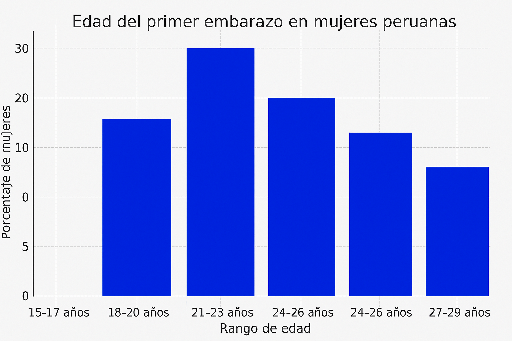

# Capítulo I: Introducción

## 1.1. Startup Profile
A continuación, se brindará información sobre a qué se dedica nuestra empresa, WebExpert.
### 1.1.1. Descripción de la Startup
  WebExpert es una startup que se dedica principalmente al desarrollo de software. Fue creada por cinco estudiantes de la Universidad Peruana de Ciencias Aplicadas (UPC) con la visión de generar un impacto social positivo. El objetivo de WebExpert es ayudar a personas que estén en situación de dependencia, tales como mujeres embarazadas, personas de la tercera edad y personas con movilidad reducida. Asimismo, WebExpert se compromete a ofrecer una aplicación web accesible,intuitiva y centrada solo en lo que necesita el usuario. También, se busca mejorar significativamente la calidad de vida de los usuarios,brindándoles autonomía,seguridad y acceso oportuno a ayuda personalizada.

- Misión: Desarrollar soluciones tecnológicas accesibles y eficientes que ayuden a las personas en situación de dependencia, mediante plataformas intuitivas y con facil uso
- Visión: En un futuro cercano, WebExpert se destacará como una empresa líder en desarrollo de soluciones tecnológicas que ayuden a las personas que más lo necesitan.Asimismo, se le reconocerá por su compromiso con la accesibilidad,innovación social y la mejora continua de la calidad de vida de las personas en situación de dependencia.
- Logo de la Startup:

  

 - Logo de la aplicacion web

  

### 1.1.2. Perfiles de integrantes del equipo
|        | Soy estudiante de Ingeniería de Software. Me interesa el aprendizaje continuo en todo lo relacionado al desarrollo de aplicaciones interactivas. He desarrollado proyectos en C++, Python, HTML y CSS. Actualmente estoy aprendiendo a realizar aplicaciones web usando el framework Angular y Vue. Me considero una persona trabajadora y apoyaré a mis compañeros a realizar un buen trabajo. |
|:----------------------------------------------|:---------------------------------------------------------------------------------------------------------------------------------------------------------------------------------------------------------------------------------------------------------------------------------------------------------------------------------------------------------------------------------------------------------------------------------------------------------------------------------------------------------------|
|       | Soy estudiante de la carrera Ingenieria de Software. Me interesa mucho el aprendizaje relacionado al desarrollo de paginas web. He desarrollado proyectos con lenguajes como, HTML, CSS, C++. Ahora quiero ampliar mis conocimeientos sobre todo en Front-End. Me considero una persona trabajadora y comunicativa.                                                                                                                                                                                                                                                          |
|         | Soy una estudiante de ingeniería de software, mi segunda carrera. Combino mi experiencia previa con creatividad e interes por la tecnología para contribuir al proyecto.
|  | Soy estudiante de sexto ciclo de la carrera de Ingeniería de Software.Durante el camino aprendí lenguajes como c++,python y java.Tambien,aprendi sobre motores de base de datos como MySQL  y MongoDB.En mis tiempos libres estudio otras tecnologías,juego y veo futbol.                                                                                                                                                                                                                                       |
|   | Soy estudiante a tiempo completo, me apasiona programar y me gustaría especializarme en Data Science o Desarrollo de Videojuegos en un futuro.                                                                           |

## 1.2. Solution Profile
En este punto del informe, se presentará información detallada sobre nuestro producto de software, incluyendo su nombre, descripción y el modelo de monetización.

__Product Name__: Se decidió llamar a nuestro producto “HelpMom”, un nombre compuesto por dos palabras en inglés: “Help” (ayuda) y “Mom” (mamá). Esta combinación refleja claramente el propósito principal de la plataforma: brindar apoyo integral a las madres durante el embarazo y los primeros meses de vida del bebé.

__Product Desciption__: HelpMom es una plataforma cuya función principal es permitir que madres gestantes y primerizas reciban atención médica directa de profesionales especializados a través de la aplicación. Las usuarias pueden elegir al doctor u obstetra que mejor se adapte a sus necesidades, consultando perfiles, tarifas y valoraciones. Además, se genera un historial médico virtual que se actualiza con cada consulta, facilitando un seguimiento continuo del estado de salud de la madre y el bebé.

__Monetización__:  
HelpMom funciona mediante un modelo de suscripción mensual o anual, con una prueba gratuita de 14 días para nuevas usuarias. Se ofrecen dos planes diseñados para adaptarse a diferentes niveles de necesidad y acompañamiento durante el embarazo y el posparto:

- **Plan Básico**:  
  Dirigido a madres que requieren organización básica sin seguimiento médico avanzado.
  - Recordatorios inteligentes de citas médicas prenatales y postnatales
  - Alertas para controles y vacunas
  - Consejos semanales personalizados según la etapa del embarazo
  - No ofrece acceso a especialistas ni análisis de datos médicos.

- **Plan Cuidado Integral**:  
  Pensado para una maternidad segura y acompañada por expertos. Incluye todo lo del Plan Básico, más:
  - Chat 24/7 con doctores y matronas
  - Subida y análisis del historial médico para un seguimiento avanzado
  - Informes personalizados sobre tendencias de salud (presión, glucosa, peso, etc.)
  - Recordatorios de citas y medicamentos con alertas prioritarias

### 1.2.1 Antecedentes y problemática

| Elemento        | Descripción                                                                                                                                                                                                                                                                                                                                                                                                                                         |
|-----------------|-----------------------------------------------------------------------------------------------------------------------------------------------------------------------------------------------------------------------------------------------------------------------------------------------------------------------------------------------------------------------------------------------------------------------------------------------------|
| **Who (Quién)** | Padres, madres gestantes y obstetras que necesitan monitorear el crecimiento y salud del bebé (antes y después del nacimiento).                                                                                                                                                                                                                                                                                                                     |
| **What (Qué)**  | Plataforma digital que permite el seguimiento del crecimiento del bebé (prenatal y posnatal), visualización de signos vitales, historial médico, y administración de medicamentos o suplementos por parte del doctor.                                                                                                                                                                                                                               |
| **Where (Dónde)** | En clínicas, hospitales, consultorios médicos y desde el hogar (acceso remoto mediante app o plataforma web).                                                                                                                                                                                                                                                                                                                                       |
| **When (Cuándo)** | Durante el embarazo (fase prenatal) y después del nacimiento (fase posnatal), especialmente en los primeros meses o años de vida del bebé.                                                                                                                                                                                                                                                                                                          |
| **Why (Por qué)** | Actualmente, el seguimiento del desarrollo del bebé puede estar disperso en diferentes sistemas o registros físicos. Hay falta de centralización y acceso en tiempo real a la información médica, lo que dificulta una atención más precisa, continua y personalizada. Además, las madres primerizas no tienen experiencia en cuidado pre y post natal, de manera que esta plataforma les facilitaría estar pendientes de los cuidados respectivos. |
| **How (Cómo)** | Mediante el desarrollo de una plataforma tecnológica que conecte a los doctores con los pacientes, permitiendo registrar y consultar datos médicos, administrar tratamientos y hacer seguimiento del desarrollo del bebé en tiempo real.                                                                                                                                                                                                            |
| **How Much (Cuánto)** | La plataforma es accesible a través de una suscripción mensual dependiendo de la cantidad de características disponibles para cada plan.                                                                                                                                                                                                                                                                                                            |

### 1.2.2 Lean UX Process.

El proceso Lean UX que adoptamos está orientado a maximizar la eficiencia en el desarrollo de nuestro producto, enfocándose en principios fundamentales como la validación continua, el pensamiento crítico y la acción rápida. A partir de esta filosofía, hemos estructurado nuestro propio enfoque Lean UX, basado en cuatro componentes esenciales: definición de problemas, formulación de suposiciones, creación de hipótesis y desarrollo de un lienzo estratégico.

#### 1.2.2.1. Lean UX Problem Statements.
Nuestra página web está diseñada con la finalidad de proporcionar tranquilidad, control e información confiable a madres y padres que desean acompañar de forma segura y activa el desarrollo de sus bebés, desde el embarazo hasta los primeros años de vida. En esta etapa, muchas familias enfrentan ansiedad, dudas constantes y la necesidad de tomar decisiones informadas sobre la salud y el bienestar de sus hijos, pero no siempre cuentan con herramientas accesibles o actualizadas.

HelpMom es una innovadora startup que combina tecnología de punta, como pulseras inteligentes (IoT) diseñadas especialmente para bebés, con una aplicación móvil que ofrece seguimiento en tiempo real de signos vitales, consejos actualizados por expertos, chat médico 24/7 y recordatorios personalizados para el cuidado infantil.

El desafío principal que enfrentamos es generar confianza en madres y padres primerizos o con experiencia limitada, para que integren el uso de tecnología como una herramienta aliada en el cuidado de sus bebés. A pesar de la precisión de nuestra solución, muchas familias pueden sentirse abrumadas por la tecnología o dudar de su fiabilidad en temas tan delicados como la salud infantil. Esto puede dificultar la adopción inicial y limitar el impacto positivo que HelpMom puede generar.

¿Cómo podríamos lograr que madres y padres confíen en HelpMom como una solución confiable, intuitiva y segura para acompañar el desarrollo de sus bebés, integrando tecnología y atención médica en su día a día de forma natural?

#### 1.2.2.2. Lean UX Assumptions.
- **Contexto**: Las mujeres embarazadas y en etapa posparto suelen utilizar diversas plataformas independientes para seguimiento médico, consultas y soporte profesional, lo que puede causar desorganización y estrés.

  **Assumptions**: Una solución integrada que combine monitoreo de salud, contenido confiable y consultas virtuales optimizará la experiencia de las usuarias, disminuyendo su ansiedad al centralizar todos los recursos en un solo lugar.

- **Contexto**: La sobreabundancia de información no certificada sobre embarazo y maternidad en internet puede llevar a confusiones y elecciones poco fundamentadas.

  **Assumptions**: Al proporcionar información médica respaldada por expertos y seguimiento personalizado, las usuarias podrán manejar su gestación y recuperación posparto con mayor seguridad y basándose en datos verificados.

- **Contexto**: La demora en obtener asesoramiento profesional hace que muchas mujeres tomen decisiones críticas sin el respaldo necesario, incrementando posibles complicaciones.

  **Assumptions**: Facilitar conexiones rápidas con especialistas a través de teleconsulta mejorará la atención médica y ayudará a las usuarias a elegir con mayor conocimiento.

- **Contexto**: Existe inquietud sobre la protección de información personal en aplicaciones de salud, particularmente en temas tan sensibles como la maternidad.

  **Assumptions**: Priorizar la seguridad y confidencialidad de los datos aumentará la credibilidad de la plataforma, incentivando su uso constante.

- **Contexto**: La complejidad de algunas herramientas digitales representa un obstáculo para usuarias con distintos niveles de familiaridad tecnológica, sobre todo en embarazadas y madres sin experiencia previa.

  **Assumptions**: Un diseño sencillo y accesible facilitará la adopción de la plataforma, mejorando la retención y el compromiso de las usuarias.
#### 1.2.2.3. Lean UX Hypothesis Statements.

- Creemos que al ofrecer una plataforma integral que unifique el monitoreo médico, información validada y telemedicina, mejoraremos la experiencia de las gestantes y madres recientes al reducir su ansiedad y proporcionarles acceso a información confiable y apoyo profesional. Sabremos que estamos en lo correcto cuando observemos un aumento en la adopción de la plataforma por parte de gestantes y madres recientes, así como una disminución en la ansiedad reportada por los usuarios debido a la confianza en la información y en el acceso a profesionales de la salud.

- Creemos que al ofrecer contenido médico avalado y monitoreo personalizado, aumentaremos la capacidad de las usuarias para gestionar su embarazo y postparto de manera más segura y confiable. Sabremos que estamos en lo correcto cuando observemos un aumento en el uso de las funcionalidades de seguimiento médico, así como una mejora en la satisfacción general de las usuarias con la calidad de la información que reciben.

- Creemos que al proporcionar acceso directo a especialistas a través de telemedicina, mejoraremos la calidad de la atención médica para las gestantes y madres recientes, lo que les permitirá tomar decisiones más informadas sobre su salud. Sabremos que estamos en lo correcto cuando observemos un aumento en la cantidad de consultas realizadas a través de la plataforma y comentarios positivos sobre la facilidad y efectividad de las consultas con los profesionales de la salud.

- Creemos que al garantizar la privacidad y seguridad de la información médica de las usuarias, generaremos confianza en nuestra plataforma, lo que fomentará una mayor adopción entre las gestantes y madres recientes. Sabremos que estamos en lo correcto cuando observemos un aumento en la satisfacción de los usuarios con respecto a la seguridad de sus datos y una disminución de las preocupaciones relacionadas con la privacidad.

- Creemos que al ofrecer una interfaz intuitiva y fácil de usar, aumentaremos la aceptación y la retención de las usuarias, facilitando la adaptación de las madres recientes y gestantes a la plataforma. Sabremos que estamos en lo correcto cuando observemos una disminución en las tasas de abandono del producto y un aumento en la tasa de retención y participación activa de las usuarias.
#### 1.2.2.4. Lean UX Canvas.

<table>
<tr>
<td>
<strong>Business Problem</strong>  
En el sector de salud materna en Perú, las gestantes y madres recientes enfrentan una grave dispersión de recursos para gestionar su salud. Actualmente deben navegar entre múltiples plataformas desconectadas, fuentes de información no verificadas y sistemas de atención fragmentados. Esta situación genera altos niveles de ansiedad, dificulta el seguimiento médico continuo y aumenta el riesgo de seguir recomendaciones peligrosas.

El problema se agrava por la falta de acceso oportuno a especialistas, particularmente en zonas rurales, y por la proliferación de contenido médico no avalado en redes sociales. Muchas mujeres terminan confiando en información de dudosa procedencia por no tener alternativas confiables y accesibles.

Al mismo tiempo, los profesionales de salud carecen de herramientas integradas para hacer seguimiento remoto de sus pacientes, lo que limita su capacidad de prevenir complicaciones. Las historias clínicas físicas o en sistemas aislados impiden una visión completa del caso.

Esta problemática evidencia la necesidad urgente de una solución tecnológica unificada que combine tres elementos clave: monitoreo médico completo, contenido validado por expertos y canales de comunicación directa con especialistas. Una plataforma así permitiría mejorar significativamente la calidad de atención, reducir riesgos y empoderar a las mujeres durante todo su proceso de maternidad. Estudios recientes muestran que la mayoría de gestantes peruanas estarían dispuestas a adoptar este tipo de solución si garantiza confiabilidad y facilidad de uso.
</td>

<td rowspan="2">
<strong>Solutions</strong>  
1. <strong>Plataforma unificada</strong>: Integrar en una sola app: 
  • Monitoreo de signos vitales y crecimiento del bebé (prenatal/postnatal). 
  • Historial médico digital accesible para doctores y usuarias. 
  • Alertas personalizadas (medicamentos, citas).  
2. <strong>Contenido certificado</strong>: Biblioteca con artículos, videos y guías avaladas por obstetras.  
3. <strong>Telemedicina</strong>: Conexión directa con especialistas para consultas urgentes o seguimiento.  
4. <strong>Privacidad</strong>: Encriptación de datos médicos y cumplimiento de normativas locales.  
5. <strong>Interfaz intuitiva</strong>: Diseño centrado en usuarias con baja alfabetización digital (ej.: iconos claros, recordatorios visuales).
</td>
    
<td>
<strong>Business Outcomes</strong>  
1. <strong>Adopción</strong>: Aumento de usuarias activas (gestantes) y profesionales (doctores) registrados.  
2. <strong>Retención</strong>: Uso continuo de la app durante todo el embarazo y postparto.  
3. <strong>Satisfacción</strong>: Reducción de ansiedad reportada por usuarias.  
4. <strong>Impacto clínico</strong>: Mejora en adherencia a controles médicos (métricas de citas cumplidas).  
5. <strong>Sostenibilidad</strong>: Ingresos por suscripciones premium (planes para clínicas o usuarias).
</td>
</tr>

<tr>
<td>
<strong>Users</strong>  
1. <strong>Gestantes</strong> (25-35 años): Principalmente primerizas que buscan información confiable y seguimiento médico.  
2. <strong>Doctores</strong> (22-40 años): Necesitan acceso remoto a historiales médicos y herramientas para gestionar pacientes.  
</td>

<td>
<strong>User Outcomes & Benefits</strong>  
1. <strong>Reducción de ansiedad</strong>: Acceso a información médica validada y apoyo profesional 24/7.  
2. <strong>Autogestión de la salud</strong>: Mayor control sobre su salud y la del bebé mediante datos en tiempo real.  
3. <strong>Eficiencia</strong>: Para obstetras, optimización de tiempo en consultas y seguimiento.  
4. <strong>Prevención</strong>: Detección temprana de riesgos mediante alertas personalizadas.  
5. <strong>Comodidad</strong>: Acceso desde casa sin depender de registros físicos.
</td>
</tr>

<tr>
<td>
<strong>Hypotheses</strong>  
Al arrancar el proyecto, nuestro primer objetivo debe ser detectar y validar aquellos supuestos que presenten mayor riesgo para el éxito de la iniciativa. Este enfoque estratégico nos permitirá concentrar nuestros recursos en los aspectos más críticos, obteniendo aprendizajes valiosos de forma ágil mientras minimizamos potenciales amenazas antes de escalar el desarrollo. 

1. Creemos que al integrar monitoreo médico y contenido validado, reduciremos la ansiedad en gestantes.  
2. Creemos que la telemedicina aumentará la adherencia a controles prenatales.  
3. Creemos que la seguridad de datos incrementará la confianza y adopción.  
4. Creemos que una interfaz intuitiva mejorará la retención.  
5. Creemos que las suscripciones premium serán viables para clínicas y usuarias.
</td>

<td>
<strong>What’s the most important thing we need to learn first?</strong>  

Al arrancar el proyecto, nuestro primer objetivo debe ser detectar y validar aquellos supuestos que presenten mayor riesgo para el éxito de la iniciativa. Este enfoque estratégico nos permitirá concentrar nuestros recursos en los aspectos más críticos, obteniendo aprendizajes valiosos de forma ágil mientras minimizamos potenciales amenazas antes de escalar el desarrollo.

- El supuesto más riesgoso asociado con la Hipótesis 1 es que las gestantes realmente prefieran información médica validada en nuestra plataforma frente a fuentes gratuitas como redes sociales o buscadores. Si este supuesto falla, el núcleo de nuestra propuesta de valor perdería relevancia.

- El supuesto más riesgoso asociado con la Hipótesis 2 es que las gestantes utilicen consistentemente las funciones de telemedicina para sus controles prenatales, en lugar de seguir prefiriendo las consultas presenciales tradicionales.

- El supuesto más riesgoso asociado con la Hipótesis 3 es que las usuarias consideren la seguridad de datos como un factor decisivo para adoptar la plataforma, por encima de otros aspectos como costo o facilidad de uso.

- El supuesto más riesgoso asociado con la Hipótesis 4 es que la simplicidad de la interfaz sea suficiente para mantener el compromiso de las usuarias a lo largo de todo su embarazo, especialmente considerando los diferentes niveles de alfabetización digital.

- El supuesto más riesgoso asociado con la Hipótesis 5 es que tanto clínicas como usuarias individuales estén dispuestas a pagar por funcionalidades premium, en un mercado con alternativas gratuitas disponibles.

En esta fase inicial, debemos priorizar la validación del supuesto relacionado con la Hipótesis 1, ya que la preferencia real de las gestantes por contenido médico validado es el pilar fundamental de nuestro modelo. Si este supuesto no se sostiene, toda nuestra propuesta de valor podría verse comprometida. La percepción de valor diferencial entre nuestra plataforma y las fuentes de información gratuitas pero no validadas será determinante para el éxito o fracaso de HelpMom.
</td>
    
<td>
<strong>What’s the least amount of work we need to do to learn the next most important thing?</strong>  
Para validar nuestro supuesto más crítico - que las gestantes prefieran información médica validada en nuestra app frente a fuentes gratuitas como redes sociales - proponemos elos siguientes experimentos con la menor cantidad de trabajo posible:

1. Entrevistas: Comenzaremos realizando entrevistas en 2 grupos clave: madres para entender sus frustraciones con las soluciones actuales y su disposición a invertir en una alternativa confiable y profesionales medicos para mapear sus necesidades reales en el flujo de atención prenatal.

2. Lanzaremos un MVP mínimo viable centrado en la funcionalidad de calendario de controles y gestión de documentos médicos. Este MVP nos permitirá medir el engagement real con estas características básicas antes de desarrollar funciones más complejas. Incluirá capacidades básicas para programar citas, recibir recordatorios y compartir resultados de análisis con los profesionales tratantes.

3. Análisis de competencias: Complementaremos esta investigación con un análisis competitivo de aplicaciones similares disponibles en el mercado latinoamericano, identificando brechas no cubiertas en términos de integración médica, calidad de contenido y modelos de monetización. Este análisis nos ayudará a posicionar nuestra solución de manera diferenciada desde el inicio.

Todos estos esfuerzos estarán orientados a validar nuestra hipótesis principal: que existe una necesidad insatisfecha de una plataforma integrada que combine información médica confiable con herramientas prácticas de seguimiento del embarazo, y que las usuarias están dispuestas a adoptar esta solución como alternativa a las fuentes de información no validadas que predominan actualmente. Los resultados nos guiarán en el refinamiento de nuestra propuesta de valor antes de escalar el desarrollo.
</td>
</tr>
</table>

## 1.3. Segmentos objetivo.

Para el desarrollo de este punto hemos recolectado información basada en los reportes estadísticos del INEI y medios oficiales, donde se muestra la edad en la que las mujeres peruanas se embarazan por primera vez. Según estos datos, se observa una mayor concentración de embarazos iniciales entre los 18 y 20 años, seguida por el grupo de 15 a 17 años.

Referencia: [INEI](https://www.inei.gob.pe/media/MenuRecursivo/publicaciones_digitales/Est/Lib1864/libro.pdf)

__Segmento objetivo #1: Gestantes peruanas de entre 18 a 29 años de edad__

Descipcion: Este segmento objetivo está compuesto por mujeres embarazadas, especialmente primerizas, que buscan apoyo profesional, recordatorios médicos y seguimiento personalizado durante el embarazo y el posparto, a través de una plataforma digital.

Aspectos demograficos: Sexo: Mayormente femenino Edades: Mayormente entre 18 y 29. Nivel socioeconómico: Clases B y C (media-alta y media)

Aspectos geográficos: Nacionalidad: Peruana Zona geográfica en la que vive: Urbana Departamento: Lima y Callao

Necesidades:Desean recibir recordatorios de citas, vacunas y controles; acceder a consejos personalizados según su etapa de embarazo; y contar con atención médica en línea cuando lo necesiten

Aspectos psicográficos: Valoran la organización, el cuidado de su salud y la de su bebé. Buscan seguridad en la información médica que reciben y desean tener acceso rápido y confiable a especialistas. También se preocupan por estar preparadas ante cualquier complicación o duda en el proceso de gestación.

Requisitos: Buscan una plataforma confiable, fácil de usar y que centralice toda su información médica, además de permitir la comunicación directa con profesionales de salud.

Objetivo: Tener un embarazo seguro, con acompañamiento profesional constante, reduciendo la incertidumbre y mejorando su experiencia como futuras madres.

__Segmento objetivo #2: Obstetras peruanas de entre 22 a 40 años de edad__

Descipcion: Este segmento objetivo está compuesto por profesionales de la salud, especialmente obstetras jóvenes, que buscan plataformas digitales para atender pacientes, dar seguimiento a gestantes y ampliar sus oportunidades laborales en entornos digitales.

Aspectos demograficos: Sexo: Mayormente femenino Edades: Mayormente entre 22 y 40. Nivel socioeconómico: Clases B y C (media-alta y media)

Aspectos geográficos: Nacionalidad: Peruana Zona geográfica en la que vive: Urbana Departamento: Lima y Callao

Aspectos psicográficos:Están abiertas a adoptar herramientas tecnológicas que mejoren su práctica profesional. Valoran la eficiencia, la organización del historial clínico digital y la posibilidad de atención remota. Buscan plataformas que respeten la ética profesional y la confidencialidad de los datos.

Necesidades:Quieren brindar atención médica de calidad desde cualquier lugar, llevar un registro ordenado de sus pacientes y reducir el tiempo de gestiones manuales.

Requisitos: Buscan una plataforma segura, profesional y fácil de usar que les permita hacer seguimiento, chatear con pacientes, registrar historial médico y emitir alertas o recomendaciones.

Objetivo: Ofrecer un servicio médico moderno, ampliar su alcance como profesionales y mejorar la calidad de atención mediante herramientas digitales.

Según cifras del INEI (Instituto Nacional de Estadística e Informática) emitidas en el año 2021, este grupo de profesionales atendió aproximadamente el 80% de los nacimientos registrados en mujeres de 15 a 45 años de edad en el año 2020.