# Capítulo II: Requirements Elicitation & Analysis

## 2.1. Competidores.

Llevamos a cabo este analisis competitivo, para poder darnos cuenta de nuestras ventajas y desventajas dentro del mercado con competidores que cuentan con un modelo de negocio similiar o parecido al nuestro.
# BabyCenter
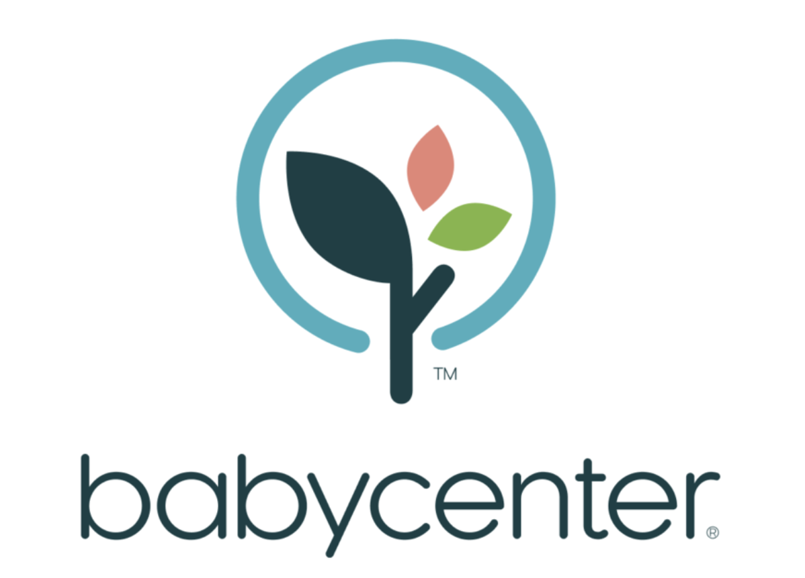

BabyCenter es una plataforma en línea centrada en la salud y el bienestar durante el embarazo, el parto y la crianza de los hijos. Ofrece contenido educativo confiable, herramientas de seguimiento del embarazo y desarrollo del bebé, así como foros comunitarios para que los padres intercambien experiencias y consejos. Además, cuenta con una aplicación móvil que proporciona artículos personalizados según la etapa del embarazo o edad del niño. BabyCenter también realiza investigaciones y encuestas que le permiten generar contenido basado en datos reales de su comunidad global.

# Clue

Clue es una aplicación de salud femenina enfocada en el seguimiento del ciclo menstrual, la ovulación y la fertilidad. Utiliza datos científicos y algoritmos personalizados para ayudar a los usuarios a comprender sus ciclos y síntomas. Ofrece funciones como recordatorios, predicciones de menstruación, PMS y días fértiles. Clue también apuesta por la educación en salud reproductiva y promueve una visión inclusiva y no binaria de la salud menstrual. La plataforma cuenta con una versión gratuita y una opción premium con funciones adicionales de análisis y personalización.

# Ovia Health

Ovia Health es una plataforma de salud digital centrada en el bienestar reproductivo y familiar. Ofrece tres aplicaciones principales: Ovia Fertility, Ovia Pregnancy y Ovia Parenting, diseñadas para cubrir todas las etapas desde la concepción hasta la crianza temprana. La plataforma proporciona herramientas de seguimiento altamente personalizadas, contenido médico validado y acceso a recursos de salud laboral a través de asociaciones con empresas. Además, Ovia recopila datos anónimos para mejorar sus algoritmos y proporcionar información basada en inteligencia artificial y tendencias de salud poblacional.

### 2.1.1. Análisis competitivo.

<table>
  <tr>
    <th colspan="22">Competitive Analysis Landscape</th>
  </tr>
  <tr>
    <td colspan="1">¿Por qué llevar a cabo el análisis?</td>
    <td colspan="17">Este análisis se lleva a cabo con la finalidad de poder conocer la competencia y cómo “nombre de la empresa” se diferencia ante esta.</td>
  </tr>
  <tr>
    <td colspan="2"></td>
    <td>HelpMom </td>
    <td>BabyCenter </td>
    <td>Clue </td>
    <td>Ovia Health	 </td>
</tr>
  <tr>
    <td rowspan="2">Perfil</td>
    <td>Overview</td>
    <td>Ofrecer una plataforma unificada y validada para gestantes y madres recientes.</td>
    <td>Conocer los puntos fuertes y debilidades de cada competidor para identificar cómo HelpMom puede diferenciarse.	</td>
    <td>Entender cómo la competencia gestiona la personalización.	</td>
    <td>Evaluar cómo mejorar la oferta para competir mejor en el mercado.	</td>
</tr>
  <tr>
  <td>Ventaja competitiva ¿Qué valor ofrece a los clientes?</td>
    <td>Plataforma integral que ofrece monitoreo médico, educación validada y telemedicina.</td>
    <td>Gran comunidad, información verificada, seguimiento detallado del embarazo.</td>
    <td>Monitoreo detallado del ciclo menstrual y seguimiento de embarazo.	</td>
    <td>Monitoreo avanzado, personalización de la salud reproductiva.	</td>
    </tr>
<tr>
    <td rowspan="2">Perfil de Marketing</td>
    <td>Mercado Objetivo</td>
    <td>Gestantes y madres recientes que buscan información confiable y soporte médico. </td>
    <td>Gestantes, padres recientes, familias en general.	</td>
    <td>Mujeres que buscan monitorear su ciclo menstrual y embarazo.	</td>
    <td>Gestantes, mujeres en fase de fertilidad, padres recientes. </td>
  </tr>
  <tr>
  <td>Estrategias de Marketing</td>
    <td>Publicidad en redes sociales, alianzas con productos de bebe y/o Insitituciones de Salud</td>
    <td>Publicidad digital, alianzas con marcas de productos de bebé, contenido de blogs.	</td>
    <td>Publicidad en redes sociales y aplicaciones móviles.</td>
    <td>Marketing de contenido, SEO, recomendaciones a través de profesionales.</td>
    </tr>
<tr>
    <td rowspan="3">Perfil de Producto</td>
    <td>Productos y Serviciós</td>
    <td>Plataforma con monitoreo médico, información certificada y telemedicina.</td>
    <td>Aplicación móvil para seguimiento de embarazo, comunidad online, consejos de salud.	</td>
    <td>App para seguimiento de ciclo menstrual, embarazo, y salud general.	</td>
    <td>Monitoreo de salud, telemedicina, consejos personalizados.	</td>
  </tr>
  <tr>
  <td>Precios y Costos</td>
    <td>Posiblemente modelo preemium o suscripción, con acceso a expertos médicos.</td>
    <td>Gratis con opciones premium.	</td>
    <td>Gratis con opciones premium.	</td>
    <td>Gratis, con opción premium.	</td>
    </tr>
<td>Canales de distribución (Web y/o Móvil)</td>
    <td>Aplicación web</td>
    <td>Aplicación Web y aplicación móvil.	</td>
    <td>Aplicación móvil.	</td>
    <td>Aplicación Web y aplicación móvil.	</td>
<tr>
    <td rowspan="4">Análisis SWOT</td>
    <td>Fortalezas</td>
    <td>Plataforma integral, enfoque en la confiabilidad médica, soporte telemédico.</td>
    <td>Buena experiencia de usuario, fuerte en la fase de monitoreo menstrual.	</td>
    <td>Comunidad activa, información verificada, gran cantidad de usuarios.	</td>
    <td>    Personalización avanzada, enfoque en salud femenina, telemedicina.	</td>
  </tr>
  <tr>
  <td>Debilidades</td>
    <td>Nuevo en el mercado, posible barrera para ganar confianza.</td>
    <td>No enfoque específico en postparto ni telemedicina.	</td>
    <td>No tan fuerte en postparto ni en la consulta directa con médicos.	</td>
    <td>Foco en fertilidad y embarazo, falta de apoyo postparto.	</td>
    </tr>
  <tr>
<td>Oportunidades</td>
    <td>Posicionarse como líder en un mercado que demanda información confiable y soporte médico.</td>
    <td>Expansión de servicios postparto, integración de más expertos.	</td>
    <td>Expansión a un público más amplio y mayor integración médica.	</td>
    <td>Creación de más contenido y servicios para la madre postparto.	</td>

</tr>
  <tr>
<td>Amenazas</td>
    <td>Competencia con plataformas grandes como BabyCenter, Ovia, y Clue.</td>
    <td>Competencia de apps más especializadas y plataformas de telemedicina.	</td>
    <td>Competencia con plataformas más grandes como BabyCenter.	</td>
    <td>Competencia con apps que ofrezcan más servicios médicos.	</td>
</tr>
</table>

### 2.1.2. Estrategias y tácticas frente a competidores.

Hemos definido una serie de estrategias para aprovechar brechas y consolidar nuestro posicionamiento.

Nuestra estrategia se basa en la confiabilidad médica y el soporte integral, incluyendo monitoreo profesional, educación certificada y atención a través de un chat privado con el médico. 
A diferencia de los competidores, el acompañamiento postparto y la integración directa con especialistas de la salud son nuestra gran ventaja.

Además, planteamos hacer una segmentación y márketing específico con la finalidad de dirigir campañas digitales a madres primerizas, ofreciendo un apoyo y servicio personalizado.
Las alianzas estratégicas también son un rol importante en nuestro plan, ya que establecer convenios con productos que nuestros segmentos utilizan y servicios afines (farmacias, productos de cuidado materno-infantil, seguros de salud), nos ayudarán a llegar a más personas y sobresalir en el mercado.

## 2.2. Entrevistas.

Las entrevistas estarán dirigidas a madres gestantes peruanas de 18 a 29 años y obstetras peruanas de 22 a 40 años, con el objetivo de comprender sus necesidades específicas en el acceso a información médica confiable, seguimiento prenatal/postnatal y comunicación con especialistas.

### 2.2.1. Diseño de entrevistas.

#### Segmento objetivo #1: Gestantes peruanas de entre 18 a 29 años de edad

1. ¿Podría presentarse brevemente? (Nombre, edad, número de hijos y etapa actual: embarazo/postparto).
2. ¿A dónde suele acudir para informarse sobre el cuidado de su bebé?
3. ¿Qué aspectos del embarazo le generan más ansiedad o dudas?
4. ¿Qué información le hubiera gustado recibir antes del parto sobre el postparto?
5. ¿Cuáles son sus mayores dificultades en el cuidado del bebé durante el pre y postparto?
6. ¿Usa alguna app o dispositivo para monitorear su embarazo? ¿Qué le gusta/no le gusta de ella?
7. ¿Ha utilizado alguna aplicación o plataforma digital para el seguimiento de su embarazo? ¿Cuál y qué le pareció?
8. ¿Qué funcionalidades le gustaron más de esas apps? ¿Qué cree que les faltaba?
9. ¿Con qué frecuencia usa su teléfono para informarse sobre el embarazo o el desarrollo de su bebé?
10. ¿Se siente cómoda usando tecnología para temas relacionados con su salud?
11. ¿Pagaría por una app que le permita compartir datos en tiempo real con su médico?

#### Segmento objetivo #2: Obstetras peruanas de entre 22 a 40 años de edad

1. ¿Podría presentarse brevemente? (Nombre, profesión, años de experiencia y lugar donde ejerce).
2. ¿Qué datos clínicos son más relevantes para monitorear en una gestante o madre reciente?
3. ¿Qué indicadores de depresión postparto o ansiedad considera clave monitorear?
4. ¿Cómo registran y comparten información con sus pacientes actualmente? (Ej: historias clínicas, consultas, mensajes).
5. ¿Ha tenido experiencia trabajando con plataformas digitales que conectan con pacientes? ¿Qué le funcionó y qué no?
6. ¿Ha recomendado apps de salud a sus pacientes? ¿Cuáles y por qué?
7. ¿Qué funcionalidades debería tener una app ideal para apoyar su trabajo?
8. ¿Qué características considera importantes en una plataforma dirigida a madres gestantes?

#### Preguntas de seguimiento, dirigida a ambos segmentos:

- En su rutina diaria, ¿qué dispositivos tecnológicos utiliza con mayor frecuencia (celular, computadora, tablet)? ¿Y qué navegadores o aplicaciones prefiere para temas de salud materna o infantil?

### 2.2.2. Registro de entrevistas.
MADRES

ENTREVISTA 1

link: https://shorturl.at/FNPrB

inicia: 0:00

Duración: 6:45

Nombre: Patricia Conga

edad: 27 años

Distrito: La victoria

Resumen: Patricia Conga (27 años, 1 hija) recurría a redes como TikTok para informarse durante su embarazo, pero notó falta de orientación clara sobre el postparto. Sufrió complicaciones debido a un desgarro mal atendido, lo que prolongó su recuperación. Mencionó que el primer mes con su bebé fue el más difícil, especialmente por el llanto inconsolable y la falta de comprensión en su relación de pareja. Probó una app de embarazo, pero la encontró confusa y con demasiada publicidad. Finalmente, expresó interés en una plataforma digital que permita comunicación en tiempo real con médicos para resolver dudas urgentes.

Información extra:

    Dispositivos:
    - iPhone (uso constante durante el día).
    - Smartwatch (para monitorear actividad física).
    
    Aplicaciones/Navegadores:
    - Apps: Aplicación de seguimiento fetal (no recuerda nombre).
    - Redes: TikTok y YouTube
    - Navegador: Safari para buscar clínicas y especialistas.
    
    Personalidad:
    - Profesión: comerciante 
    - Ansiosa por el desarrollo fetal, necesita recordatorios automáticos.
    - Prefiere datos precisos sobre crecimiento del bebé.

ENTREVISTA 2

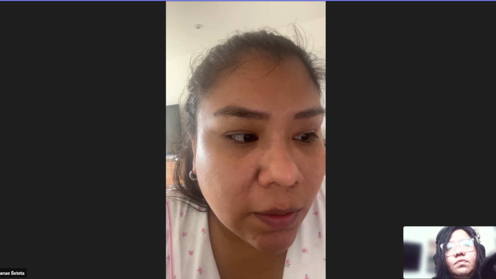

link: https://shorturl.at/jIaxB

inicia: 0:00

Duración: 12:18

Nombre: Danae Beteta

edad: 33 años

Distrito: San Borja

Resumen: Danae Beteta (33 años, 1 hija) buscó información durante su embarazo principalmente en Google, foros y con su ginecólogo, ya que su embarazo fue de alto riesgo (17 semanas en reposo). Los mayores miedos fueron posibles complicaciones y el desarrollo de su bebé. Recibió buena orientación médica previa al parto, pero en el postparto enfrentó estrés emocional, especialmente porque su hija nació con problemas de salud.

Usó apps como BabyCenter y una de Philips para seguir el desarrollo semanal del bebé, destacando las representaciones en 3D. También empleó su Apple Watch y dispositivos Bluetooth para monitorear presión arterial y ritmo cardíaco. Aunque valora la tecnología, busca herramientas con recordatorios (por su TDAH). Pagaría por una app de telemedicina pediátrica con respuestas rápidas, similar al servicio de videollamadas que ya usa con su seguro.

Información extra:

    Dispositivos:
    - Celular (iPhone) y iPad para contenido educativo.
    - PC ocasionalmente (solo para documentos importantes).
    
    Aplicaciones/Navegadores:
    - Apps: Flow (ciclo menstrual), app de Philips para desarrollo fetal.
    - Redes: TikTok y YouTube
    - Navegador: Firefox (por privacidad).
    
    Personalidad:
    - Profesión: abogada
    - Analítica y organizada, combina apps con consultas médicas.
    - Verifica fuentes antes de seguir recomendaciones.

ENTREVISTA 3

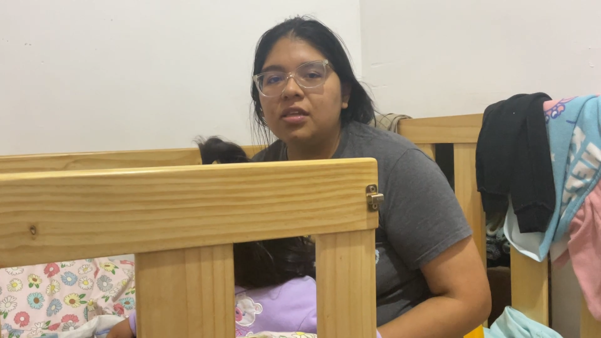

link: https://shorturl.at/gaGSh

inicia: 0:00

Duración: 5:42

Nombre: Valeria Reyes

edad: 26 años

Distrito: Jesus Maria

Resumen: Valeria Reyes (27 años, 1 hija) recurrió a TikTok y una app de embarazo para informarse, pero luego priorizó a su ginecóloga. Sus mayores preocupaciones fueron el desarrollo fetal adecuado y los problemas de lactancia (baja producción de leche que requirió fórmula).

En el preparto, la ansiedad se centró en posibles malformaciones y parto prematuro (con info contradictoria entre redes y su médico). En el postparto, los desafíos fueron la alimentación con fórmula y cuidados específicos (pañales y abrigo, al nacer en invierno).

Usó una app que mostraba el tamaño del feto por semanas (comparado con frutas) y recordatorios de citas, pero criticó los pagos extras por consultas médicas. Le habría gustado un chatbot para dudas frecuentes.

Información extra:

    Dispositivos:
    - Celular (Android) como principal dispositivo.
    - PC para trabajo remoto.
    - Celular corporativo
    
    Aplicaciones/Navegadores:
    - Apps: BabyCenter, Mi Embarazo (UNICEF).
    - Redes: TikTok y YouTube (aunque duda de su confiabilidad).
    - Navegador: Chrome para búsquedas rápidas.
    
    Personalidad:
    - Profesión: contadora
    - Práctica y resolutiva, pero desconfía de fuentes no médicas.
    - Busca información visual (videos, infografías).

DOCTORES

ENTREVISTA 1

link: https://shorturl.at/LH2Xu

inicia: 0:00

Duración: 12:35

Nombre: Sandra Ramos

edad: 30 años

Distrito: San Juan de Lurigancho

Resumen:
Dra. Sandra Ramos (30 años) es ginecóloga egresada de la Universidad Tecnológica del Perú con experiencia en hospitales de Lurigancho y Villa El Salvador. En su práctica clínica, enfatiza la evaluación de factores de riesgo en gestantes, particularmente en adolescentes y mujeres mayores de 35 años.

Utiliza tanto historias clínicas físicas como el sistema digital SIS peruano para el manejo de información. A sus pacientes recomienda aplicaciones especializadas: Flow para seguimiento menstrual y apps para monitoreo de contracciones en embarazos avanzados.

La Dra. Ramos considera fundamental que exista una plataforma digital que cumpla con tres características esenciales: lenguaje accesible para pacientes, información detallada sobre medicamentos y protocolos, y capacidad de responder consultas médicas de forma inmediata. Este enfoque refleja su compromiso por hacer la atención ginecológica más accesible y comprensible para todas sus pacientes.

Información extra:

    Dispositivos:
    - PC con Windows en consultorio (historiales clínicos).
    - Celular solo para WhatsApp con pacientes.
    
    Aplicaciones/Navegadores:
    - Software: SIS (Sistema Informático de Salud peruano).
    - Navegador: Edge (compatibilidad con sistemas hospitalarios).
    
    Personalidad:
    - Técnica y escéptica, solo recomienda apps validadas.
    - Enfocada en seguridad de datos.

ENTREVISTA 2

link: https://shorturl.at/wQ832

inicia: 0:00

Duración: 6:03

Nombre: Helena Ordoñez Castillo

edad: 30 años

Distrito: Magdalena

Resumen: Dra. Helena Ordoñez es obstetra del INMP especializada en embarazos de alto riesgo. Con 4 años de experiencia, monitorea signos vitales, desarrollo fetal y salud mental postparto usando evaluaciones clínicas y test estandarizados.

Actualmente, trabaja con historias clínicas físicas y el sistema SIEN, aunque critica su limitado acceso para pacientes. Valora iniciativas digitales como recordatorios por WhatsApp, pero destaca las desigualdades en acceso tecnológico.

Propone desarrollar plataformas que integren: 1) historiales médicos accesibles, 2) alertas personalizadas y 3) contenido educativo verificado. Además, sugiere crear comunidades virtuales seguras moderadas por profesionales

Información extra:

    Dispositivos:
    - Laptop HP para telemedicina.
    - Tablet Samsung para mostrar ecografías.
    
    Aplicaciones/Navegadores:
    - Plataforma: SIEN (sistema del INMP).
    - Navegador: Edge (compatibilidad con sistemas hospitalarios).
    
    Personalidad:
    - Eficiente y metódica, prioriza ahorrar tiempo en consultas.
    - Prefiere herramientas interoperables con sistemas públicos.

ENTREVISTA 3

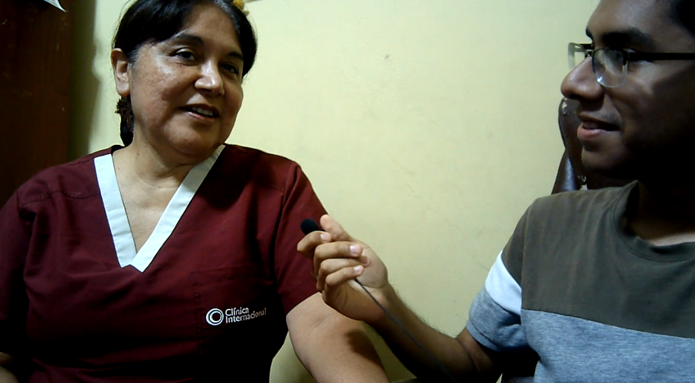

link: https://shorturl.at/4fBWU

inicia: 0:00

Duración: 6:03

Nombre: Judith Jesus Ayala Maurtua

edad: 55 años

Distrito: Pueblo Libre

Resumen: 

Judith Ayala es una obstetra con 30 años de experiencia que trabaja en la Clínica Internacional. Ella comparte información sobre los datos clínicos más relevantes para el monitoreo de madres gestantes, incluyendo antecedentes de embarazos, vitalidad y posición del bebé, exámenes médicos y funciones vitales. 
También menciona la importancia de detectar indicadores de depresión posparto, que son comunes en madres primerizas. Explica que en la clínica utilizan un test para evaluar estos casos y prevenir situaciones graves como el riesgo de suicidio.
Sobre el registro y el intercambio de información con los pacientes, destaca el uso de historias clínicas electrónicas a través de una plataforma llamada GIS, que permite compartir evaluaciones y resultados entre especialistas. Finalmente, comenta que una aplicación útil para su trabajo debería permitir la integración de múltiples especialidades para mejorar el diagnóstico y tratamiento de los pacientes.

Información extra:

    Dispositivos:
    - PC de escritorio (Windows) en la clínica (uso principal).
    - Tablet android.
    - Celular corporativo (solo para emergencias).
    
    Aplicaciones/Navegadores:
    ➡ Plataforma profesional: GIS.
    ➡ Navegador: Google Chrome.
    ➡ Otras herramientas:
        Test digitalizado de depresión posparto (integrado en GIS).
        No usa apps móviles de salud (prefiere sistemas institucionales).
    
    Personalidad:
    - Experta y meticulosa: Con 30 años de experiencia, prioriza protocolos clínicos establecidos.
    - Enfoque preventivo: Insiste en la detección temprana de riesgos (ej: depresión posparto).
    - Tradicional con apertura tecnológica:
        Usa tecnología solo si está validada institucionalmente (ej: GIS).
        Escéptica ante apps independientes sin respaldo médico.
    - Colaborativa: Valora plataformas que integren múltiples especialidades (ginecólogos, psicólogos, neonatólogos).

### 2.2.3. Análisis de entrevistas.

MADRES

Para el análisis de las entrevistas, se pueden identificar varias características comunes entre las madres entrevistadas que son relevantes para la construcción de los arquetipos de usuarias. A continuación, se presenta un análisis de estas características:
- Inician consultas en redes sociales (TikTok) o buscadores (Google), pero validan la información con profesionales de salud.
- Priorizan temas como desarrollo fetal, lactancia y cuidados postparto..
- Todas presentan ansiedad por malformaciones fetales, parto prematuro o complicaciones postparto (ej. desgarros no diagnosticados).
- La mayoría usa apps como BabyCenter o Mi Embarazo (UNICEF) para seguir el desarrollo fetal
- Casi todas critican el exceso de publicidad o funcionalidades de pago.
- Prefieren contenido visual (videos, modelos 3D) y recordatorios personalizados.
- La mayoría quiere una app con respuestas rápidas de médicos (chatbots o telemedicina)
- Casi todas resaltan la necesidad de información clara y accesible, especialmente sobre salud mental postparto o cuidados del recién nacido.
- Todas usan smartphones como dispositivo principal (iPhone/Android).
- La mayoría navega en Chrome o Safari, con algunas excepciones que prefieren Firefox por privacidad.

DOCTORES

Para el análisis de las entrevistas, se pueden identificar varias características comunes entre los profesionales de salud entrevistados que son relevantes para la construcción de los arquetipos de usuarios en el segmento objetivo de ginecólogos y obstetras. A continuación, se presenta un análisis de estas características
- Todas monitorean signos vitales (presión arterial, glucosa), desarrollo fetal y salud mental postparto.
- La mayoría recomienda Flow (seguimiento menstrual) y Contracciones (monitoreo de trabajo de parto), pero advierte que muchas apps carecen de respaldo médico.
- Las entrevistadas consideran clave una plataforma con, historiales médicos accesibles, alertas personalizadas (citas, medicación), contenido educativo verificado (videos, infografías).
- La mayoría busca mejorar la comunicación médico-paciente con herramientas seguras y adaptadas a distintos niveles educativos.
- Casi todas enfatizan que la tecnología debe complementar no reemplazar la atención
- Todas usan PCs en consultorios (Windows).
- Todas evitan apps independientes sin validación institucional.

## 2.3. Needfinding.

Utilizando la información recolectada, hemos realizado un análisis de las necesidades de los usuarios, 
que nos permitirá identificar y priorizar las funcionalidades que se incluirán en la plataforma. 
El resultado es la elaboración de los arquetipos User Persona, que representan a los usuarios 
finales de la plataforma, el User Task Matrix, User Journey Maps, Empathy Mapping y As-Is Scenario Mapping.

### 2.3.1. User Personas.

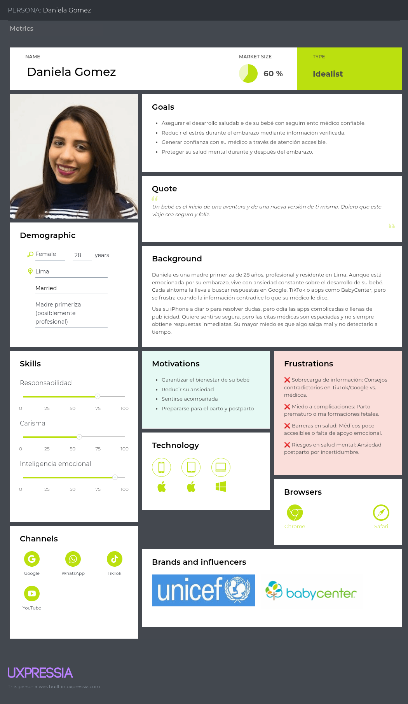	

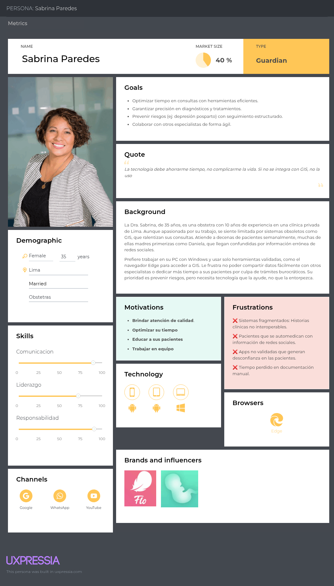

### 2.3.2. User Task Matrix.
En esta sección se presenta la matriz de tareas de los usuarios, que muestra las actividades realizadas por las obstetras y mujeres gestantes, junto con su frecuencia e importancia. Esta matriz permite identificar las tareas clave asociadas al proceso de atención y vivencia del embarazo, destacando su relevancia para cada tipo de usuario.
Para ello, se utilizaron los user personas desarrollados en la sección anterior: Daniela Gómez, correspondiente al segmento 1: Mujer gestante, y Sabrina Paredes, correspondiente al segmento 2: Obstetra.

#### Segmento objetivo #1: Gestantes peruanas de entre 18 a 29 años de edad

| Actividades                             | Frecuencia   | Importancia |
|-----------------------------------------|--------------|-------------|
| Monitorear signos vitales               | Rara vez     | Alta        |
| Asistencia al médico                    | Siempre      | Media       |
| Detectar riesgos y complicaciones       | Nunca        | Alta        |
| Brindar soporte emocional               | Rara vez     | Media       |
| Realizar clases de preparación de parto | Siempre      | Baja        |
| Asesorar sobre el plan de parto         | Rara vez     | Media       |
| Realizar exámenes médicos               | Nunca        | Alta        |
| Buscar información sobre gestación      | Siempre      | Media       |

#### Segmento objetivo #2: Obstetras peruanas de entre 22 a 40 años de edad

| Actividades                             | Frecuencia   | Importancia |
|-----------------------------------------|--------------|-------------|
| Monitorear signos vitales               | Siempre      | Alta        |
| Asistencia al médico                    | Rara vez     | Media       |
| Detectar riesgos y complicaciones       | Siempre      | Alta        |
| Brindar soporte emocional               | Rara vez     | Media       |
| Realizar clases de preparación de parto | Rara vez     | Media       |
| Asesorar sobre el plan de parto         | Siempre      | Alta        |
| Realizar exámenes médicos               | Siempre      | Alta        |
| Buscar información sobre gestación      | Rara vez     | Media       |

### 2.3.3. User Journey Mapping.

El User Journey Mapping nos permitirá conocer los objetivos de nuestros usuarios. Respecto al segmento de las madres, abarcaremos el camino desde que descubren la aplicación hasta que registren los datos de sus bebés para su monitoreo por parte de su doctora. Respecto al segmento de los doctores, abarcaremos el camino desde que registran a sus pacientes hasta que monitorean los datos de sus pacientes.

Segmento objetivo #1: Gestantes

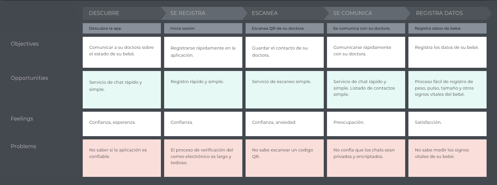

Segmento objetivo #2: Obstetras

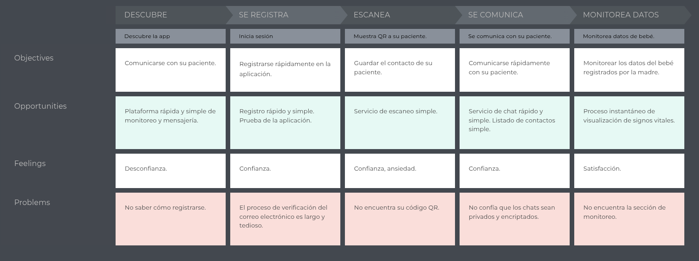

### 2.3.4. Empathy Mapping.

El Empathy Mapping nos ayudará a crear perfiles detallados de los User Persona y a desarrollar una descripción desde su propia perspectiva, comprendiendo mejor sus pensamientos, emociones, necesidades y comportamientos

Segmento objetivo #1: Gestantes

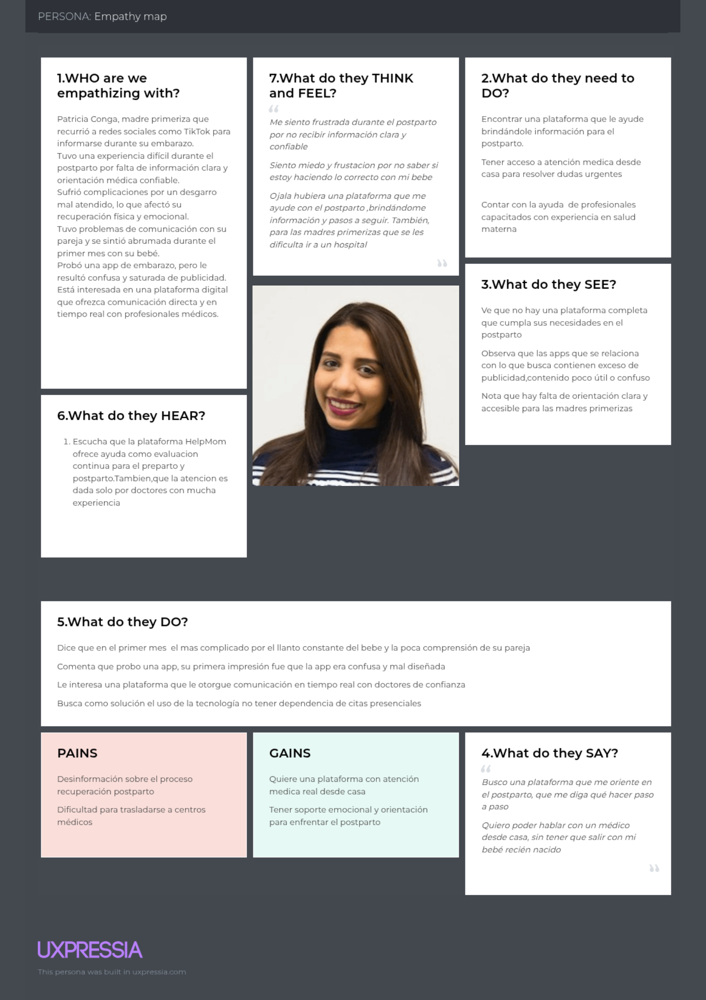

Segmento objetivo #2: Obstetras

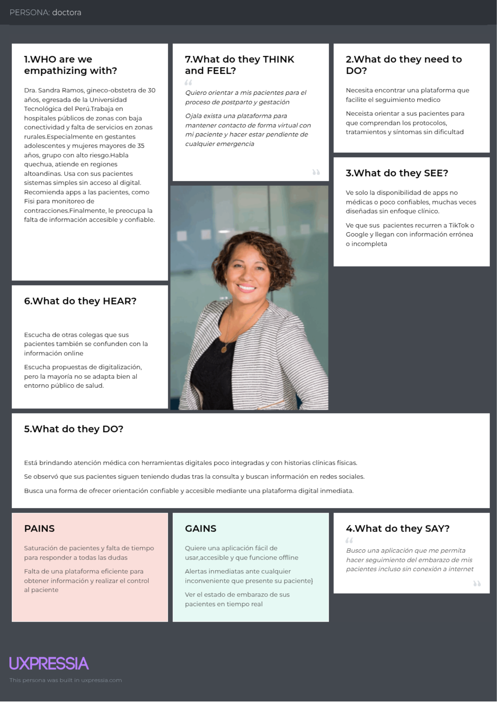

### 2.3.5. As-is Scenario Mapping.

Segmento Madres

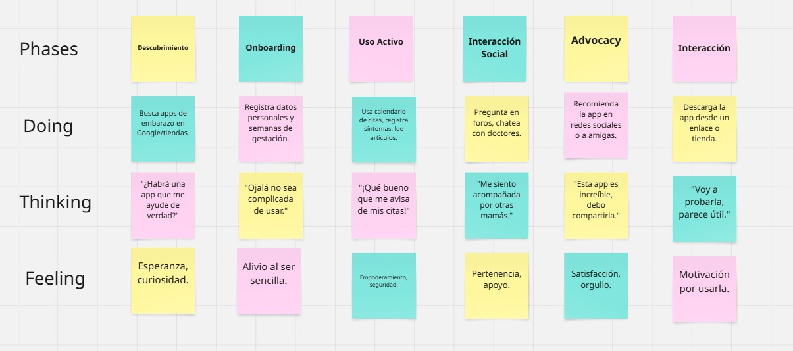

Segmento Doctores

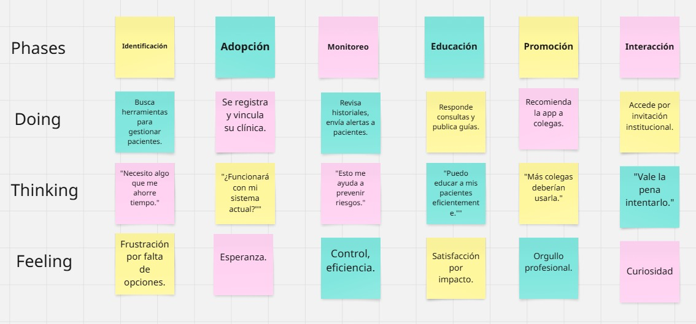

## 2.4. Ubiquitous Language.

El Lenguaje Ubicuo es un pilar esencial dentro del enfoque de Domain-Driven Design (DDD), ya que promueve una comunicación precisa y uniforme entre todos los miembros del equipo y las partes interesadas. Este lenguaje establece una terminología compartida y bien definida sobre los elementos clave del dominio, lo que facilita la colaboración efectiva y asegura que todos estén alineados en la comprensión del sistema.
A continuación, se describen los principales términos y conceptos definidos específicamente para el proyecto HelpMom

__Conceptos Principales__

* **Servicio:** Representa una función dentro del dominio que encapsula lógica importante sin estar ligada directamente a una entidad u objeto específico. Por ejemplo, agendar una cita médica desde la plataforma HelpMom.

* **Evento de Dominio:** Suceso relevante que refleja un cambio significativo dentro del sistema, como cuando se registra un nuevo control prenatal o se actualiza el historial médico.

* **Repositorio:** Elemento que se encarga de gestionar el almacenamiento y recuperación de datos del dominio, ocultando la complejidad del acceso a la base de datos.

* **Objeto de Valor:** Información que describe atributos o propiedades, sin identidad propia, y que no cambia en el tiempo, como una combinación de fecha y hora para una cita médica.

* **Agregado:** Estructura compuesta por varios objetos que se gestionan como un bloque coherente, normalmente con un punto de entrada central, como el historial de atención de una gestante.

* **Entidad:** Objeto principal dentro del dominio que se distingue por su identidad única, independientemente de los datos que contenga, como una usuaria o una profesional de salud en HelpMom.

__Terminos Especificos__

* **HelpMom:** Es una plataforma cuya función principal es permitir que madres gestantes y primerizas reciban atención médica directa de profesionales especializados a través de la aplicación. Las usuarias pueden elegir al doctor u obstetra que mejor se adapte a sus necesidades, consultando perfiles, tarifas y valoraciones. Además, se genera un historial médico virtual que se actualiza con cada consulta, facilitando un seguimiento continuo del estado de salud de la madre y el bebé.

* **Wireframe:** Es un esquema visual que indica la organización de los elementos dentro de las interfaces de usuario de la plataforma, crucial para la creación del diseño de UI.

* **Landing Page:** Es la página principal que los usuarios ven al acceder al sitio, diseñada para convertir visitantes en usuarios registrados, resaltando las ventajas y beneficios clave de la plataforma.

* **Mock-up:** Son prototipos preliminares de las funcionalidades dentro de la plataforma **HelpMom**, utilizados para la demostración y validación del diseño antes de su implementación final.

* **User Persona:** Son representaciones ficticias de diferentes grupos de usuarios, basadas en datos demográficos, que guían tanto el diseño de la interfaz como el desarrollo de funcionalidades de la plataforma.

* **Sprint Review:** Son reuniones periódicas en las que se presenta el avance del proyecto a los stakeholders, mostrando nuevas características implementadas y revisando las tareas que están en proceso.

__Términos Adicionales del Dominio Específico__

* **Lean UX Canvas:** Herramienta visual que ayuda a definir y organizar los elementos fundamentales del proceso de diseño y desarrollo del producto, incluyendo problemas, soluciones, suposiciones y métricas de éxito.

* **Problem Statements:** Descripciones que identifican los principales desafíos que enfrentan los usuarios y sirven como guía para el diseño y desarrollo del producto.

* **Hypothesis Statements:** Afirmaciones que reflejan creencias sobre cómo resolver los problemas identificados, estableciendo los criterios para medir el éxito del producto.

* **Lean UX Process:** Enfoque de desarrollo centrado en la mejora del producto a través de la validación, el pensamiento y la acción, que incluye la identificación de problemas, suposiciones, hipótesis y el uso de lienzos para organizar ideas y estrategias.

* **Plataforma de Preparación para Entrevistas Técnicas:** Un sistema en línea diseñado para ayudar a los programadores y desarrolladores a mejorar sus habilidades técnicas y prepararse para entrevistas laborales.

* **Entrevistas Técnicas:** Son procesos de evaluación que utilizan las empresas tecnológicas para medir las habilidades técnicas y la idoneidad de los candidatos para un puesto específico.

* **Recursos de Preparación:** Herramientas educativas y materiales que ayudan a mejorar las habilidades técnicas y a prepararse para entrevistas en el ámbito tecnológico.

* **Usuarios Objetivo:** Son los grupos específicos a quienes se dirige el producto, tales como desarrolladores que buscan empleo y estudiantes de informática o carreras relacionadas.

* **Valor Agregado:** Beneficios adicionales que ofrece la plataforma de preparación para entrevistas técnicas, como acceso a contenido exclusivo de empresas tecnológicas, oportunidades de reclutamiento integradas y sesiones de tutoría personalizadas.

