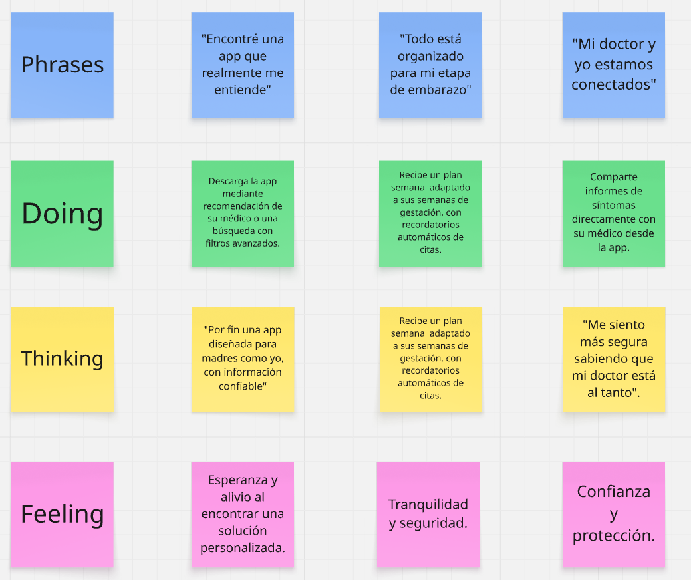
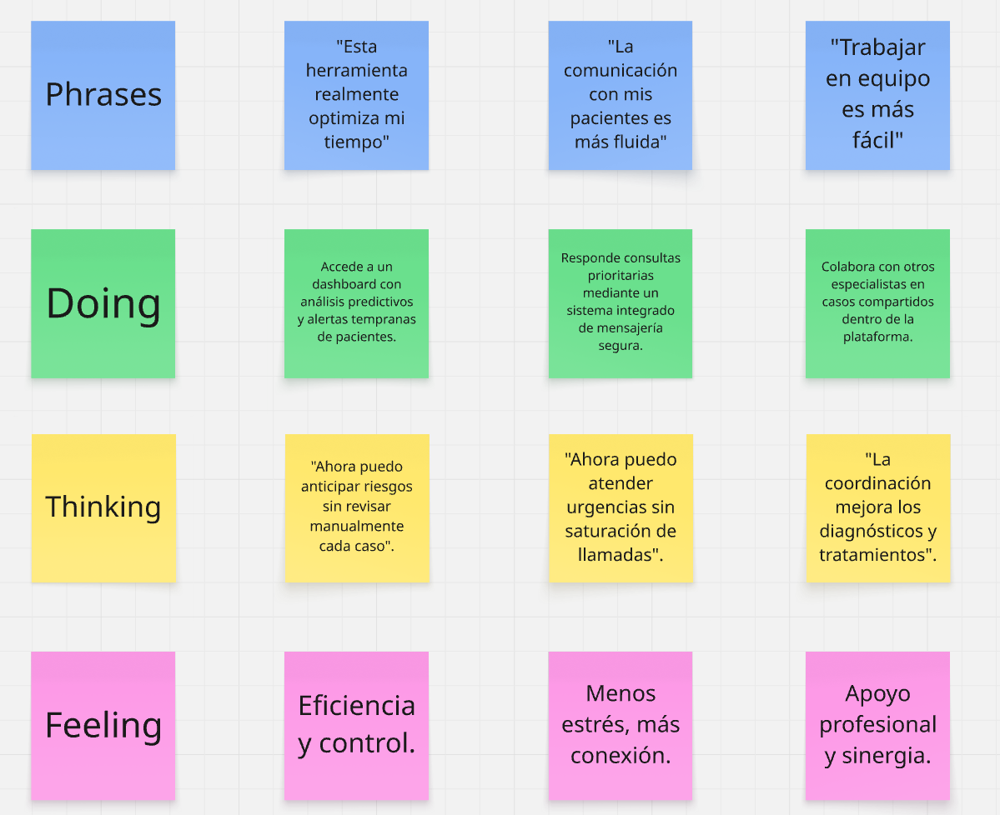
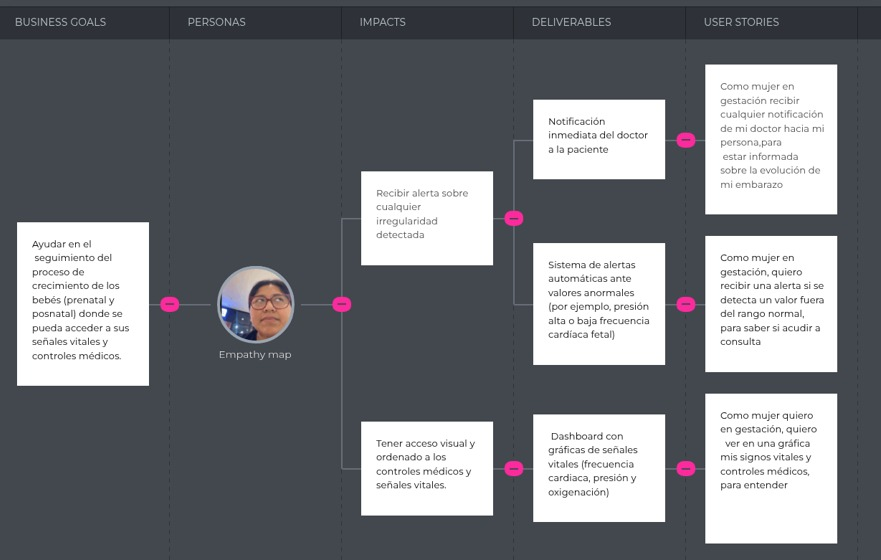
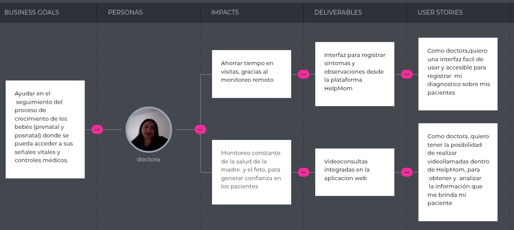

# Capítulo III: Requirements Specification

## 3.1. To-Be Scenario Mapping.

**Segmento objetivo 1:** Madres:

**Segmento objetivo 2:** Doctores

## 3.2. User Stories.

Epics de la landing page:

| Epic ID | Título                  |
|---------|-------------------------|
| EP1     | Información del Start Up |
| EP2     | Sobre el Producto        |
| EP3     | Planes y suscripciones   |
| EP4     | Preguntas frecuentes     |
| EP5     | Contacto                 |

Epics de la aplicación web:

| Epic ID | Título                   |
|---------|--------------------------|
| EP1     | Ingreso de datos médicos |
| EP2     | Gestionar datos personales |
| EP3     | Comunicación personalizada |
| EP4     | Soporte al usuario       |

| Story ID | Título                               | Descripción                                               | Criterios de aceptación |
|----------|-------------------------------------|-----------------------------------------------------------|-------------------------|
| HU1      | Visualización de información de startup | Como invitado, quiero visualizar la información de la startup para informarme sobre la empresa. | Escenario 1: Visualización correcta de información. Dado que ingresa una cadena de texto, cuando se muestre la página, entonces muestra correctamente la informacion de startup. Escenario 2: Visualización incorrecta de información. Dado que hay un error en la carga de la pagina, cuando se muestre la página, entonces se muestra el `aria-label`. |
| HU2      | Visualizacion de foto de startup | Como invitado, quiero visualizar la foto de la startup para informarme sobre la empresa. | Escenario 1: Visualizacion correcta de informacion. Dado que la imagen es valida, cuando se muestre la pagina, entonces muestra la imagen de la startup. Escenario 2: Visualizacion incorrecta de informacion. Dado que hay un error en la carga de la imagen, cuando se muestre la pagina, entonces muestra un aria-label.|
| HU3      | Visualización de información de producto | Como invitado, quiero visualizar la información del producto para informarme sobre lo que se ofrece. | Escenario 1: Visualización correcta de información. Dado que carga la pagina, cuando se muestre la página, entonces muestra la informacion del producto. Escenario 2: Visualización incorrecta de información. Dado que hay un error de carga en la pagina, cuando se muestre la página, entonces muestra el `aria-label`. |
| HU4      | Visualización de foto de producto | Como invitado, quiero visualizar la foto del producto para informarme sobre lo que se ofrece. | Escenario 1: Visualización correcta de información. Dado que la imagen es valida, cuando se muestre la pagina, entonces muestra la imagen del producto.  Escenario 2: Visualización incorrecta de información. Dado que hay un error en la carga de la imagen, cuando se muestre la pagina, entonces muestra un aria-label. |
| HU5      | Ingreso a la aplicacion web | Como invitado, quiero ingresar a la aplicacion web para hacer uso del producto.| Escenario 1: Visualizacion correcta de informacion. Dado que la aplicacion web esta desplegada, cuando se muestre la aplicacion web, entonces redirige a la aplicacion web en una nueva ventana. Escenario 2: Visualizacion incorrecta de informacion. Dado que no hay despliegue de la aplicacion web, cuando se muestre la aplicacion web, entonces redirige a una pagina not-found. |
| HU6      | Visualización de información de planes | Como invitado, quiero visualizar la información de los planes para informarme sobre la membresía. | Escenario 1: Visualización correcta de información. Dado que la información carga correctamente, cuando se muestre la página, entonces  muestra la informacion. Escenario 2: Visualización incorrecta de información. Dado que no carga la información, cuando se muestre la página, entonces muestra el `aria-label`. |
| HU7      | Visualización de preguntas frecuentes | Como invitado, quiero visualizar las preguntas frecuentes y sus respuestas para solucionar dudas sobre el producto. | Escenario 1: Visualización correcta de información. Dado que la información carga correctamente, cuando se muestre la página, entonces muestra la informacion. Escenario 2: Visualización incorrecta de información. Dado que no carga la información, cuando se muestre la página, entonces muestra el `aria-label` del texto. |
| HU8      | Visualización de imágenes de preguntas frecuentes | Como invitado, quiero visualizar las imágenes en las preguntas frecuentes para solucionar dudas sobre el producto. | Escenario 1: Visualización correcta de información. Dado que la imagen es válida, cuando se muestre la página, entonces muestra la imagen. Escenario 2: Visualización incorrecta de información. Dado que no carga la imagen, cuando se muestre la página, entonces muestra el `aria-label`. |
| HU9      | Ingreso de datos personales y consulta | Como invitado, quiero ingresar mi nombre, mi correo y un mensaje para comunicarme con la startup. | Escenario 1: Envío válido de nombre, correo y mensaje. Dado que ingresa un texto no vacío, cuando se envíe el mensaje, entonces el sistema permite el envio del mensaje. Escenario 2: Envío de texto vacío en nombre, correo o mensaje. Dado que ingresa un texto vacío en el nombre, correo o mensaje, cuando se envíe el mensaje, entonces el sistema previene el envio del mensaje. Escenario 3: Envío de correo inválido. Dado que envia un correo inválido, cuando se envíe el mensaje, entonces el sistema previene el envio del mensaje.|
| HU10       | Ingreso de recetas médicas | Como doctor, quiero registrar la receta médica de mi paciente con la finalidad de ver a detalle los medicamentos que toma. | Dado que un doctor registra los medicamentos con las respectivas validaciones, cuando el sistema procese la información, entonces muestra el medicamento registrado. Dado que el doctor registra la receta médica, cuando guarde su receta, entonces el sistema muestra un mensaje de confirmación. |
| HU11       | Añadir instrucciones a recetas | Como doctor, quiero agregar instrucciones a las recetas para evitar errores en la toma de medicamentos. | Dado que un doctor registra una receta médica, cuando desee agregar una instrucción o comentario, entonces la plataforma muestra esa opción. |
| HU12       | Historial de recetas      | Como doctor, quiero visualizar las recetas medicas para mejorar el diagnostico.          | Dado que el doctor registra más de una receta médica, cuando desee visualizar las recetas guardadas, entonces el sistema muestra todas las recetas registradas. |
| HU13       | Ingreso de nombre completo | Como usuario, quiero registrar mi nombre para identificarme.                  | Escenario 1: Ingreso válido. Dado que ingresa texto mayor a 3 caracteres y no vacío, cuando se realice el cambio de nombre, entonces el sistema permite el cambio de nombre. Escenario 2: Ingreso vacío o menor a 3 caracteres. Dado que ingresa texto vacío o menor a 3 caracteres, cuando se realice el cambio de nombre, entonces el sistema previene la operación y la cancela. |
| HU14       | Ingreso de correo           | Como usuario, quiero registrar mi correo para identificarme en la aplicación. | Escenario 1: Ingreso válido. Dado que ingresa correo válido y no vacío, cuando se realice el cambio de correo, entonces el sistema permite el registro del correo. Escenario 2: Ingreso vacío o inválido. Dado que ingreso un correo inválido o vacío, cuando se realice la operacion, entonces el sistema previene el registro. |
| HU15 | Registro de número telefónico de doctor | Como madre, quiero registrar el número telefónico de una doctora para guardar su contacto. | Escenario 1: Dado que ingresa un número de 9 caracteres, cuando se registre el contacto de la doctora, entonces el sistema permite el registro. Escenario 2: Dado que no se ingreso ningun numero, cuando se registre el contacto de la doctora, entonces el sistema previene el registro del contacto. Escenario 3: Dado que ingresa un número diferente a 9 caracteres, cuando se registre el contacto de la doctora, el sistema previene el registro. Escenario 4: Dado que ingresa un número cuyo primer carácter es diferente a 9, cuando se registre el contacto de la doctora, entonces el sistema previene el registro. |
| HU16 | Envío de mensaje | Como madre, quiero enviar un mensaje a una doctora para comunicarme con ella. | Escenario 1: Dado que ingresa un texto no vacío, cuando se envíe el mensaje, entonces el sistema permite el envio del mensaje. Escenario 2: Dado que se envia texto vacio, cuando se envie el mensaje, entonces el sistema previene el envio del mensaje. |
| HU17 | Ingreso de consulta | Como madre, quiero enviar un mensaje a soporte técnico para comunicar un problema con la aplicación. | Escenario 1: Dado que ingresa texto no vacio, cuando se envíe el mensaje, entonces el sistema permite el envio del mensaje Escenario 2: Dado que se envia texto vacio, cuando se envie el mensaje, entonces el sistema previene el envio del mensaje.|
| HU18 | Envío de respuesta | Como madre, quiero recibir la respuesta del servicio técnico para solucionar un problema con la aplicación. | Escenario 1: Dado que envia texto no vacio, cuando se envíe el mensaje, entonces el sistema permite el envio del mensaje. Escenario 2: Dado que el personal envió un texto vacío, cuando se envíe el mensaje, entonces el sistema previene el envio. |
| HU19       | Registro de medicamento      | Como doctor, quiero registrar el nombre y cantidad de un medicamento para mejorar diagnósticos.          | Escenario 1: Dado que el doctor ingresa texto no vacio y un numero no vacio diferente de 0, cuando se registre el medicamento, entonces el sistema permite el proceso. |
| HU20       | Ingreso de recetas médicas | Como doctor, quiero registrar una receta medica para recetar medicamentos. | Escenario 1: Receta medica contiene mas de un medicamento. Dado que existe mas de un medicamento, cuando se registre la receta medica, entonces el sistema permite el registro. Escenario 2: Receta medica no contiene un medicamento. Dado que la receta medica no contiene medicamentos, cuando se registre la receta medica, entonces el sistema previene el registro. |
| HU21       | Añadir instrucciones a recetas | Como doctor, quiero agregar instrucciones a las recetas para informar al paciente. | Escenario 1: Ingreso de texto valido. Dado que se ingresa texto no vacio, cuando guarde la instruccion, entonces el sistema permite el proceso. Escenario 2: Ingreso de texto no valido. Dado que se ingresa texto vacio, cuando guarde la instruccion, entonces el sistema previene el proceso. |

### 3.2.1 Technical Stories

<table>
  <tr>
    <th>ID</th>
    <th>Título</th>
    <th>Descripción</th>
    <th>Criterios de Aceptación</th>
  </tr>

  <!-- Escenario 1: Registro de Usuarios -->
  <tr>
    <td>TS21</td>
    <td>Registro de Usuarios </td>
    <td>Como usuario no registrado, quiero crear una cuenta con mi email, contraseña y datos personales (nombre, fecha de nacimiento), para acceder a las funcionalidades de la aplicación.</td>
    <td>
      <strong>Scenario 1: Registro exitoso</strong> 
      <strong>Given:</strong> El endpoint "/api/v1/register" está disponible. 
      <strong>When:</strong> Se envía un POST request con { "email": "paciente@example.com", "password": "Secure123", "name": "Juan Pérez", "birthdate": "1990-01-01" }. 
      <strong>Then:</strong> El sistema responde con status 201, crea el usuario en PostgreSQL y encripta la contraseña con bcrypt.  
      <strong>Scenario 2: Registro con email duplicado</strong> 
      <strong>Given:</strong> El endpoint "/api/v1/register" y un email ya registrado ("paciente@example.com"). 
      <strong>When:</strong> Se envía un POST request con el mismo email. 
      <strong>Then:</strong> El sistema responde con status 409 y el mensaje "Email already registered".
    </td>
  </tr>

  <!-- Escenario 2: Validación de Credenciales Médicas -->
  <tr>
    <td>TS22</td>
    <td>Validación de Credenciales Médicas</td>
    <td>Como médico, quiero subir mi certificado médico (PDF/IMG) para que el equipo administrativo valide mi identidad y me otorgue acceso a funcionalidades profesionales.</td>
    <td>
      <strong>Scenario 1: Subida exitosa de certificado</strong> 
      <strong>Given:</strong> El endpoint "/api/v1/doctors/:id/certificate" acepta archivos (multipart/form-data). 
      <strong>When:</strong> Se envía un POST request con el archivo certificate.pdf y el doctorId válido. 
      <strong>Then:</strong> El sistema guarda el archivo en AWS S3, marca al médico como pending_verification y responde con status 202.  
      <strong>Scenario 2: Subida con formato inválido</strong> 
      <strong>Given:</strong> El endpoint "/api/v1/doctors/:id/certificate". 
      <strong>When:</strong> Se envía un archivo certificate.txt (no soportado). 
      <strong>Then:</strong> El sistema responde con status 400 y el mensaje "Only PDF/JPEG/PNG allowed".
    </td>
  </tr>

  <!-- Escenario 3: Agendar Cita Médica -->
  <tr>
    <td>TS23</td>
    <td>Agendar Cita Médica</td>
    <td>Como paciente, quiero seleccionar una fecha/hora disponible en el calendario de un médico para agendar una cita.</td>
    <td>
      <strong>Scenario 1: Cita agendada correctamente</strong> 
      <strong>Given:</strong> El endpoint "/api/v1/appointments" y un slot disponible para el médico doctorId=123. 
      <strong>When:</strong> Se envía un POST request con { "doctorId": 123, "patientId": 456, "date": "2025-05-20", "time": "10:00" }. 
      <strong>Then:</strong> El sistema crea la cita en PostgreSQL, envía un email de confirmación y responde con status 201.  
      <strong>Scenario 2: Slot ya ocupado</strong> 
      <strong>Given:</strong> El endpoint "/api/v1/appointments" y un slot ya reservado. 
      <strong>When:</strong> Se intenta agendar la misma fecha/hora para el mismo médico. 
      <strong>Then:</strong> El sistema responde con status 409 y el mensaje "Time slot not available".
    </td>
  </tr>

  <!-- Escenario 4: Comunicación Encriptada (Chat) -->
  <tr>
    <td>TS24</td>
    <td>Comunicación Encriptada (Chat)</td>
    <td>Como paciente, quiero enviar mensajes encriptados a mi médico para discutir síntomas o resultados.</td>
    <td>
      <strong>Scenario 1: Mensaje enviado con éxito</strong> 
      <strong>Given:</strong> El endpoint "/api/v1/chat/messages" usa WebSockets con TLS. 
      <strong>When:</strong> Se envía { "senderId": "patient123", "receiverId": "doctor456", "content": "Tengo dolor de cabeza" }. 
      <strong>Then:</strong> El sistema encripta el mensaje (AES-256), lo guarda en MongoDB y devuelve status 200.  
      <strong>Scenario 2: Intento de acceso no autorizado</strong> 
      <strong>Given:</strong> El endpoint "/api/v1/chat/messages". 
      <strong>When:</strong> Un usuario sin JWT válido intenta enviar un mensaje. 
      <strong>Then:</strong> El sistema responde con status 401 y "Unauthorized".
    </td>
  </tr>

  <!-- Escenario 5: Monitoreo de Signos Vitales -->
  <tr>
    <td>TS25</td>
    <td>Monitoreo de Signos Vitales</td>
    <td>Como dispositivo wearable, quiero enviar datos de frecuencia cardíaca y presión arterial al servidor para monitoreo en tiempo real.</td>
    <td>
      <strong>Scenario 1: Datos válidos recibidos</strong> 
      <strong>Given:</strong> El endpoint "/api/v1/patients/:id/vitals" está activo. 
      <strong>When:</strong> Se envía un POST request con { "patientId": "789", "heartRate": 75, "bloodPressure": "120/80", "timestamp": "2025-04-23T12:00:00Z" }. 
      <strong>Then:</strong> El sistema guarda los datos en Firebase Realtime DB y responde con status 200.  
      <strong>Scenario 2: Datos incompletos</strong> 
      <strong>Given:</strong> El endpoint "/api/v1/patients/:id/vitals". 
      <strong>When:</strong> Se envía un request sin heartRate o bloodPressure. 
      <strong>Then:</strong> El sistema responde con status 400 y "Missing required fields".
    </td>
  </tr>

  <!-- Escenario 6: Generación de Recetas Digitales -->
  <tr>
    <td>TS26</td>
    <td>Generación de Recetas Digitales</td>
    <td>Como médico, quiero generar recetas con firma digital para que los pacientes las presenten en farmacias.</td>
    <td>
      <strong>Scenario 1: Receta firmada correctamente</strong> 
      <strong>Given:</strong> El endpoint "/api/v1/prescriptions" y un JWT válido de médico. 
      <strong>When:</strong> Se envía { "patientId": "456", "medication": "Paracetamol", "dosage": "500mg" }. 
      <strong>Then:</strong> El sistema genera un PDF con firma RSA, lo guarda en S3 y devuelve la URL (status 201).  
      <strong>Scenario 2: Intento sin autenticación</strong> 
      <strong>Given:</strong> El endpoint "/api/v1/prescriptions". 
      <strong>When:</strong> Un usuario no médico envía un request. 
      <strong>Then:</strong> El sistema responde con status 403 y "Forbidden: Doctor role required".
    </td>
  </tr>

  <!-- Escenario 7: Soporte Técnico (Creación de Tickets) -->
  <tr>
    <td>TS27</td>
    <td>Soporte Técnico (Creación de Tickets)</td>
    <td>Como usuario, quiero reportar problemas técnicos para recibir ayuda del equipo de soporte.</td>
    <td>
      <strong>Scenario 1: Ticket creado exitosamente</strong> 
      <strong>Given:</strong> El endpoint "/api/v1/support/tickets". 
      <strong>When:</strong> Se envía { "userId": "123", "issue": "No puedo subir archivos", "priority": "high" }. 
      <strong>Then:</strong> El sistema crea un ticket en Zendesk, envía un email de confirmación y responde con ticketId (status 201).  
      <strong>Scenario 2: Falta descripción del problema</strong> 
      <strong>Given:</strong> El endpoint "/api/v1/support/tickets". 
      <strong>When:</strong> Se envía un request sin el campo issue. 
      <strong>Then:</strong> El sistema responde con status 400 y "Issue description is required".
    </td>
  </tr>

  <!-- Escenario 8: Integración con Laboratorios (HL7/FHIR) -->
  <tr>
    <td>TS28</td>
    <td>Integración con Laboratorios (HL7/FHIR)</td>
    <td>Como administrador, quiero sincronizar resultados de exámenes de laboratorios externos automáticamente.</td>
    <td>
      <strong>Scenario 1: Resultados recibidos vía API HL7</strong> 
      <strong>Given:</strong> El endpoint "/api/v1/labs/results" está configurado para parsear HL7. 
      <strong>When:</strong> El laboratorio envía un mensaje HL7 con patientId=456 y testType="blood". 
      <strong>Then:</strong> El sistema guarda los datos en PostgreSQL y notifica al paciente (status 200).  
      <strong>Scenario 2: Mensaje HL7 mal formado</strong> 
      <strong>Given:</strong> El endpoint "/api/v1/labs/results". 
      <strong>When:</strong> Se recibe un mensaje HL7 inválido (sin patientId). 
      <strong>Then:</strong> El sistema responde con status 400 y "Invalid HL7 message".
    </td>
  </tr>

  <!-- Escenario 9: Recordatorios de Citas (Automáticos) -->
  <tr>
    <td>TS29</td>
    <td>Recordatorios de Citas (Automáticos)</td>
    <td>Como sistema, quiero enviar recordatorios de citas 24 horas antes para reducir inasistencias.</td>
    <td>
      <strong>Scenario 1: Notificación enviada por SMS</strong> 
      <strong>Given:</strong> Un cron job ejecuta checkAppointments diariamente. 
      <strong>When:</strong> Encuentra una cita próxima (appointmentId=789). 
      <strong>Then:</strong> El sistema envía un SMS via Twilio al paciente y registra el envío en la DB.  
      <strong>Scenario 2: Paciente sin número de teléfono</strong> 
      <strong>Given:</strong> El cron job checkAppointments. 
      <strong>When:</strong> La cita no tiene phoneNumber asociado. 
      <strong>Then:</strong> El sistema envía un email en su lugar y registra el fallo en logs.
    </td>
  </tr>

</table>

## 3.3. Impact Mapping.
Impact Mapping es una técnica visual que facilita la definición clara de los objetivos que queremos alcanzar y cómo estos se relacionan con nuestros usuarios. Esta herramienta nos permite mantener el enfoque y orientar nuestros esfuerzos hacia el cumplimiento del objetivo principal. Al finalizar el mapa, se identifican las funcionalidades y acciones necesarias para desarrollar el proyecto de forma eficiente.

Segmento objetivo #1: Mujer en gestacion

Segmento objetivo #2: Obstetra

## 3.4. Product Backlog.

| #  | User Story Id | Título                         | Descripción                                                                                     | Story Points | Epic Relacionado    |
|----|--------------|--------------------------------|-------------------------------------------------------------------------------------------------|--------------|---------------------|
| 1  | HU20         | Seguimiento de signos vitales  | Como madre/médico quiero registrar y visualizar signos vitales para monitorear bienestar fetal/materno. | 8 | Monitoreo de bebés  |
| 2  | HU10         | Ingreso de recetas médicas     | Como doctor quiero registrar recetas médicas para que los pacientes sigan tratamientos correctamente. | 5 | Ingreso de datos    |
| 3  | HU12         | Historial de recetas           | Como doctor quiero revisar historial de medicamentos recetados para mejorar diagnósticos.        | 5 | Ingreso de datos    |
| 4  | HU21         | Visualización de medicamentos  | Como madre quiero consultar medicamentos anteriores para reponer recetas.                      | 5 | Historial de citas  |
| 5  | HU23         | Gestión de citas (doctores)    | Como doctor quiero organizar las agendas de mis pacientes.                                      | 5 | Calendario de citas |
| 6  | HU-SUB       | Gestión de suscripción premium | Como usuario quiero actualizar mi plan premium para acceder a funciones exclusivas.            | 5 | Monetización        |
| 7  | HU18         | Ingreso de consulta            | Como madre quiero reportar problemas técnicos para obtener soporte inmediato.                   | 3 | Soporte al usuario  |
| 8  | HU17         | Envío de mensaje               | Como madre quiero comunicarme directamente con mi doctora para resolver dudas urgentes.         | 3 | Comunicación        |
| 9  | HU11         | Añadir instrucciones           | Como doctor quiero agregar notas a las recetas para evitar errores en la medicación.            | 3 | Ingreso de datos    |
| 10 | HU16         | Registro de número telefónico  | Como madre quiero guardar el contacto de mi doctora para emergencias.                          | 3 | Comunicación        |
| 11 | HU19         | Respuesta del servicio técnico | Como madre quiero recibir soluciones a mis reportes técnicos.                                  | 3 | Soporte al usuario  |
| 12 | HU15         | Registro de certificado médico | Como doctor quiero validar mi credencial profesional en la plataforma.                         | 3 | Comunicación        |
| 13 | HU24         | Gestión de citas (pacientes)   | Como paciente quiero ver mis citas programadas para no olvidarlas.                             | 3 | Calendario de citas |
| 14 | HU14         | Ingreso de correo              | Como usuario quiero registrar mi correo para recibir notificaciones importantes.               | 2 | Datos personales    |
| 15 | HU13         | Ingreso de nombre completo     | Como usuario quiero personalizar mi perfil con mi identidad real.                              | 2 | Datos personales    |
