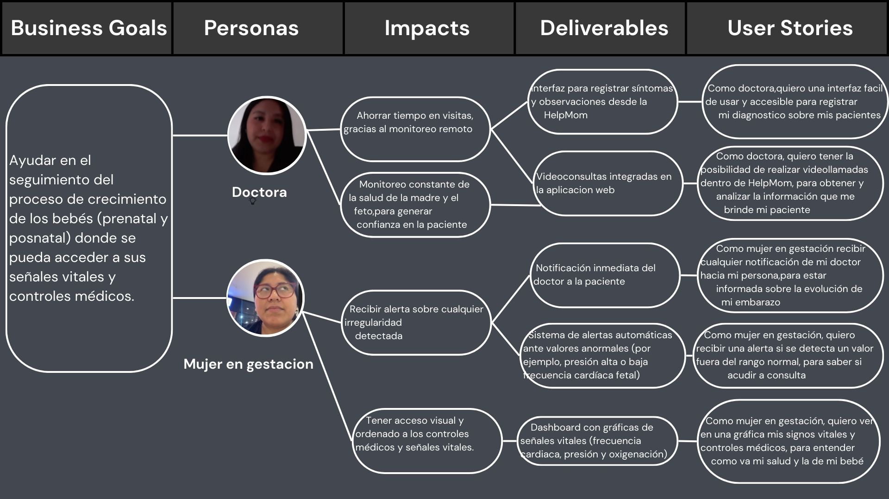

# Capítulo III: Requirements Specification

## 3.1. To-Be Scenario Mapping.

## 3.2. User Stories.

### 3.2.1 Technical Stories

<table>
  <tr>
    <th>ID</th>
    <th>Título</th>
    <th>Descripción</th>
    <th>Criterios de Aceptación</th>
  </tr>

  <!-- Escenario 1: Registro de Usuarios -->
  <tr>
    <td>TS21</td>
    <td>Registro de Usuarios </td>
    <td>Como usuario no registrado, quiero crear una cuenta con mi email, contraseña y datos personales (nombre, fecha de nacimiento), para acceder a las funcionalidades de la aplicación.</td>
    <td>
      <strong>Scenario 1: Registro exitoso</strong> 
      <strong>Given:</strong> El endpoint "/api/v1/register" está disponible. 
      <strong>When:</strong> Se envía un POST request con { "email": "paciente@example.com", "password": "Secure123", "name": "Juan Pérez", "birthdate": "1990-01-01" }. 
      <strong>Then:</strong> El sistema responde con status 201, crea el usuario en PostgreSQL y encripta la contraseña con bcrypt.  
      <strong>Scenario 2: Registro con email duplicado</strong> 
      <strong>Given:</strong> El endpoint "/api/v1/register" y un email ya registrado ("paciente@example.com"). 
      <strong>When:</strong> Se envía un POST request con el mismo email. 
      <strong>Then:</strong> El sistema responde con status 409 y el mensaje "Email already registered".
    </td>
  </tr>

  <!-- Escenario 2: Validación de Credenciales Médicas -->
  <tr>
    <td>TS22</td>
    <td>Validación de Credenciales Médicas</td>
    <td>Como médico, quiero subir mi certificado médico (PDF/IMG) para que el equipo administrativo valide mi identidad y me otorgue acceso a funcionalidades profesionales.</td>
    <td>
      <strong>Scenario 1: Subida exitosa de certificado</strong> 
      <strong>Given:</strong> El endpoint "/api/v1/doctors/:id/certificate" acepta archivos (multipart/form-data). 
      <strong>When:</strong> Se envía un POST request con el archivo certificate.pdf y el doctorId válido. 
      <strong>Then:</strong> El sistema guarda el archivo en AWS S3, marca al médico como pending_verification y responde con status 202.  
      <strong>Scenario 2: Subida con formato inválido</strong> 
      <strong>Given:</strong> El endpoint "/api/v1/doctors/:id/certificate". 
      <strong>When:</strong> Se envía un archivo certificate.txt (no soportado). 
      <strong>Then:</strong> El sistema responde con status 400 y el mensaje "Only PDF/JPEG/PNG allowed".
    </td>
  </tr>

  <!-- Escenario 3: Agendar Cita Médica -->
  <tr>
    <td>TS23</td>
    <td>Agendar Cita Médica</td>
    <td>Como paciente, quiero seleccionar una fecha/hora disponible en el calendario de un médico para agendar una cita.</td>
    <td>
      <strong>Scenario 1: Cita agendada correctamente</strong> 
      <strong>Given:</strong> El endpoint "/api/v1/appointments" y un slot disponible para el médico doctorId=123. 
      <strong>When:</strong> Se envía un POST request con { "doctorId": 123, "patientId": 456, "date": "2025-05-20", "time": "10:00" }. 
      <strong>Then:</strong> El sistema crea la cita en PostgreSQL, envía un email de confirmación y responde con status 201.  
      <strong>Scenario 2: Slot ya ocupado</strong> 
      <strong>Given:</strong> El endpoint "/api/v1/appointments" y un slot ya reservado. 
      <strong>When:</strong> Se intenta agendar la misma fecha/hora para el mismo médico. 
      <strong>Then:</strong> El sistema responde con status 409 y el mensaje "Time slot not available".
    </td>
  </tr>

  <!-- Escenario 4: Comunicación Encriptada (Chat) -->
  <tr>
    <td>TS24</td>
    <td>Comunicación Encriptada (Chat)</td>
    <td>Como paciente, quiero enviar mensajes encriptados a mi médico para discutir síntomas o resultados.</td>
    <td>
      <strong>Scenario 1: Mensaje enviado con éxito</strong> 
      <strong>Given:</strong> El endpoint "/api/v1/chat/messages" usa WebSockets con TLS. 
      <strong>When:</strong> Se envía { "senderId": "patient123", "receiverId": "doctor456", "content": "Tengo dolor de cabeza" }. 
      <strong>Then:</strong> El sistema encripta el mensaje (AES-256), lo guarda en MongoDB y devuelve status 200.  
      <strong>Scenario 2: Intento de acceso no autorizado</strong> 
      <strong>Given:</strong> El endpoint "/api/v1/chat/messages". 
      <strong>When:</strong> Un usuario sin JWT válido intenta enviar un mensaje. 
      <strong>Then:</strong> El sistema responde con status 401 y "Unauthorized".
    </td>
  </tr>

  <!-- Escenario 5: Monitoreo de Signos Vitales -->
  <tr>
    <td>TS25</td>
    <td>Monitoreo de Signos Vitales</td>
    <td>Como dispositivo wearable, quiero enviar datos de frecuencia cardíaca y presión arterial al servidor para monitoreo en tiempo real.</td>
    <td>
      <strong>Scenario 1: Datos válidos recibidos</strong> 
      <strong>Given:</strong> El endpoint "/api/v1/patients/:id/vitals" está activo. 
      <strong>When:</strong> Se envía un POST request con { "patientId": "789", "heartRate": 75, "bloodPressure": "120/80", "timestamp": "2025-04-23T12:00:00Z" }. 
      <strong>Then:</strong> El sistema guarda los datos en Firebase Realtime DB y responde con status 200.  
      <strong>Scenario 2: Datos incompletos</strong> 
      <strong>Given:</strong> El endpoint "/api/v1/patients/:id/vitals". 
      <strong>When:</strong> Se envía un request sin heartRate o bloodPressure. 
      <strong>Then:</strong> El sistema responde con status 400 y "Missing required fields".
    </td>
  </tr>

  <!-- Escenario 6: Generación de Recetas Digitales -->
  <tr>
    <td>TS26</td>
    <td>Generación de Recetas Digitales</td>
    <td>Como médico, quiero generar recetas con firma digital para que los pacientes las presenten en farmacias.</td>
    <td>
      <strong>Scenario 1: Receta firmada correctamente</strong> 
      <strong>Given:</strong> El endpoint "/api/v1/prescriptions" y un JWT válido de médico. 
      <strong>When:</strong> Se envía { "patientId": "456", "medication": "Paracetamol", "dosage": "500mg" }. 
      <strong>Then:</strong> El sistema genera un PDF con firma RSA, lo guarda en S3 y devuelve la URL (status 201).  
      <strong>Scenario 2: Intento sin autenticación</strong> 
      <strong>Given:</strong> El endpoint "/api/v1/prescriptions". 
      <strong>When:</strong> Un usuario no médico envía un request. 
      <strong>Then:</strong> El sistema responde con status 403 y "Forbidden: Doctor role required".
    </td>
  </tr>

  <!-- Escenario 7: Soporte Técnico (Creación de Tickets) -->
  <tr>
    <td>TS27</td>
    <td>Soporte Técnico (Creación de Tickets)</td>
    <td>Como usuario, quiero reportar problemas técnicos para recibir ayuda del equipo de soporte.</td>
    <td>
      <strong>Scenario 1: Ticket creado exitosamente</strong> 
      <strong>Given:</strong> El endpoint "/api/v1/support/tickets". 
      <strong>When:</strong> Se envía { "userId": "123", "issue": "No puedo subir archivos", "priority": "high" }. 
      <strong>Then:</strong> El sistema crea un ticket en Zendesk, envía un email de confirmación y responde con ticketId (status 201).  
      <strong>Scenario 2: Falta descripción del problema</strong> 
      <strong>Given:</strong> El endpoint "/api/v1/support/tickets". 
      <strong>When:</strong> Se envía un request sin el campo issue. 
      <strong>Then:</strong> El sistema responde con status 400 y "Issue description is required".
    </td>
  </tr>

  <!-- Escenario 8: Integración con Laboratorios (HL7/FHIR) -->
  <tr>
    <td>TS28</td>
    <td>Integración con Laboratorios (HL7/FHIR)</td>
    <td>Como administrador, quiero sincronizar resultados de exámenes de laboratorios externos automáticamente.</td>
    <td>
      <strong>Scenario 1: Resultados recibidos vía API HL7</strong> 
      <strong>Given:</strong> El endpoint "/api/v1/labs/results" está configurado para parsear HL7. 
      <strong>When:</strong> El laboratorio envía un mensaje HL7 con patientId=456 y testType="blood". 
      <strong>Then:</strong> El sistema guarda los datos en PostgreSQL y notifica al paciente (status 200).  
      <strong>Scenario 2: Mensaje HL7 mal formado</strong> 
      <strong>Given:</strong> El endpoint "/api/v1/labs/results". 
      <strong>When:</strong> Se recibe un mensaje HL7 inválido (sin patientId). 
      <strong>Then:</strong> El sistema responde con status 400 y "Invalid HL7 message".
    </td>
  </tr>

  <!-- Escenario 9: Recordatorios de Citas (Automáticos) -->
  <tr>
    <td>TS29</td>
    <td>Recordatorios de Citas (Automáticos)</td>
    <td>Como sistema, quiero enviar recordatorios de citas 24 horas antes para reducir inasistencias.</td>
    <td>
      <strong>Scenario 1: Notificación enviada por SMS</strong> 
      <strong>Given:</strong> Un cron job ejecuta checkAppointments diariamente. 
      <strong>When:</strong> Encuentra una cita próxima (appointmentId=789). 
      <strong>Then:</strong> El sistema envía un SMS via Twilio al paciente y registra el envío en la DB.  
      <strong>Scenario 2: Paciente sin número de teléfono</strong> 
      <strong>Given:</strong> El cron job checkAppointments. 
      <strong>When:</strong> La cita no tiene phoneNumber asociado. 
      <strong>Then:</strong> El sistema envía un email en su lugar y registra el fallo en logs.
    </td>
  </tr>

</table>

## 3.3. Impact Mapping.
Impact Mapping es una técnica visual que facilita la definición clara de los objetivos que queremos alcanzar y cómo estos se relacionan con nuestros usuarios. Esta herramienta nos permite mantener el enfoque y orientar nuestros esfuerzos hacia el cumplimiento del objetivo principal. Al finalizar el mapa, se identifican las funcionalidades y acciones necesarias para desarrollar el proyecto de forma eficiente.

## 3.4. Product Backlog.