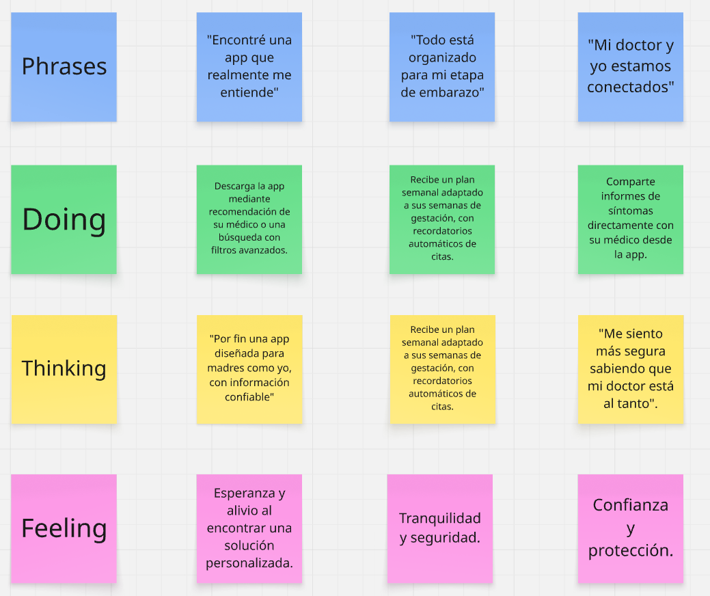
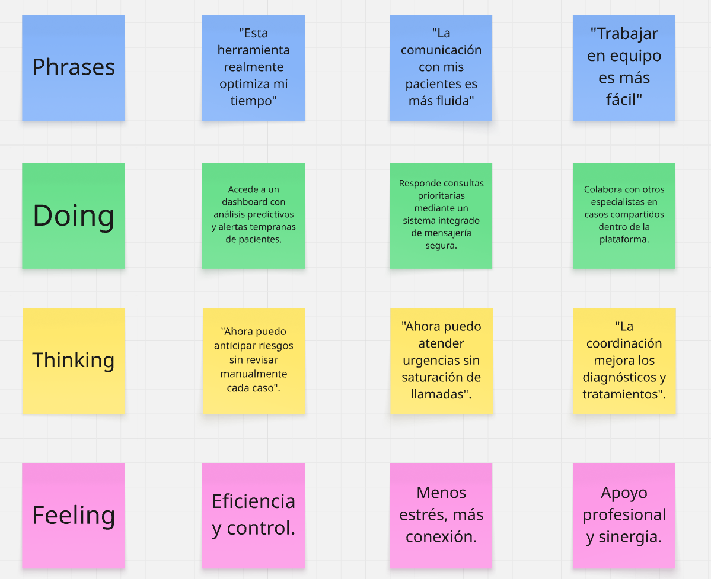
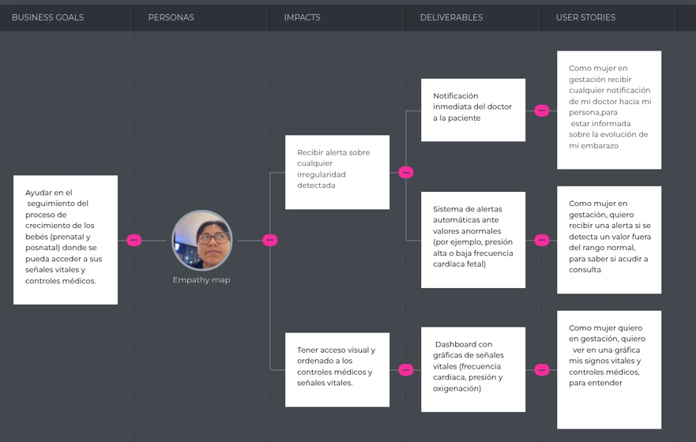
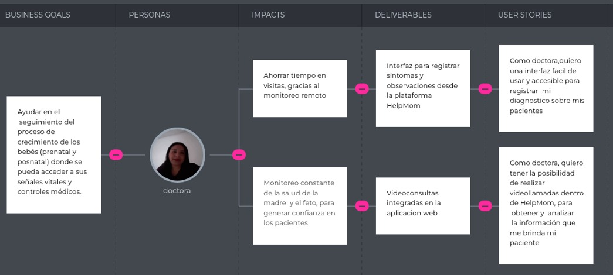

# Capítulo III: Requirements Specification

## 3.1. To-Be Scenario Mapping.

Durante el desarrollo del mapa "To Be", se llevó a cabo una lluvia de ideas para generar propuestas de mejora. A partir de esta dinámica, se identificaron soluciones viables para abordar los retos y problemas detectados en el mapa "As Is". Luego, se definieron las etapas del proceso como columnas dentro del mapa "To Be", incorporando en cada una las mejoras sugeridas. Entre estas mejoras destacan la incorporación de un sistema de mensajería entre la obstetra y la paciente, un plan semanal para monitorear la evolución del embarazo, y una opción para que la gestante pueda compartir reportes de síntomas directamente con la obstetra.

**Segmento objetivo 1:** Madres:

**Segmento objetivo 2:** Doctores

## 3.2. User Stories.

| **Epic/Story ID** | **Título**                   | **Descripción**                                                                                                                                                                                                            | **Criterios de aceptación**                                                                                                                                                                                                                                    |
|-------------------|------------------------------|----------------------------------------------------------------------------------------------------------------------------------------------------------------------------------------------------------------------------|----------------------------------------------------------------------------------------------------------------------------------------------------------------------------------------------------------------------------------------------------------------|
| EP1               | Información de StartUp       | Como visitante, quiero conocer información sobre la startup para entender su propósito y confiar en sus servicios.                                                                                                           | **Escenario 1:** - **Dado** que el usuario navega a la sección de servicios. - **Cuando** accede a la página. - **Entonces** se muestra una descripción clara de lo que ofrece WebExpert.                                                              |
| EP2               | Sobre el Producto            | Como visitante, quiero conocer detalles del producto para evaluar si satisface mis necesidades.                                                                                                                            | **Escenario 1:** - **Dado** que el usuario busca funcionalidades del producto. - **Cuando** accede a la sección correspondiente. - **Entonces** se listan claramente las características principales de HelpMom.                                      |
| EP3               | Planes y Suscripciones       | Como visitante, quiero conocer los planes disponibles para decidir si suscribirme.                                                                                                                                         | **Escenario 1:** - **Dado** que el usuario visualiza los planes. - **Cuando** accede a la sección de suscripciones. - **Entonces** se detallan las características y el costo de cada plan (mensual/anual).                                          |
| EP4               | Preguntas frecuentes         | Como visitante, quiero acceder a preguntas frecuentes para resolver dudas rápidamente.                                                                                                                                     | **Escenario 1:** - **Dado** que el usuario busca una pregunta específica. - **Cuando** utiliza la barra de búsqueda o navega por categorías. - **Entonces** puede encontrar la información fácilmente.                                               |
| EP5               | Contacto                     | Como visitante, quiero contactar al equipo de la startup para obtener asistencia personalizada.                                                                                                                            | **Escenario 1:** - **Dado** que el usuario completa el formulario de contacto. - **Cuando** envía el mensaje. - **Entonces** recibe una confirmación de envío.                                                         |
| EP1               | Ingreso de datos médicos     | Como doctor, quiero ingresar información médica relevante para que se mantenga actualizado el historial clínico del embarazo y la salud del bebé.                                                                          | **Escenario 1:** - **Dado** que el doctor realiza una consulta médica. - **Cuando** ingresa nuevos datos clínicos. - **Entonces** estos se guardan en el historial médico digital del usuario.                                                       |
| EP2               | Gestionar datos personales   | Como usuario de la plataforma, quiero poder registrar y actualizar mis datos personales para asegurarme de que mi información esté siempre completa y correcta.                                                            | **Escenario 1:** - **Dado** que el usuario edita sus datos personales. - **Cuando** guarda los cambios y actualiza la página. - **Entonces** se muestra la información actualizada.                                                                  |
| EP3               | Comunicación personalizada   | Como madre gestante, quiero comunicarme directamente con un profesional de salud para recibir orientación personalizada y resolver mis dudas.                                                                              | **Escenario 1:** - **Dado** que existe una conversación activa con un profesional. - **Cuando** la madre envía un nuevo mensaje. - **Entonces** este aparece instantáneamente en el chat.                                                            |
| EP4               | Soporte al usuario           | Como usuario, quiero tener acceso a soporte técnico y funcional para resolver problemas relacionados con el uso de la plataforma.                                                                                           | **Escenario 1:** - **Dado** que el usuario completa el formulario de soporte. - **Cuando** envía el ticket. - **Entonces** este se almacena en la base de datos y se notifica al equipo de soporte.                                                 |
| EP5               | Monitoreo de bebés           | Como madre gestante, quiero registrar y visualizar la información del desarrollo de mi bebé para llevar un seguimiento de su crecimiento y bienestar.                                                                      | **Escenario 1:** - **Dado** que la madre ingresa un nuevo dato de crecimiento. - **Cuando** guarda la información. - **Entonces** esta se refleja en el gráfico de evolución.                                                                       |
| EP6               | Historial de citas médicas   | Como usuaria, quiero visualizar el historial de mis citas médicas para consultar fácilmente las fechas, profesionales y resultados de consultas anteriores.                                                               | **Escenario 1:** - **Dado** que el usuario accede a la sección de historial. - **Cuando** selecciona "Citas médicas". - **Entonces** se muestran todas sus citas anteriores ordenadas por fecha.                                                    |
| EP7               | Calendario de citas médicas  | Como usuaria, quiero visualizar mis citas médicas programadas y recibir recordatorios para no perder ningún control importante.                                                                                           | **Escenario 1:** - **Dado** que el usuario accede al calendario. - **Cuando** selecciona una vista (día/semana/mes). - **Entonces** puede visualizar sus citas programadas de forma clara.                                                          |
| EP8               | Gestión de suscripción       | Como usuaria, quiero poder ver mi plan de suscripción actual, modificarlo o cancelarlo de forma sencilla y transparente.                                                                                                 | **Escenario 1:** - **Dado** que el usuario accede a la gestión de suscripción. - **Cuando** revisa su plan actual. - **Entonces** puede ver el tipo de plan y la fecha de vencimiento.                                                              |

---

### User Stories Detalladas:

| **Story ID** | **Título**                                | **Descripción**                                                                                                                         | **Criterios de aceptación**                                                                                                                                                                                                                              | **Relacionado con (Epic ID)** |
|--------------|-------------------------------------------|-----------------------------------------------------------------------------------------------------------------------------------------|----------------------------------------------------------------------------------------------------------------------------------------------------------------------------------------------------------------------------------------------------------|-------------------------------|
| HU1          | Visualización de información de startup   | Como invitado, quiero visualizar la información de la startup para informarme sobre la empresa.                                        | **Escenario 1:** - **Dado** que hay texto ingresado en la información de la startup. - **Cuando** el usuario accede a la página. - **Entonces** se muestra la información correctamente.  **Escenario 2:** - **Dado** que no hay información cargada. - **Cuando** el usuario accede a la página. - **Entonces** se muestra el `aria-label` correspondiente. | EP1                           |
| HU2          | Visualización de foto de startup          | Como invitado, quiero visualizar la foto de la startup para informarme sobre la empresa.                                               | **Escenario 1:** - **Dado** que hay una imagen válida cargada. - **Cuando** el usuario accede a la página. - **Entonces** se muestra la imagen correctamente.  **Escenario 2:** - **Dado** que la imagen no se carga. - **Cuando** el usuario accede a la página. - **Entonces** se muestra el `aria-label` correspondiente. | EP1                           |
| HU3          | Visualización de información de producto  | Como invitado, quiero visualizar la información del producto para informarme sobre lo que se ofrece.                                  | **Escenario 1:** - **Dado** que hay información cargada sobre el producto. - **Cuando** el usuario accede a la página. - **Entonces** se muestra la información correctamente.  **Escenario 2:** - **Dado** que no hay información cargada. - **Cuando** el usuario accede a la página. - **Entonces** se muestra el `aria-label` correspondiente. | EP2                           |
| HU4          | Visualización de foto de producto         | Como invitado, quiero visualizar la foto del producto para informarme sobre lo que se ofrece.                                         | **Escenario 1:** - **Dado** que hay una imagen válida cargada. - **Cuando** el usuario accede a la página. - **Entonces** se muestra la imagen correctamente.  **Escenario 2:** - **Dado** que la imagen no se carga. - **Cuando** el usuario accede a la página. - **Entonces** se muestra el `aria-label` correspondiente. | EP2                           |
| HU5          | Ingreso a la aplicación web               | Como invitado, quiero ingresar a la aplicación web para hacer uso del producto.                                                       | **Escenario 1:** - **Dado** que el enlace a la aplicación es válido. - **Cuando** el usuario hace clic en el enlace. - **Entonces** se carga la aplicación correctamente.  **Escenario 2:** - **Dado** que el enlace no carga la información. - **Cuando** el usuario hace clic en el enlace. - **Entonces** se muestra el `aria-label` correspondiente. | EP2                           |
| HU6          | Visualización de información de planes    | Como invitado, quiero visualizar la información de los planes para informarme sobre la membresía.                                     | **Escenario 1:** - **Dado** que hay información cargada sobre los planes. - **Cuando** el usuario accede a la página. - **Entonces** se muestra la información correctamente.  **Escenario 2:** - **Dado** que no hay información cargada. - **Cuando** el usuario accede a la página. - **Entonces** se muestra el `aria-label` correspondiente. | EP3                           |
| HU7          | Visualización de preguntas frecuentes     | Como invitado, quiero visualizar las preguntas frecuentes y sus respuestas para solucionar dudas sobre el producto.                   | **Escenario 1:** - **Dado** que hay preguntas frecuentes cargadas. - **Cuando** el usuario accede a la página. - **Entonces** se muestra la información correctamente.  **Escenario 2:** - **Dado** que no hay información cargada. - **Cuando** el usuario accede a la página. - **Entonces** se muestra el `aria-label` correspondiente. | EP4                           |
| HU8          | Visualización de imágenes de preguntas frecuentes | Como invitado, quiero visualizar las imágenes en las preguntas frecuentes para solucionar dudas sobre el producto.            | **Escenario 1:** - **Dado** que hay una imagen válida cargada. - **Cuando** el usuario accede a la pregunta frecuente. - **Entonces** se muestra la imagen correctamente.  **Escenario 2:** - **Dado** que la imagen no se carga. - **Cuando** el usuario accede a la pregunta frecuente. - **Entonces** se muestra el `aria-label` correspondiente. | EP4                           |
| HU9          | Ingreso de datos personales y consulta    | Como invitado, quiero ingresar mi nombre, correo y un mensaje para comunicarme con la startup.                                        | **Escenario 1:** - **Dado** que los datos ingresados son válidos (nombre, correo y mensaje). - **Cuando** el usuario envía el formulario. - **Entonces** se envía el correo correctamente.  **Escenario 2:** - **Dado** que hay campos vacíos. - **Cuando** el usuario intenta enviar el formulario. - **Entonces** se muestra un mensaje de error.  **Escenario 3:** - **Dado** que el correo ingresado es inválido. - **Cuando** el usuario intenta enviar el formulario. - **Entonces** se muestra un mensaje de error. | EP5                           |
| HU10         | Ingreso de recetas médicas                | Como doctor, quiero registrar la receta médica de mi paciente para detallar los medicamentos que toma.                                | **Escenario 1:** - **Dado** que se ingresan datos válidos del medicamento. - **Cuando** el doctor envía el formulario. - **Entonces** se muestra el medicamento registrado.  **Escenario 2:** - **Dado** que el formulario se completa correctamente. - **Cuando** el doctor envía el formulario. - **Entonces** se muestra un mensaje de guardado exitoso. | EP6                           |
| HU11         | Añadir instrucciones                      | Como doctor, quiero agregar instrucciones a las recetas para prevenir errores en la medicación.                                       | **Escenario 1:** - **Dado** que el doctor ingresa instrucciones detalladas. - **Cuando** se guarda la receta. - **Entonces** las instrucciones quedan registradas.  **Escenario 2:** - **Dado** que las instrucciones están vacías. - **Cuando** el doctor intenta guardar la receta. - **Entonces** se muestra un mensaje de error. | EP6                           |
| HU12         | Historial de recetas                      | Como doctor, quiero visualizar los medicamentos registrados para mejorar el diagnóstico y mantener un historial.                      | **Escenario 1:** - **Dado** que existen recetas registradas. - **Cuando** el doctor accede al historial. - **Entonces** se muestra una lista ordenada de recetas.  **Escenario 2:** - **Dado** que el doctor está en la vista del paciente. - **Cuando** selecciona la opción de historial. - **Entonces** se redirige al historial de recetas. | EP6                           |
| HU13         | Ingreso de nombre completo                | Como usuario, quiero registrar mi nombre para identificarme.                                                                          | **Escenario 1:** - **Dado** que el nombre ingresado es válido. - **Cuando** el usuario envía el formulario. - **Entonces** el nombre se guarda correctamente.  **Escenario 2:** - **Dado** que el nombre está vacío. - **Cuando** el usuario intenta guardar. - **Entonces** se muestra un mensaje de error. | EP7                           |
| HU14         | Ingreso de correo                         | Como usuario, quiero registrar mi correo para identificarme en la aplicación.                                                         | **Escenario 1:** - **Dado** que el correo ingresado es válido. - **Cuando** el usuario envía el formulario. - **Entonces** el correo se guarda correctamente.  **Escenario 2:** - **Dado** que el correo tiene un formato inválido. - **Cuando** el usuario intenta guardar. - **Entonces** se muestra un mensaje de error. | EP7                           |
| HU15         | Registro de certificado médico del doctor | Como doctor, quiero registrar mi certificado médico para validar mi identidad.                                                       | **Escenario 1:** - **Dado** que el doctor sube un certificado en PDF o imagen. - **Cuando** se envía el formulario. - **Entonces** se guarda el certificado.  **Escenario 2:** - **Dado** que el certificado se guarda correctamente. - **Cuando** se completa el proceso. - **Entonces** se muestra un mensaje de éxito. | EP8                           |
| HU16         | Registro de número telefónico de doctor   | Como madre, quiero registrar el número telefónico de una doctora para guardar su contacto.                                           | **Escenario 1:** - **Dado** que el número ingresado es válido. - **Cuando** la madre guarda el contacto. - **Entonces** el número se almacena en el perfil.  **Escenario 2:** - **Dado** que el número se guarda correctamente. - **Cuando** se completa el proceso. - **Entonces** el contacto queda registrado. | EP8                           |
| HU17         | Envío de mensaje                          | Como madre, quiero enviar un mensaje a una doctora para comunicarme con ella.                                                         | **Escenario 1:** - **Dado** que la madre redacta un mensaje. - **Cuando** lo envía. - **Entonces** el mensaje se envía correctamente.  **Escenario 2:** - **Dado** que el mensaje se envía. - **Cuando** se completa el proceso. - **Entonces** se muestra una confirmación de envío. | EP8                           |
| HU18         | Ingreso de consulta                       | Como madre, quiero enviar un mensaje a soporte técnico para comunicar un problema con la aplicación.                                 | **Escenario 1:** - **Dado** que la madre describe el problema. - **Cuando** envía el formulario. - **Entonces** la consulta se registra.  **Escenario 2:** - **Dado** que el formulario no está completo. - **Cuando** la madre intenta enviarlo. - **Entonces** se muestra un mensaje de error. | EP9                           |
| HU19         | Respuesta del servicio técnico            | Como madre, quiero recibir la respuesta del servicio técnico para solucionar un problema con la aplicación.                           | **Escenario 1:** - **Dado** que hay una respuesta disponible. - **Cuando** la madre accede a su bandeja. - **Entonces** se muestra la notificación.  **Escenario 2:** - **Dado** que la madre quiere ver el historial. - **Cuando** accede a la sección correspondiente. - **Entonces** se muestran las respuestas anteriores. | EP9                           |
| HU20         | Registro de signos vitales de la madre    | Como madre, quiero ingresar manualmente mis signos vitales para llevar un control actualizado de mi estado de salud.                  | **Escenario 1:** - **Dado** que los datos ingresados son válidos. - **Cuando** la madre envía el formulario. - **Entonces** los datos se guardan correctamente.  **Escenario 2:** - **Dado** que los datos son inválidos o incompletos. - **Cuando** la madre intenta guardar. - **Entonces** se muestra un mensaje de error. | EP10                          |
| HU21         | Registro de signos vitales del bebé postnatal | Como madre con bebé postnatal, quiero ingresar manualmente los signos vitales de mi bebé para llevar un control preciso de su salud. | **Escenario 1:** - **Dado** que el bebé es postnatal. - **Cuando** la madre accede al formulario. - **Entonces** se muestra el formulario de signos vitales.  **Escenario 2:** - **Dado** que los datos son inválidos. - **Cuando** la madre intenta guardar. - **Entonces** se muestra un mensaje de error. | EP10                          |
| HU22         | Restricción y confirmación de ingreso de signos vitales | Como madre, quiero que el sistema confirme el ingreso exitoso y restrinja registros incompletos para asegurar la validez de los datos. | **Escenario 1:** - **Dado** que los datos son válidos y completos. - **Cuando** la madre envía el formulario. - **Entonces** se muestra una confirmación de registro exitoso.  **Escenario 2:** - **Dado** que hay datos inválidos o faltantes. - **Cuando** la madre intenta enviar el formulario. - **Entonces** el sistema bloquea el envío. | EP10                          |

### 3.2.1 Technical Stories

| ID  | Título                                | Descripción                                                                                                                                 | Criterios de Aceptación                                                                                                                                                                                                                                                                                                                                 |
|-----|---------------------------------------|---------------------------------------------------------------------------------------------------------------------------------------------|---------------------------------------------------------------------------------------------------------------------------------------------------------------------------------------------------------------------------------------------------------------------------------------------------------------------------------------------------------|
| TS21| Registro de Usuarios                  | Como usuario no registrado, quiero crear una cuenta con mi email, contraseña y datos personales para acceder a las funcionalidades.         | **Escenario 1: Registro exitoso** - **Dado** que el endpoint "/api/v1/register" está disponible - **Cuando** se envía un POST request con datos válidos - **Entonces** el sistema responde con status 201 y crea el usuario  **Escenario 2: Email duplicado** - **Dado** que el email ya está registrado - **Cuando** se intenta registrar - **Entonces** el sistema responde con status 409 |
| TS22| Validación de Credenciales Médicas    | Como médico, quiero subir mi certificado médico para que el equipo administrativo valide mi identidad.                                      | **Escenario 1: Subida exitosa** - **Dado** que el doctor tiene un certificado válido - **Cuando** se envía al endpoint correspondiente - **Entonces** el sistema guarda el archivo y marca como pending_verification  **Escenario 2: Formato inválido** - **Dado** un archivo no soportado - **Cuando** se intenta subir - **Entonces** el sistema rechaza con status 400 |
| TS23| Agendar Cita Médica                   | Como paciente, quiero seleccionar una fecha/hora disponible en el calendario de un médico.                                                 | **Escenario 1: Cita agendada** - **Dado** un slot disponible - **Cuando** se reserva correctamente - **Entonces** el sistema crea la cita y envía confirmación  **Escenario 2: Slot ocupado** - **Dado** un horario ya reservado - **Cuando** se intenta agendar - **Entonces** el sistema responde con status 409 |
| TS24| Comunicación Encriptada (Chat)        | Como paciente, quiero enviar mensajes encriptados a mi médico para discutir síntomas.                                                      | **Escenario 1: Mensaje exitoso** - **Dado** un chat activo - **Cuando** se envía mensaje válido - **Entonces** el sistema encripta y almacena el mensaje  **Escenario 2: Acceso no autorizado** - **Dado** un usuario sin credenciales - **Cuando** intenta enviar mensaje - **Entonces** el sistema rechaza con status 401 |
| TS25| Monitoreo de Signos Vitales           | Como dispositivo wearable, quiero enviar datos de frecuencia cardíaca y presión arterial al servidor.                                      | **Escenario 1: Datos válidos** - **Dado** mediciones correctas - **Cuando** se envían al endpoint - **Entonces** el sistema guarda en Firebase  **Escenario 2: Datos incompletos** - **Dado** campos faltantes - **Cuando** se intenta enviar - **Entonces** el sistema rechaza con status 400 |
| TS26| Generación de Recetas Digitales       | Como médico, quiero generar recetas con firma digital para que los pacientes las presenten en farmacias.                                   | **Escenario 1: Receta firmada** - **Dado** un médico autenticado - **Cuando** genera receta válida - **Entonces** el sistema crea PDF firmado  **Escenario 2: Sin permisos** - **Dado** usuario no médico - **Cuando** intenta generar receta - **Entonces** el sistema rechaza con status 403 |
| TS27| Soporte Técnico (Creación de Tickets) | Como usuario, quiero reportar problemas técnicos para recibir ayuda del equipo de soporte.                                                 | **Escenario 1: Ticket creado** - **Dado** un problema válido - **Cuando** se reporta correctamente - **Entonces** el sistema crea ticket en Zendesk  **Escenario 2: Descripción faltante** - **Dado** campo issue vacío - **Cuando** se intenta enviar - **Entonces** el sistema rechaza con status 400 |
| TS28| Integración con Laboratorios (HL7/FHIR)| Como administrador, quiero sincronizar resultados de exámenes de laboratorios externos automáticamente.                                    | **Escenario 1: Resultados recibidos** - **Dado** mensaje HL7 válido - **Cuando** llega al endpoint - **Entonces** el sistema procesa y notifica  **Escenario 2: Mensaje inválido** - **Dado** HL7 mal formado - **Cuando** se recibe - **Entonces** el sistema rechaza con status 400 |
| TS29| Recordatorios de Citas (Automáticos)  | Como sistema, quiero enviar recordatorios de citas 24 horas antes para reducir inasistencias.                                              | **Escenario 1: SMS enviado** - **Dado** cita próxima con teléfono - **Cuando** se ejecuta el cron job - **Entonces** el sistema envía SMS  **Escenario 2: Email alternativo** - **Dado** cita sin teléfono - **Cuando** se ejecuta cron job - **Entonces** el sistema envía email |

## 3.3. Impact Mapping.
Impact Mapping es una técnica visual que facilita la definición clara de los objetivos que queremos alcanzar y cómo estos se relacionan con nuestros usuarios. Esta herramienta nos permite mantener el enfoque y orientar nuestros esfuerzos hacia el cumplimiento del objetivo principal. Al finalizar el mapa, se identifican las funcionalidades y acciones necesarias para desarrollar el proyecto de forma eficiente.

Segmento objetivo #1: Mujer en gestacion

Segmento objetivo #2: Obstetra

## 3.4. Product Backlog.

| #  | User Story Id | Título                         | Descripción                                                                                     | Story Points | Epic Relacionado    |
|----|--------------|--------------------------------|-------------------------------------------------------------------------------------------------|--------------|---------------------|
| 1  | HU20         | Seguimiento de signos vitales  | Como madre/médico quiero registrar y visualizar signos vitales para monitorear bienestar fetal/materno. | 8 | Monitoreo de bebés  |
| 2  | HU10         | Ingreso de recetas médicas     | Como doctor quiero registrar recetas médicas para que los pacientes sigan tratamientos correctamente. | 5 | Ingreso de datos    |
| 3  | HU12         | Historial de recetas           | Como doctor quiero revisar historial de medicamentos recetados para mejorar diagnósticos.        | 5 | Ingreso de datos    |
| 4  | HU21         | Visualización de medicamentos  | Como madre quiero consultar medicamentos anteriores para reponer recetas.                      | 5 | Historial de citas  |
| 5  | HU23         | Gestión de citas (doctores)    | Como doctor quiero organizar las agendas de mis pacientes.                                      | 5 | Calendario de citas |
| 6  | HU-SUB       | Gestión de suscripción premium | Como usuario quiero actualizar mi plan premium para acceder a funciones exclusivas.            | 5 | Monetización        |
| 7  | HU18         | Ingreso de consulta            | Como madre quiero reportar problemas técnicos para obtener soporte inmediato.                   | 3 | Soporte al usuario  |
| 8  | HU17         | Envío de mensaje               | Como madre quiero comunicarme directamente con mi doctora para resolver dudas urgentes.         | 3 | Comunicación        |
| 9  | HU11         | Añadir instrucciones           | Como doctor quiero agregar notas a las recetas para evitar errores en la medicación.            | 3 | Ingreso de datos    |
| 10 | HU16         | Registro de número telefónico  | Como madre quiero guardar el contacto de mi doctora para emergencias.                          | 3 | Comunicación        |
| 11 | HU19         | Respuesta del servicio técnico | Como madre quiero recibir soluciones a mis reportes técnicos.                                  | 3 | Soporte al usuario  |
| 12 | HU15         | Registro de certificado médico | Como doctor quiero validar mi credencial profesional en la plataforma.                         | 3 | Comunicación        |
| 13 | HU24         | Gestión de citas (pacientes)   | Como paciente quiero ver mis citas programadas para no olvidarlas.                             | 3 | Calendario de citas |
| 14 | HU14         | Ingreso de correo              | Como usuario quiero registrar mi correo para recibir notificaciones importantes.               | 2 | Datos personales    |
| 15 | HU13         | Ingreso de nombre completo     | Como usuario quiero personalizar mi perfil con mi identidad real.                              | 2 | Datos personales    |
