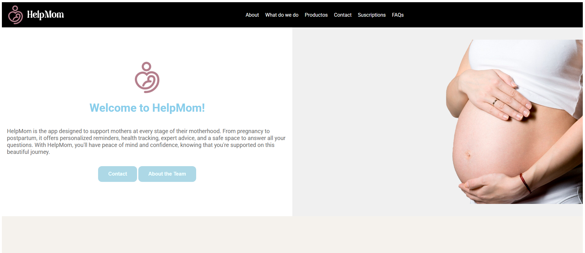
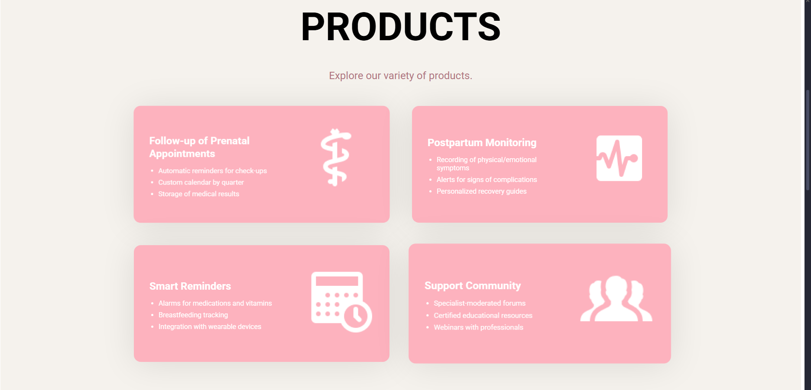
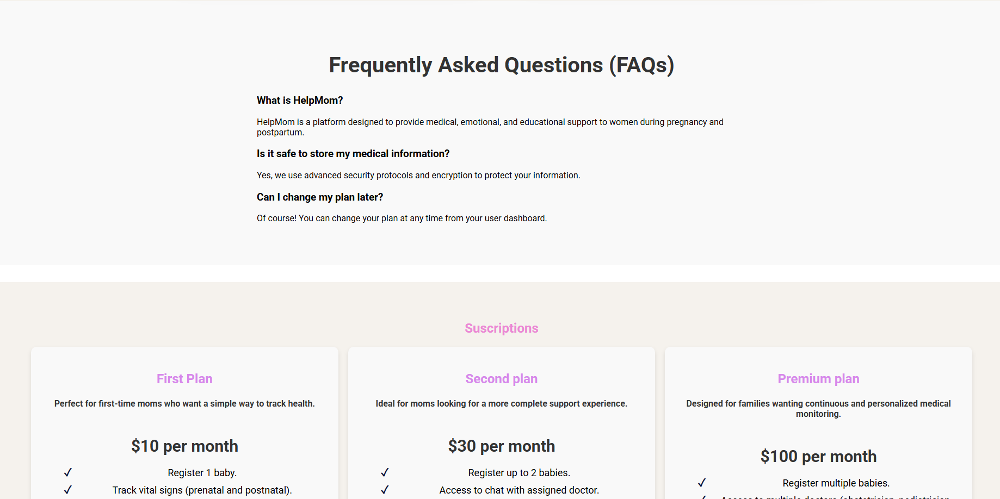
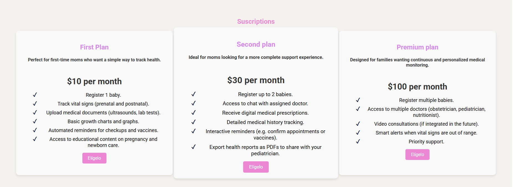
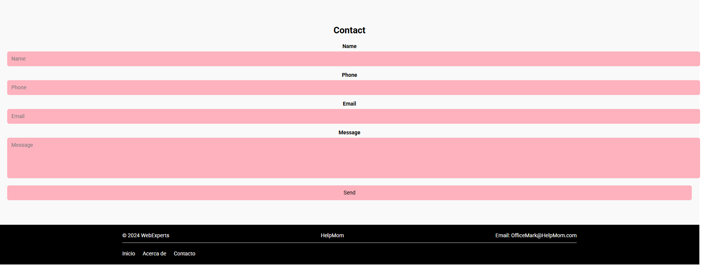

# Capítulo V: Product Implementation, Validation & Deployment

## 5.1. Software Configuration Management.

En esta sección se muestran las decisiones y convenciones que permitirán mantener consistencia durante el ciclo de vida del proyecto.

### 5.1.1. Software Development Environment Configuration.

En esta sección, se incluirá los productos de software que se usaron en el proyecto.
Los enlaces a cada una de las herramientas se encuentran disponibles en los anexos.

##### Project Management:
- Trello: Herramienta de gestión de proyectos basada en Kanban, utilizada para planificar tareas y asignar responsabilidades al equipo.

##### Product UX/UI Design:
- Figma: Herramienta colaborativa para crear prototipos interactivos de interfaces.
- Lucidchart: Para creación de diagramas de flujo.
- Uxpressia: Para elaboración de mapas de empatía y recorridos del usuario.
- Structurizr: Para modelado de arquitectura de software.

#### Software Development
- IntelliJ IDEA: IDE para desarrollo backend en Java. Para el primer y segundo sprint se utilizó para la redacción del informe del proyecto.
- WebStorm: IDE especializado para el desarrollo frontend. Se utilizó para el desarrollo de la Landing Page y frontend de la aplicación.
- Visual Studio Code: Editor utilizado únicamente para la exportación del reporte de formato markdown a PDF.
- GitHub: Plataforma de control de versiones y colaboración.

#### Software Deployment
- GitHub Pages: Servicio de despliegue de aplicaciones web estáticas desde repositorios GitHub.
- Netlify: Plataforma de despliegue continuo que permite publicar aplicaciones web estáticas y JAMstack. Fue utilizada para el despliegue del frontend.

### 5.1.2. Source Code Management.

**Gestión del Proyecto en GitHub**:
En este proyecto, utilizamos GitHub como plataforma principal para el control de versiones y gestión colaborativa del código fuente bajo una organización dedicada.

**Repositorios** en GitHub
- **Organización**: [https://github.com/HelpMom-AppWeb](https://github.com/HelpMom-AppWeb)
- **Landing Page**: [https://github.com/HelpMom-AppWeb/landing-page](https://github.com/HelpMom-AppWeb/landing-page)
- **Informe Final**: [https://github.com/HelpMom-AppWeb/final-report](https://github.com/HelpMom-AppWeb/final-report)
- **Frontend**: [https://github.com/HelpMom-AppWeb/HelpMom-frontend.git](https://github.com/HelpMom-AppWeb/HelpMom-frontend.git)

#### Modelo de ramificación: GitFlow

Para el modelo de desarrollo, se decidió usar GitFlow como modelo de ramificación. Este modelo permite una gestión eficiente de las ramas y facilita la colaboración entre los desarrolladores.

Para el repositorio del informe final se crearon las siguientes ramas:
- **dev:** Rama principal de desarrollo, donde se integrarán todas las características y correcciones de errores.
- **chapter-1:** Rama para el desarrollo del capítulo 1 del informe.
- **chapter-2:** Rama para el desarrollo del capítulo 2 del informe.
- **chapter-3:** Rama para el desarrollo del capítulo 3 del informe.
- **chapter-4:** Rama para el desarrollo del capítulo 4 del informe.
- **chapter-5:** Rama para el desarrollo del capítulo 5 del informe.

Para el repositorio de Landing Page se crearon las siguientes ramas:
- **main:** Rama principal de desarrollo, donde se integrarán todas las características y correcciones de errores.

Para el repositorio del Fronted se crearon las siguientes ramas:
- **develop**: Rama principal donde una vez concluida la programación de un bounded context se hace un merge a esta rama.
- **feature/patient-management**: Rama donde se desarrolla el bounded context
- **feature/medication**: Rama donde se desarrolla el bounded context
- **feature/baby-monitoring**: Rama donde se desarrolla el bounded context
- **feature/chat**: Rama donde se desarrolla el bounded context
- **feature/appointments**: Rama donde se desarrolla el bounded context
- 
#### Estilo de commits: Conventional Commits
Para asegurar mensajes de commits claros y estandarizados, se seguirá la convención [Conventional Commits](https://www.conventionalcommits.org/en/v1.0.0/). Algunos ejemplos:

- `feat: add search by name functionality`
- `fix: correct form validation error`
- `docs: update installation instructions`
- `refactor: simplify calculation logic`

El prefijo de categorías se define de la siguiente forma:
- `feat`: A new feature
- `fix`: A bug fix
- `docs`: Documentation only changes
- `style`: Changes that do not affect the meaning of the code (formatting, missing semicolons, etc.)
- `refactor`: A code change that neither fixes a bug nor adds a feature
- `test`: Adding missing tests or correcting existing ones
- `chore`: Changes to the build process or auxiliary tools

### 5.1.3. Source Code Style Guide & Conventions.

Establecemos las siguientes convenciones para garantizar consistencia y calidad en el desarrollo del proyecto, aplicables a todos los lenguajes y tecnologías utilizados (HTML, CSS, JavaScript, Vue.js, C# y Gherkin). Todas las nomenclaturas seguirán el idioma inglés y estándares reconocidos.

1. **HTML y CSS**

   **Estándares**:
      - Basados en recomendaciones del **W3C** y **Google Style Guide**
      - Identación: **2 espacios**
      - Comillas: **Dobles** para atributos HTML
      - Comentarios: Descriptivos y en inglés

   **Metodología**:
      - **BEM** (Block-Element-Modifier) para clases CSS
      - **HTML semántico**: Uso correcto de etiquetas (`<header>`, `<section>`, etc.)
   
      **Vue.js**:
     - Componentes: **PascalCase** (ej. `UserProfile.vue`)
     - Props/Métodos: **camelCase**

2. **JavaScript**

   **Guías**:
   - Según **MDN** y **Google JavaScript Style Guide**
   - Variables/funciones: **camelCase** (ej. `calculateTotal`)
   - Declaración: Siempre `const` o `let` (nunca `var`)
   - Literales: Comillas **simples** (`'texto'`)
   - Funciones: Preferir **arrow functions**

3. **Vue.js**

   **Convenciones**:
   - Directivas abreviadas: `@` para `v-on`, `:` para `v-bind`
   - Organización:
      - Componentes en carpetas por funcionalidad
      - Ciclo de vida ordenado (`created()`, `mounted()`, etc.)

4. C# (ASP.NET Core)

   **Estilo Microsoft**:
   - Clases/Métodos: **PascalCase** (ej. `UserService`)
   - Variables/parámetros: **camelCase**
   - Documentación: Comentarios **XML** (`/// 
`)

   **ASP.NET Core**:
   - Inyección de dependencias (DI)
   - Separación clara de capas (MVC)
   - Uso de **ViewModels**

5. Gherkin (.feature)

   **Prácticas**:
   - Keywords: **Given-When-Then** (ej. `Given a logged-in admin`)
   - Lenguaje: **Claro y no técnico**
   - Estructura:
      - Escenarios modulares
      - Pasos reutilizables

**Buenas Prácticas Generales**
- **Modularidad** y reutilización de código
- **Legibilidad** (nombres descriptivos, indentación consistente)
- **Optimización** de rendimiento
- **Seguridad** integrada en el diseño

Estas convenciones aseguran coherencia, mantenibilidad y calidad en todo el código del proyecto.

### 5.1.4. Software Deployment Configuration.

A continuación se detallan los pasos para desplegar cada componente de nuestra solución:

**Pasos para el despliegue**
1. Landing Page:
- Clonar o descargar el repositorio desde GitHub.
- Configurar el servidor web para alojar la Landing Page.
- Copiar los archivos HTMLS, CSS y JavaScript en el directorio correspondiente del servidor.
- Configurar cualquier dependencia adicional, como bibliotecas de JavaScript o imágenes.
- Verificar que la Landing Page se cargue correctamente en el navegador.

🔗 Enlace al repositorio de la Landing Page: https://github.com/HelpMom-AppWeb/landing-page
🔗 Enlace a la Landing Page desplegada: https://helpmom-appweb.github.io/landing-page/

2. Web Services (API):
- Preparar el código fuente del servicio web, asegurando que esté correctamente estructurado y documentado.
- Configurar un entorno de desarrollo o pruebas para realizar pruebas exhaustivas del servicio antes del despliegue.
- Desplegar el código en un servidor adecuado para el entorno de producción.
- Configurar la seguridad y la autenticación según los requisitos del sistema.
- Documentar la API utilizando OpenAPI Specification para facilitar su integración y uso por parte de otros sistemas.

3. Frontend Web Applications:
- Clonar repositorio desde GitHub.
- Compilar y empaquetar las aplicaciones frontend. En nuestro caso, utilizamos el framework Vue.js, por lo que se debe ejecutar los comandos de construcción (`npm run build`) para generar los archivos estáticos.
- Una vez empaquetadas, las Frontend Web Applications se pueden servir utilizando un servidor de aplicaciones compatible con archivos estáticos, como Nginx o incluso GitHub Pages para proyectos estáticos más simples.
- Si es necesario, se deben configurar las rutas en el servidor de aplicaciones para que coincidan con las rutas esperadas por las aplicaciones frontend.
  re redacta esto siguiendo el mismo formato

🔗 Enlace al repositorio de la Landing Page: https://github.com/HelpMom-AppWeb/HelpMom-frontend
🔗 Enlace a la Landing Page desplegada:

## 5.2. Landing Page, Services & Applications Implementation.
En esta sección se detalla y evidencia la implementación de cada entregable de HelpMom.

#### Landing page:
La landing page fue realizada de manera grupal y desplegada debidamente con la herramienta GitHub Pages.
A continuación las siguientes imágenes sirven de referencia para evidencia la implementación de la Landing Page.

#### Frontend:
El frontend fue realizado de manera grupal utilizando el framework Vue.
A continuación las siguientes imágenes sirven de referencia para evidencia la implementación del frontend.

### 5.2.1. Sprint 1

#### 5.2.1.1. Sprint Planning 1.

Para este primer sprint nos enfocaremos en los tasks para la
elaboración de la Landing Page. Nos dividiremos entre nosotros cada
una de las tareas identificadas para el sprint.
<table>
<tr>
    <th colspan="5">Sprint 1</th>
    <th colspan="9">Sprint 1</th>
  </tr>
      <tr>
    <td colspan="13">Sprint Planning Background</td>
  </tr>
  <tr>
    <td colspan="5">Date</td>
    <td colspan="8">2025-04-07</td>
</tr>
  <tr>
    <td colspan="5">Time</td>
    <td colspan="8">8:30 PM</td>
  </tr>
  <tr>
    <td colspan="5">Location</td>
    <td colspan="8">Via Discord</td>
<tr>
    <td colspan="5">Prepared By</td>
    <td colspan="8">Gabriel Alejandro Rivera Ayala</td>
</tr>
<tr>
    <td colspan="5">Attendees (to planning meeting)</td>
    <td colspan="8">Romina Guadalupe Maita Falckenheiner, Gabriel Cristian Mamani Marca, Camila Asuncion Reyes Menacho, Gabriel Alejandro Rivera Ayala, Stephano Jose Espinoza Cueva</td>
</tr>
<tr>
    <td colspan="5">Sprint  1 Review Summary</td>
    <td colspan="8">En esta primera sección se planteo el desarrollo de la Landing Page y planeación de aplicación para el proyecto de HelpMom.</td>
</tr>
<tr>
    <td colspan="5">Sprint 1 Retrospective Summary</td>
    <td colspan="8">En esta sección todos los integrantes mencionaron tener aciertos en partes del codigo y en otras partes poder mejorar sus habilidades realizando la Landing Page</td>
</tr>
<tr>
    <td colspan="13">Sprint Goal & User Stories</td>
</tr>
<tr>
    <td colspan="5">Sprint 1 Goal</td>
    <td colspan="8">
Desarrollar y desplegar una landing page que presente información a los usuarios a través de imágenes y texto. La página debe ser completamente adaptable a cualquier tipo de dispositivo que utilicen los usuarios, garantizando una experiencia de usuario fluida y responsiva.</td>
</tr>
<tr>
    <td colspan="5">Sprint 1 Velocity</td>
    <td colspan="8">4 story points</td>
</tr>
<tr>
    <td colspan="5">Sum of Story Points</td>
    <td colspan="8">4 Story Points</td>
</tr>
</table>

#### 5.2.1.2. Aspect Leaders and Collaborators.

| Team member (LastName, First Name) | GitHub UserName | Aspect 1: Landing Page Leader (L) / Collaborator (C) | Aspect 2: Diseños Figma: Leader (L) / Collaborator (C) | Aspect 3: Reporte (L) / Collaborator (C) |
|------------------------------------|-----------------|------------------------------------------------------|--------------------------------------------------------|------------------------------------------|
| Rivera Gabriel                     | guestwhoo       | C                                                    | C                                                      | L                                        |
| Reyes Camila                       | dakuma-ai       | L                                                    | C                                                      | L                                        |
| Cueva Stephano                     | Stephanoescu    | L                                                    | C                                                      | L                                        |
| Maita Romina                       | RominaMaita     | C                                                    | L                                                      | L                                        |
| Mamani Gabriel                     | Gabrlel0105     | C                                                    | C                                                      | L                                        |

#### 5.2.1.3. Sprint Backlog n.

<table border="1">
  <tr>
    <th colspan="3">Sprint 1</th>
    <th colspan="10">Sprint 1</th>
  </tr>
  <tr>
    <td colspan="3">User Story</td>
    <td colspan="10">Work-Item/Task</td>
  </tr>
  <tr>
    <td colspan="1">ID</td>
    <td colspan="2">Title</td>
    <td colspan="1">ID</td>
    <td colspan="2">Title</td>
    <td colspan="3">Description</td>
    <td colspan="1">Estimation</td>
    <td colspan="2">Assigned to</td>
    <td colspan="1">Status (To-do / InProcess / To-Review / Done)</td>
  </tr>
  <tr>
    <td colspan="1">US01</td>
    <td colspan="2">Visualizar la información de la startup</td>
    <td colspan="1">UT01</td>
    <td colspan="2">Redactar el contenido informativo de la startup</td>
    <td colspan="3">Crear o recopilar el texto que describe la misión, visión, historia y valores de la startup.</td>
    <td colspan="1">2h</td>
    <td colspan="2">Gabriel Rivera</td>
    <td colspan="1">Done</td>
  </tr>
  <tr>
    <td colspan="1"></td>
    <td colspan="2"></td>
    <td colspan="1">UT02</td>
    <td colspan="2">Implementar visualización de la información de la startup</td>
    <td colspan="3">Diseñar e integrar la sección de presentación de la empresa en el sitio, asegurando buena legibilidad y diseño responsive.</td>
    <td colspan="1">2h</td>
    <td colspan="2">Gabriel Rivera</td>
    <td colspan="1">Done</td>
  </tr>
  <tr>
    <td colspan="1">US02</td>
    <td colspan="2">Visualizar la foto de la startup</td>
    <td colspan="1">UT03</td>
    <td colspan="2">Seleccionar y preparar la imagen de la startup</td>
    <td colspan="3">Escoger una imagen representativa de la empresa, optimizarla para web (peso y resolución).</td>
    <td colspan="1">2h</td>
    <td colspan="2">Camila</td>
    <td colspan="1">Done</td>
  </tr>
  <tr>
    <td colspan="1"></td>
    <td colspan="2"></td>
    <td colspan="1">UT04</td>
    <td colspan="2">Integrar la imagen de la startup en la web</td>
    <td colspan="3">Mostrar la imagen en la sección de "Sobre Nosotros" o similar, cuidando su ubicación y estilo visual.</td>
    <td colspan="1">1h</td>
    <td colspan="2">Camila</td>
    <td colspan="1">Done</td>
  </tr>
   <tr>
    <td colspan="1">US03</td>
    <td colspan="2">Visualizar la información del producto</td>
    <td colspan="1">UT05</td>
    <td colspan="2">Redactar la descripción del producto</td>
    <td colspan="3">Crear el contenido textual que explica qué es el producto, qué beneficios ofrece y cómo funciona.</td>
    <td colspan="1">4h</td>
    <td colspan="2">Camila</td>
    <td colspan="1">Done</td>
  </tr>
  <tr>
    <td colspan="1"></td>
    <td colspan="2"></td>
    <td colspan="1">UT06</td>
    <td colspan="2">Diseñar e implementar la sección del producto</td>
    <td colspan="3">Integrar el contenido del producto en el sitio, utilizando un diseño atractivo e intuitivo.</td>
    <td colspan="1">4h</td>
    <td colspan="2">Camila</td>
    <td colspan="1">Done</td>
  </tr>
  <tr>
    <td colspan="1">US04</td>
    <td colspan="2">Visualizar la foto del producto</td>
    <td colspan="1">UT07</td>
    <td colspan="2">Preparar imagen destacada del producto</td>
    <td colspan="3">Seleccionar una o más imágenes del producto, optimizarlas para distintos dispositivos.</td>
    <td colspan="1">4h</td>
    <td colspan="2">Camila</td>
    <td colspan="1">Done</td>
  </tr>
  <tr>
    <td colspan="1"></td>
    <td colspan="2"></td>
    <td colspan="1">UT08</td>
    <td colspan="2">Preparar Implementar visualización de imágenes del producto</td>
    <td colspan="3">Añadir las imágenes al sitio en una galería o sección destacada del producto.</td>
    <td colspan="1">3h</td>
    <td colspan="2">Camila</td>
    <td colspan="1">Done</td>
  </tr>
  <tr>
    <td colspan="1">US06</td>
    <td colspan="2">Visualizar la información de los planes</td>
    <td colspan="1">UT09</td>
    <td colspan="2">Definir contenido de los planes/membresías</td>
    <td colspan="3">Ingresar la información sobre los distintos planes, precios, características y condiciones.</td>
    <td colspan="1">3h</td>
    <td colspan="2">Romina</td>
    <td colspan="1">Done</td>
  </tr>
  <tr>
    <td colspan="1"></td>
    <td colspan="2"></td>
    <td colspan="1">UT10</td>
    <td colspan="2">Implementar sección de comparación de planes</td>
    <td colspan="3">Diseñar una tabla o cards informativas que permitan comparar fácilmente los planes.</td>
    <td colspan="1">3h</td>
    <td colspan="2">Romina</td>
    <td colspan="1">Done</td>
  </tr>
   <tr>
    <td colspan="1">US07</td>
    <td colspan="2">Ver preguntas frecuentes (FAQs)</td>
    <td colspan="1">UT11</td>
    <td colspan="2">Redactar listado de preguntas y respuestas frecuentes</td>
    <td colspan="3">Crear un listado claro de las dudas más comunes y sus respuestas.</td>
    <td colspan="1">2h</td>
    <td colspan="2">Gabriel Mamani</td>
    <td colspan="1">Done</td>
  </tr>
   <tr>
    <td colspan="1"></td>
    <td colspan="2"></td>
    <td colspan="1">UT12</td>
    <td colspan="2">Desarrollar componente visual de preguntas frecuentes</td>
    <td colspan="3">Implementar la sección en la web, preferiblemente con acordeones o collapsibles para mejor experiencia de usuario.</td>
    <td colspan="1">2h</td>
    <td colspan="2">Gabriel Mamani</td>
    <td colspan="1">Done</td>
  </tr>
   <tr>
    <td colspan="1">US09</td>
    <td colspan="2">Enviar datos de contacto</td>
    <td colspan="1">UT13</td>
    <td colspan="2">Diseñar e implementar el formulario de contacto</td>
    <td colspan="3">Crear un formulario con campos para nombre, correo electrónico y mensaje del usuario.</td>
    <td colspan="1">3h</td>
    <td colspan="2">Stephano</td>
    <td colspan="1">Done</td>
  </tr>
   <tr>
    <td colspan="1"></td>
    <td colspan="2"></td>
    <td colspan="1">UT14</td>
    <td colspan="2">Programar validación y envío del formulario</td>
    <td colspan="3">Asegurar que los datos ingresados sean válidos y se envíen correctamente a un correo o base de datos.</td>
    <td colspan="1">3h</td>
    <td colspan="2">Stephano</td>
    <td colspan="1">Done</td>
  </tr>

</table>

#### 5.2.1.4. Development Evidence for Sprint Review.
En esta sección se demuestran los commits relacionados con los principales avances en la implementación.
Estos commits provienen del repositorio del frontend de la organización de GitHub.

🔗 Enlace al repositorio de la Landing Page: https://github.com/Biblioteca-de-Software/landing-page

| Repository | Branch | Commit Id | Commit Message | Commit Message Body | Commited on (Date) |
|------------|--------|-----------|----------------|---------------------|--------------------|
|            | main   |           |                |                     |                    |
|            | main   |           |                |                     |                    |
|            | main   |           |                |                     |                    |

#### 5.2.1.5. Execution Evidence for Sprint Review.

Durante el desarrollo del sprint se lograron completar todos los puntos planteados.
A continuación se muestran evidencias del landing page logrado.

 

#### 5.2.1.6. Services Documentation Evidence for Sprint Review.

Como se mencionó previamente, Este sprint solo tuvo como objetivo el desarrollo de Landing Page. Aún no se han implementado ni documentado Endpoints con OpenAPI, ya que el desarrollo de los servicios web está planificado para los siguientes Sprints, conforme al roadmap del proyecto.

#### 5.2.1.7. Software Deployment Evidence for Sprint Review.

Durante este Sprint, se completó el desarrollo de la Landing Page y se realizó su despliegue utilizando GitHub Pages como plataforma de publicación gratuita. El objetivo fue contar con una primera versión accesible en línea del producto digital para revisión y retroalimentación.

Actividades realizadas:
Se creó el repositorio en GitHub: https://github.com/HelpMom-AppWeb/landing-page

Se subió el código fuente de la Landing Page, incluyendo los archivos HTML, CSS necesarios.

Se configuró GitHub Pages desde la pestaña Settings > Pages, seleccionando la rama principal y la carpeta raíz.

Se verificó la correcta publicación de la Landing Page en la siguiente URL:

🔗 Landing Page desplegada: https://helpmom-appweb.github.io/landing-page/

**Evidencia del despliegue:**

#### 5.2.1.8. Team Collaboration Insights during Sprint.
En esta sección se evidencia la colaboración de cada integrante en el repositorio de la Landing Page.

🔗 Repositorio de Landing Page: https://github.com/HelpMom-AppWeb/landing-page

#### Capturas de Insights del repositorio:

# Conclusiones

# Video About-the-Team.

# Bibliografía

- Instituto Nacional de Estadística e Informática. (2023) Estadísticas Vitales: Nacimientos, Defunciones, Matrimonios y Divorcios, 2022. Registros Administrativos.
- Instituto Nacional de Estadística e Informática. (2021) Salud Materna. En D. Bonnet (2021), *Encuesta Demográfica y de Salud Familiar*.

# Anexos

### VIDEOS:

| Título                  | Descripción                                        | Enlace |
|-------------------------|----------------------------------------------------|--------|
| Video de exposición TB1 | Video explicativo de los avances de la entrega TB1 |        |
| Video de entrevistas    | Video recopilatorio de todas las entrevistas       |        |  

### DIAGRAMAS:
**Anexo B: Diagrama de clases** 

| Título                    | Descripción                                                 | Enlace                       |
|---------------------------|-------------------------------------------------------------|------------------------------|
| Diagrama de base de datos | Enlace al diagrama de base de datos realizado en Lucidchart | https://acortar.link/kMZcZN  | 
| Diagrama de clases        | Enlace al diagrama clases realizado en Lucidchart           | https://acortar.link/xGf9sy  | 

### UX/UI
| Título | Descripción                                                                                                | Enlace                       |
|--------|------------------------------------------------------------------------------------------------------------|------------------------------|
| Figma  | Enlace hacia el documento de Figma con todos los diseños planteados para tanto Frontend como Landing Page. | https://acortar.link/osskj2  | 

### GITHUB

| Título       | Descripción                            | Enlace                                              |
|--------------|----------------------------------------|-----------------------------------------------------|
| Reporte      | Enlace al repositorio del reporte      | https://github.com/HelpMom-AppWeb/final-report      |
| Landing Page | Enlace al repositorio del Landing Page | https://github.com/HelpMom-AppWeb/landing-page      |
| Frontend     | Enlace al repositorio del frontend     | https://github.com/HelpMom-AppWeb/HelpMom-frontend  |

