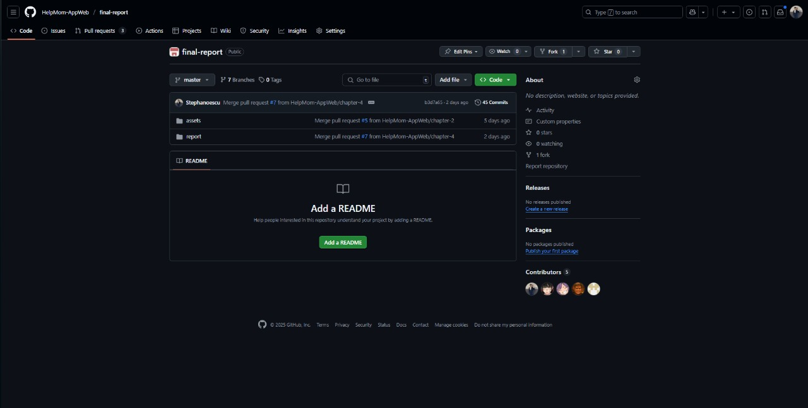
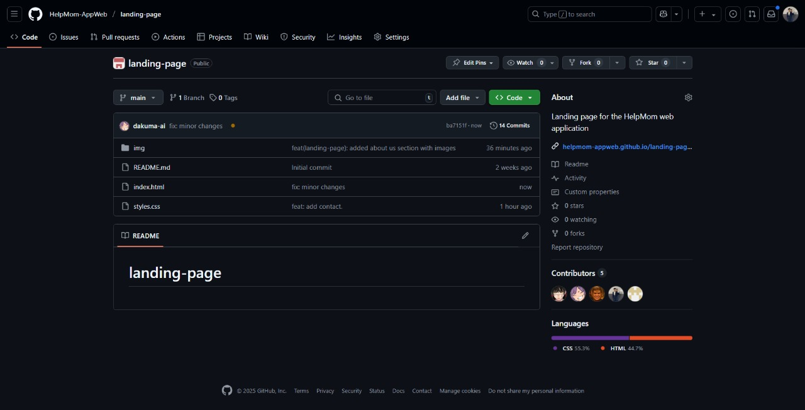
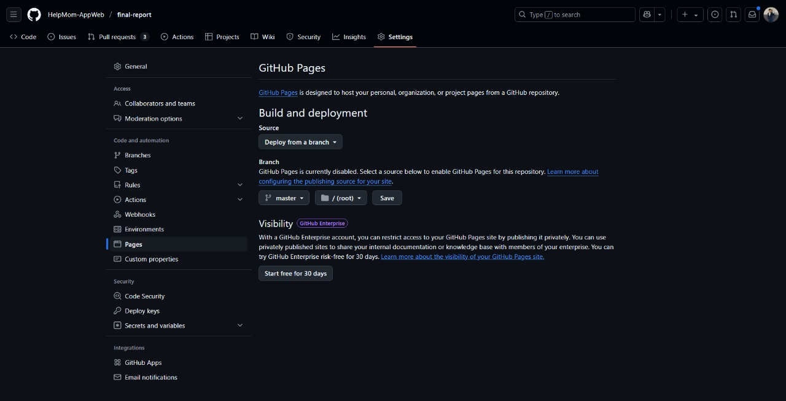
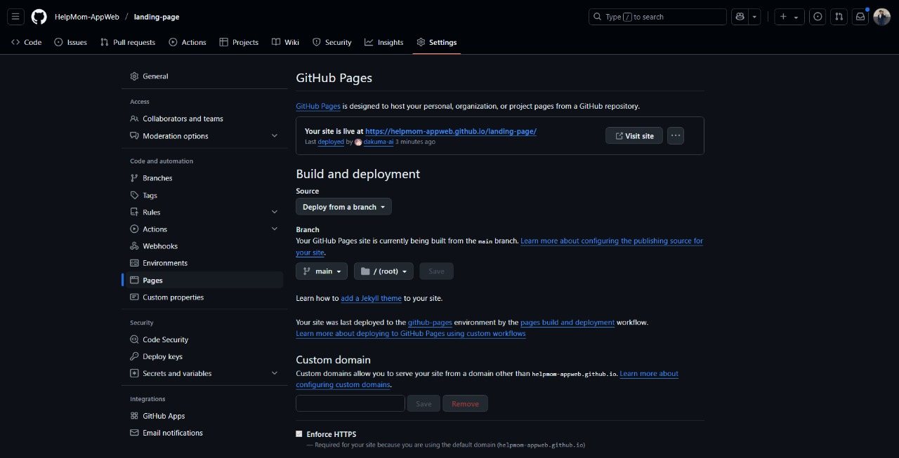

# Capítulo V: Product Implementation, Validation & Deployment

## 5.1. Software Configuration Management.

Para gestionar la configuración de software de nuestra app, nos enfocaremos en tres puntos clave: el control del código fuente, que incluye manejar versiones y organizar el código; la configuración del entorno de desarrollo, para asegurar herramientas uniformes en el equipo; y la configuración de implementación, que gestiona el despliegue en producción. Estas acciones aseguran consistencia y eficiencia durante todo el ciclo de vida de la aplicación.

### 5.1.1. Software Development Environment Configuration.
En esta sección, detallaremos y explicaremos los productos utilizados en el proyecto digital, así como su propósito y cómo se accede a cada uno de ellos y siguiendo las restricciones establecidas.

1. P**roject Management:**
   Para gestionar el proyecto, se emplearon herramientas de comunicación y control de versiones. Se configuró una organización en GitHub para administrar el código y las versiones del software. Para las reuniones y la comunicación interna, se usaron Google Meet y Discord.
   - Github: https://github.com/
   - Google Meet: https://meet.google.com/
   - Discord: https://discord.com/download

2. **Gestión de Requisitos**, La gestión de requisitos se realizó mediante herramientas personalizadas que facilitaron la recopilación, organización y priorización de los requerimientos del proyecto. Se empleó Trello para gestionar visualmente los requisitos mediante tableros personalizados, permitiendo la creación de Task Boards.
   - Trello: https://trello.com/es

3. **Diseño UX/UI del Producto**. Para el diseño de la experiencia de usuario (UX) y la interfaz (UI), se utilizó Figma, herramienta que permitió crear wireframes, mockups y prototipos interactivos para validar el diseño antes de su implementación. Adicionalmente, se emplearon:
   - Figma: https://www.figma.com/downloads/
   - UXPressia: https://uxpressia.com/
   - Miro: https://miro.com/es/

4.  **Desarrollo de Software** El desarrollo de software se implementó con HTML5, CSS3 y JavaScript para la Landing Page. Para la Web Application se utilizó Vue.js en el Frontend y ASP.NET Core con C# en el Backend. Como entorno de desarrollo principal se emplearon las herramientas del IDE JetBrains Toolbox, que proporcionan un entorno integrado con funcionalidades avanzadas para el desarrollo web.
    - jetBrains Toolbox: https://www.jetbrains.com/toolbox-app/

5. **Documentación del Software**, La documentación se gestionó en GitHub, aprovechando su sistema de control de versiones y alojamiento de información técnica. Se utilizaron archivos Markdown para facilitar la edición colaborativa en repositorios dedicados.
    - GitHub: https://github.com/

### 5.1.2. Source Code Management.

**Gestión del Proyecto en GitHub**:
En este proyecto, utilizamos GitHub como plataforma principal para el control de versiones y gestión colaborativa del código fuente bajo una organización dedicada.

**Repositorios** en GitHub
- **Organización**: [HelpMom-AppWeb](https://github.com/HelpMom-AppWeb)
- **Landing Page**: [Repositorio](https://github.com/HelpMom-AppWeb/landing-page)
- **Informe Final**: [Repositorio](https://github.com/HelpMom-AppWeb/final-report)

**Flujo de Trabajo GitFlow**:
Implementamos el modelo **GitFlow** para garantizar una gestión ordenada del desarrollo, siguiendo estas convenciones:

**Ramas Principales**:
1. **`main`/`master`**
   - Contiene únicamente código estable y versiones liberadas.
2. **`dev`**:
   - Rama de integración para nuevas funcionalidades y mejoras.

**Ramas de Desarrollo**:
- **Feature Branches**:  
  Creamos 5 ramas de características (una por cada capítulo del informe), donde se realizan los commits correspondientes antes de fusionarlas con `dev` una vez completadas.

**Conventional** Commits
Adoptamos el estándar **Conventional Commits** para mensajes de commit, asegurando:
- **Estructura clara**: Descripción precisa de los cambios.
- **Automatización**: Facilita la generación de changelogs y el seguimiento del historial.

Estas prácticas nos permitieron mantener un desarrollo organizado, colaborativo y documentado dentro de la organización en GitHub.

### 5.1.3. Source Code Style Guide & Conventions.

Establecemos las siguientes convenciones para garantizar consistencia y calidad en el desarrollo del proyecto, aplicables a todos los lenguajes y tecnologías utilizados (HTML, CSS, JavaScript, Vue.js, C# y Gherkin). Todas las nomenclaturas seguirán el idioma inglés y estándares reconocidos.

1. **HTML y CSS**

   **Estándares**:
      - Basados en recomendaciones del **W3C** y **Google Style Guide**
      - Identación: **2 espacios**
      - Comillas: **Dobles** para atributos HTML
      - Comentarios: Descriptivos y en inglés

   **Metodología**:
      - **BEM** (Block-Element-Modifier) para clases CSS
      - **HTML semántico**: Uso correcto de etiquetas (`<header>`, `<section>`, etc.)
   
      **Vue.js**:
     - Componentes: **PascalCase** (ej. `UserProfile.vue`)
     - Props/Métodos: **camelCase**

2. **JavaScript**

   **Guías**:
   - Según **MDN** y **Google JavaScript Style Guide**
   - Variables/funciones: **camelCase** (ej. `calculateTotal`)
   - Declaración: Siempre `const` o `let` (nunca `var`)
   - Literales: Comillas **simples** (`'texto'`)
   - Funciones: Preferir **arrow functions**

3. **Vue.js**

   **Convenciones**:
   - Directivas abreviadas: `@` para `v-on`, `:` para `v-bind`
   - Organización:
      - Componentes en carpetas por funcionalidad
      - Ciclo de vida ordenado (`created()`, `mounted()`, etc.)

4. C# (ASP.NET Core)

   **Estilo Microsoft**:
   - Clases/Métodos: **PascalCase** (ej. `UserService`)
   - Variables/parámetros: **camelCase**
   - Documentación: Comentarios **XML** (`/// 
`)

   **ASP.NET Core**:
   - Inyección de dependencias (DI)
   - Separación clara de capas (MVC)
   - Uso de **ViewModels**

5. Gherkin (.feature)

   **Prácticas**:
   - Keywords: **Given-When-Then** (ej. `Given a logged-in admin`)
   - Lenguaje: **Claro y no técnico**
   - Estructura:
      - Escenarios modulares
      - Pasos reutilizables

**Buenas Prácticas Generales**
- **Modularidad** y reutilización de código
- **Legibilidad** (nombres descriptivos, indentación consistente)
- **Optimización** de rendimiento
- **Seguridad** integrada en el diseño

Estas convenciones aseguran coherencia, mantenibilidad y calidad en todo el código del proyecto.

### 5.1.4. Software Deployment Configuration.

A continuación se detallan los pasos para desplegar cada componente de nuestra solución:

**Pasos para el despliegue**
1. Landing Page:
- Clonar o descargar el repositorio desde GitHub.
- Configurar el servidor web para alojar la Landing Page.
- Copiar los archivos HTMLS, CSS y JavaScript en el directorio correspondiente del servidor.
- Configurar cualquier dependencia adicional, como bibliotecas de JavaScript o imágenes.
- Verificar que la Landing Page se cargue correctamente en el navegador.

2. Web Services (API):
- Preparar el código fuente del servicio web, asegurando que esté correctamente estructurado y documentado.
- Configurar un entorno de desarrollo o pruebas para realizar pruebas exhaustivas del servicio antes del despliegue.
- Desplegar el código en un servidor adecuado para el entorno de producción.
- Configurar la seguridad y la autenticación según los requisitos del sistema.
- Documentar la API utilizando OpenAPI Specification para facilitar su integración y uso por parte de otros sistemas.

3. Frontend Web Applications:
- Clonar repositorio desde GitHub.
- Compilar y empaquetar las aplicaciones frontend. En nuestro caso, utilizamos el framework Vue.js, por lo que se debe ejecutar los comandos de construcción (`npm run build`) para generar los archivos estáticos.
- Una vez empaquetadas, las Frontend Web Applications se pueden servir utilizando un servidor de aplicaciones compatible con archivos estáticos, como Nginx o incluso GitHub Pages para proyectos estáticos más simples.
- Si es necesario, se deben configurar las rutas en el servidor de aplicaciones para que coincidan con las rutas esperadas por las aplicaciones frontend.
  re redacta esto siguiendo el mismo formato

## 5.2. Landing Page, Services & Applications Implementation.

### 5.2.X. Sprint n

#### 5.2.X.1. Sprint Planning n.

#### 5.2.X.2. Aspect Leaders and Collaborators.

#### 5.2.X.3. Sprint Backlog n.

#### 5.2.X.4. Development Evidence for Sprint Review.

Para la entrega de este primer Sprint, se completó el desarrollo de la Landing Page. No obstante, no se llevaron a cabo pruebas relacionadas con la misma en esta entrega.

#### 5.2.X.5. Execution Evidence for Sprint Review.

En este primer entregable, hemos creado la Landing Page del proyecto "PsyMed", permitiendo así la visualización de la información clave sobre nuestra plataforma.

#### 5.2.X.6. Services Documentation Evidence for Sprint Review.

#### 5.2.X.7. Software Deployment Evidence for Sprint Review.

Para el despliegue de la Landing Page, utilizamos GitHub Pages como herramienta para realizar el deployment. Creamos un repositorio donde almacenamos el código de nuestra Landing Page.

### Final-Report

### Landing-Page

Una vez creado el repositorio, accedimos a la configuración y seleccionamos la sección de Pages. En este apartado, ingresamos los datos necesarios, como la fuente del branch que se utilizará para el deployment. Finalmente, GitHub Pages nos proporcionó un enlace y publicó nuestra Landing Page en la web.

### Final-Report-Pages

### Landing-Page-Pages

#### 5.2.X.8. Team Collaboration Insights during Sprint.

A continuación se adjuntara las evidencias de trabajo en equipo que tuvimos durante esta TB1:

## 5.3. Validation Interviews.

### 5.3.1. Diseño de Entrevistas.

### 5.3.2. Registro de Entrevistas.

### 5.3.3. Evaluaciones según heurísticas.

## 5.4. Video About-the-Product.

# Conclusiones

# Video About-the-Team.

# Bibliografía

- Instituto Nacional de Estadística e Informática. (2023) Estadísticas Vitales: Nacimientos, Defunciones, Matrimonios y Divorcios, 2022. Registros Administrativos.
- Instituto Nacional de Estadística e Informática. (2021) Salud Materna. En D. Bonnet (2021), *Encuesta Demográfica y de Salud Familiar*.

# Anexos