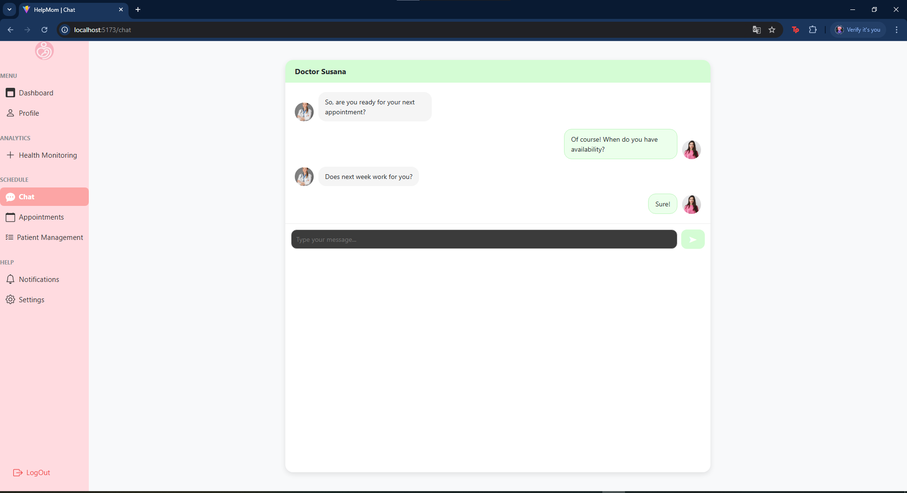

# Capítulo V: Product Implementation, Validation & Deployment

## 5.1. Software Configuration Management.

En esta sección se muestran las decisiones y convenciones que permitirán mantener consistencia durante el ciclo de vida del proyecto.

### 5.1.1. Software Development Environment Configuration.

En esta sección, se incluirá los productos de software que se usaron en el proyecto.
Los enlaces a cada una de las herramientas se encuentran disponibles en los anexos.

##### Project Management:
- Trello: Herramienta de gestión de proyectos basada en Kanban, utilizada para planificar tareas y asignar responsabilidades al equipo.

##### Product UX/UI Design:
- Figma: Herramienta colaborativa para crear prototipos interactivos de interfaces.
- Lucidchart: Para creación de diagramas de flujo.
- Uxpressia: Para elaboración de mapas de empatía y recorridos del usuario.
- Structurizr: Para modelado de arquitectura de software.

#### Software Development
- IntelliJ IDEA: IDE para desarrollo backend en Java. Para el primer y segundo sprint se utilizó para la redacción del informe del proyecto.
- WebStorm: IDE especializado para el desarrollo frontend. Se utilizó para el desarrollo de la Landing Page y frontend de la aplicación.
- Visual Studio Code: Editor utilizado únicamente para la exportación del reporte de formato markdown a PDF.
- GitHub: Plataforma de control de versiones y colaboración.

#### Software Deployment
- GitHub Pages: Servicio de despliegue de aplicaciones web estáticas desde repositorios GitHub.
- Netlify: Plataforma de despliegue continuo que permite publicar aplicaciones web estáticas y JAMstack. Fue utilizada para el despliegue del frontend.

### 5.1.2. Source Code Management.

**Gestión del Proyecto en GitHub**:
En este proyecto, utilizamos GitHub como plataforma principal para el control de versiones y gestión colaborativa del código fuente bajo una organización dedicada.

**Repositorios** en GitHub
- **Organización**: [https://github.com/HelpMom-AppWeb](https://github.com/HelpMom-AppWeb)
- **Landing Page**: [https://github.com/HelpMom-AppWeb/landing-page](https://github.com/HelpMom-AppWeb/landing-page)
- **Informe Final**: [https://github.com/HelpMom-AppWeb/final-report](https://github.com/HelpMom-AppWeb/final-report)
- **Frontend**: [https://github.com/HelpMom-AppWeb/HelpMom-frontend.git](https://github.com/HelpMom-AppWeb/HelpMom-frontend.git)

#### Modelo de ramificación: GitFlow

Para el modelo de desarrollo, se decidió usar GitFlow como modelo de ramificación. Este modelo permite una gestión eficiente de las ramas y facilita la colaboración entre los desarrolladores.

Para el repositorio del informe final se crearon las siguientes ramas:
- **dev:** Rama principal de desarrollo, donde se integrarán todas las características y correcciones de errores.
- **chapter-1:** Rama para el desarrollo del capítulo 1 del informe.
- **chapter-2:** Rama para el desarrollo del capítulo 2 del informe.
- **chapter-3:** Rama para el desarrollo del capítulo 3 del informe.
- **chapter-4:** Rama para el desarrollo del capítulo 4 del informe.
- **chapter-5:** Rama para el desarrollo del capítulo 5 del informe.

Para el repositorio de Landing Page se crearon las siguientes ramas:
- **main:** Rama principal de desarrollo, donde se integrarán todas las características y correcciones de errores.

Para el repositorio del Fronted se crearon las siguientes ramas:
- **develop**: Rama principal donde una vez concluida la programación de un bounded context se hace un merge a esta rama.
- **feature/patient-management**: Rama donde se desarrolla el bounded context
- **feature/medication**: Rama donde se desarrolla el bounded context
- **feature/baby-monitoring**: Rama donde se desarrolla el bounded context
- **feature/chat**: Rama donde se desarrolla el bounded context
- **feature/appointments**: Rama donde se desarrolla el bounded context
- 
#### Estilo de commits: Conventional Commits
Para asegurar mensajes de commits claros y estandarizados, se seguirá la convención [Conventional Commits](https://www.conventionalcommits.org/en/v1.0.0/). Algunos ejemplos:

- `feat: add search by name functionality`
- `fix: correct form validation error`
- `docs: update installation instructions`
- `refactor: simplify calculation logic`

El prefijo de categorías se define de la siguiente forma:
- `feat`: A new feature
- `fix`: A bug fix
- `docs`: Documentation only changes
- `style`: Changes that do not affect the meaning of the code (formatting, missing semicolons, etc.)
- `refactor`: A code change that neither fixes a bug nor adds a feature
- `test`: Adding missing tests or correcting existing ones
- `chore`: Changes to the build process or auxiliary tools

### 5.1.3. Source Code Style Guide & Conventions.

Establecemos las siguientes convenciones para garantizar consistencia y calidad en el desarrollo del proyecto, aplicables a todos los lenguajes y tecnologías utilizados (HTML, CSS, JavaScript, Vue.js, C# y Gherkin). Todas las nomenclaturas seguirán el idioma inglés y estándares reconocidos.

1. **HTML y CSS**

   **Estándares**:
      - Basados en recomendaciones del **W3C** y **Google Style Guide**
      - Identación: **2 espacios**
      - Comillas: **Dobles** para atributos HTML
      - Comentarios: Descriptivos y en inglés

   **Metodología**:
      - **BEM** (Block-Element-Modifier) para clases CSS
      - **HTML semántico**: Uso correcto de etiquetas (`<header>`, `<section>`, etc.)
   
      **Vue.js**:
     - Componentes: **PascalCase** (ej. `UserProfile.vue`)
     - Props/Métodos: **camelCase**

2. **JavaScript**

   **Guías**:
   - Según **MDN** y **Google JavaScript Style Guide**
   - Variables/funciones: **camelCase** (ej. `calculateTotal`)
   - Declaración: Siempre `const` o `let` (nunca `var`)
   - Literales: Comillas **simples** (`'texto'`)
   - Funciones: Preferir **arrow functions**

3. **Vue.js**

   **Convenciones**:
   - Directivas abreviadas: `@` para `v-on`, `:` para `v-bind`
   - Organización:
      - Componentes en carpetas por funcionalidad
      - Ciclo de vida ordenado (`created()`, `mounted()`, etc.)

4. C# (ASP.NET Core)

   **Estilo Microsoft**:
   - Clases/Métodos: **PascalCase** (ej. `UserService`)
   - Variables/parámetros: **camelCase**
   - Documentación: Comentarios **XML** (`/// 
`)

   **ASP.NET Core**:
   - Inyección de dependencias (DI)
   - Separación clara de capas (MVC)
   - Uso de **ViewModels**

5. Gherkin (.feature)

   **Prácticas**:
   - Keywords: **Given-When-Then** (ej. `Given a logged-in admin`)
   - Lenguaje: **Claro y no técnico**
   - Estructura:
      - Escenarios modulares
      - Pasos reutilizables

**Buenas Prácticas Generales**
- **Modularidad** y reutilización de código
- **Legibilidad** (nombres descriptivos, indentación consistente)
- **Optimización** de rendimiento
- **Seguridad** integrada en el diseño

Estas convenciones aseguran coherencia, mantenibilidad y calidad en todo el código del proyecto.

### 5.1.4. Software Deployment Configuration.

A continuación se detallan los pasos para desplegar cada componente de nuestra solución:

**Pasos para el despliegue**
1. Landing Page:
- Clonar o descargar el repositorio desde GitHub.
- Configurar el servidor web para alojar la Landing Page.
- Copiar los archivos HTMLS, CSS y JavaScript en el directorio correspondiente del servidor.
- Configurar cualquier dependencia adicional, como bibliotecas de JavaScript o imágenes.
- Verificar que la Landing Page se cargue correctamente en el navegador.

 🔗 Enlace al repositorio de la Landing Page: https://github.com/HelpMom-AppWeb/landing-page
 🔗 Enlace a la Landing Page desplegada: https://helpmom-appweb.github.io/landing-page/

2. Web Services (API):
- Preparar el código fuente del servicio web, asegurando que esté correctamente estructurado y documentado.
- Configurar un entorno de desarrollo o pruebas para realizar pruebas exhaustivas del servicio antes del despliegue.
- Desplegar el código en un servidor adecuado para el entorno de producción.
- Configurar la seguridad y la autenticación según los requisitos del sistema.
- Documentar la API utilizando OpenAPI Specification para facilitar su integración y uso por parte de otros sistemas.

3. Frontend Web Applications:
- Clonar repositorio desde GitHub.
- Compilar y empaquetar las aplicaciones frontend. En nuestro caso, utilizamos el framework Vue.js, por lo que se debe ejecutar los comandos de construcción (`npm run build`) para generar los archivos estáticos.
- Una vez empaquetadas, las Frontend Web Applications se pueden servir utilizando un servidor de aplicaciones compatible con archivos estáticos, como Nginx o incluso GitHub Pages para proyectos estáticos más simples.
- Si es necesario, se deben configurar las rutas en el servidor de aplicaciones para que coincidan con las rutas esperadas por las aplicaciones frontend.
  re redacta esto siguiendo el mismo formato

 🔗 Enlace al repositorio de la Landing Page: https://github.com/HelpMom-AppWeb/HelpMom-frontend
 🔗 Enlace al Frontend desplegado: 

## 5.2. Landing Page, Services & Applications Implementation.
En esta sección se detalla y evidencia la implementación de cada entregable de HelpMom.

#### Landing page:
La landing page fue realizada de manera grupal y desplegada debidamente con la herramienta GitHub Pages.
A continuación las siguientes imágenes sirven de referencia para evidencia la implementación de la Landing Page.

#### Frontend:
El frontend fue realizado de manera grupal utilizando el framework Vue.
A continuación las siguientes imágenes sirven de referencia para evidencia la implementación del frontend.

### 5.2.1. Sprint 1

#### 5.2.1.1. Sprint Planning 1.

Para este primer sprint nos enfocaremos en los tasks para la
elaboración de la Landing Page. Nos dividiremos entre nosotros cada
una de las tareas identificadas para el sprint.
<table>
<tr>
    <th colspan="5">Sprint 1</th>
    <th colspan="9">Sprint 1</th>
  </tr>
      <tr>
    <td colspan="13">Sprint Planning Background</td>
  </tr>
  <tr>
    <td colspan="5">Date</td>
    <td colspan="8">2025-04-07</td>
</tr>
  <tr>
    <td colspan="5">Time</td>
    <td colspan="8">8:30 PM</td>
  </tr>
  <tr>
    <td colspan="5">Location</td>
    <td colspan="8">Via Discord</td>
<tr>
    <td colspan="5">Prepared By</td>
    <td colspan="8">Gabriel Alejandro Rivera Ayala</td>
</tr>
<tr>
    <td colspan="5">Attendees (to planning meeting)</td>
    <td colspan="8">Romina Guadalupe Maita Falckenheiner, Gabriel Cristian Mamani Marca, Camila Asuncion Reyes Menacho, Gabriel Alejandro Rivera Ayala, Stephano Jose Espinoza Cueva</td>
</tr>
<tr>
    <td colspan="5">Sprint  1 Review Summary</td>
    <td colspan="8">En esta primera sección se planteo el desarrollo de la Landing Page y planeación de aplicación para el proyecto de HelpMom.</td>
</tr>
<tr>
    <td colspan="5">Sprint 1 Retrospective Summary</td>
    <td colspan="8">En esta sección todos los integrantes mencionaron tener aciertos en partes del codigo y en otras partes poder mejorar sus habilidades realizando la Landing Page</td>
</tr>
<tr>
    <td colspan="13">Sprint Goal & User Stories</td>
</tr>
<tr>
    <td colspan="5">Sprint 1 Goal</td>
    <td colspan="8">
Desarrollar y desplegar una landing page que presente información a los usuarios a través de imágenes y texto. La página debe ser completamente adaptable a cualquier tipo de dispositivo que utilicen los usuarios, garantizando una experiencia de usuario fluida y responsiva.</td>
</tr>
<tr>
    <td colspan="5">Sprint 1 Velocity</td>
    <td colspan="8">7 story points</td>
</tr>
<tr>
    <td colspan="5">Sum of Story Points</td>
    <td colspan="8">7 Story Points</td>
</tr>
</table>

#### 5.2.1.2. Aspect Leaders and Collaborators.
Con la finalidad de mejorar la colaboración en equipo a cada integrante se asignó un rol de líder por cada aspecto. Los aspectos están relacionados con los entregables.

| Team member (LastName, First Name) | GitHub UserName | Aspect 1: Landing Page Leader (L) / Collaborator (C) | Aspect 2: Diseños Figma: Leader (L) / Collaborator (C) | Aspect 3: Reporte (L) / Collaborator (C) |
|------------------------------------|-----------------|------------------------------------------------------|--------------------------------------------------------|------------------------------------------|
| Rivera Gabriel                     | guestwhoo       | C                                                    | C                                                      | L                                        |
| Reyes Camila                       | dakuma-ai       | L                                                    | C                                                      | L                                        |
| Cueva Stephano                     | Stephanoescu    | L                                                    | C                                                      | L                                        |
| Maita Romina                       | RominaMaita     | C                                                    | L                                                      | L                                        |
| Mamani Gabriel                     | Gabrlel0105     | C                                                    | C                                                      | L                                        |

#### 5.2.1.3. Sprint Backlog 1.

<table border="1">
  <tr>
    <th colspan="3">Sprint 1</th>
    <th colspan="10">Sprint 1</th>
  </tr>
  <tr>
    <td colspan="3">User Story</td>
    <td colspan="10">Work-Item/Task</td>
  </tr>
  <tr>
    <td colspan="1">ID</td>
    <td colspan="2">Title</td>
    <td colspan="1">ID</td>
    <td colspan="2">Title</td>
    <td colspan="3">Description</td>
    <td colspan="1">Estimation</td>
    <td colspan="2">Assigned to</td>
    <td colspan="1">Status (To-do / InProcess / To-Review / Done)</td>
  </tr>
  <tr>
    <td colspan="1">US01</td>
    <td colspan="2">Visualizar la información de la startup</td>
    <td colspan="1">UT01</td>
    <td colspan="2">Redactar el contenido informativo de la startup</td>
    <td colspan="3">Crear o recopilar el texto que describe la misión, visión, historia y valores de la startup.</td>
    <td colspan="1">2h</td>
    <td colspan="2">Gabriel Rivera</td>
    <td colspan="1">Done</td>
  </tr>
  <tr>
    <td colspan="1"></td>
    <td colspan="2"></td>
    <td colspan="1">UT02</td>
    <td colspan="2">Implementar visualización de la información de la startup</td>
    <td colspan="3">Diseñar e integrar la sección de presentación de la empresa en el sitio, asegurando buena legibilidad y diseño responsive.</td>
    <td colspan="1">2h</td>
    <td colspan="2">Gabriel Rivera</td>
    <td colspan="1">Done</td>
  </tr>
  <tr>
    <td colspan="1">US02</td>
    <td colspan="2">Visualizar la foto de la startup</td>
    <td colspan="1">UT03</td>
    <td colspan="2">Seleccionar y preparar la imagen de la startup</td>
    <td colspan="3">Escoger una imagen representativa de la empresa, optimizarla para web (peso y resolución).</td>
    <td colspan="1">2h</td>
    <td colspan="2">Camila</td>
    <td colspan="1">Done</td>
  </tr>
  <tr>
    <td colspan="1"></td>
    <td colspan="2"></td>
    <td colspan="1">UT04</td>
    <td colspan="2">Integrar la imagen de la startup en la web</td>
    <td colspan="3">Mostrar la imagen en la sección de "Sobre Nosotros" o similar, cuidando su ubicación y estilo visual.</td>
    <td colspan="1">1h</td>
    <td colspan="2">Camila</td>
    <td colspan="1">Done</td>
  </tr>
   <tr>
    <td colspan="1">US03</td>
    <td colspan="2">Visualizar la información del producto</td>
    <td colspan="1">UT05</td>
    <td colspan="2">Redactar la descripción del producto</td>
    <td colspan="3">Crear el contenido textual que explica qué es el producto, qué beneficios ofrece y cómo funciona.</td>
    <td colspan="1">4h</td>
    <td colspan="2">Camila</td>
    <td colspan="1">Done</td>
  </tr>
  <tr>
    <td colspan="1"></td>
    <td colspan="2"></td>
    <td colspan="1">UT06</td>
    <td colspan="2">Diseñar e implementar la sección del producto</td>
    <td colspan="3">Integrar el contenido del producto en el sitio, utilizando un diseño atractivo e intuitivo.</td>
    <td colspan="1">4h</td>
    <td colspan="2">Camila</td>
    <td colspan="1">Done</td>
  </tr>
  <tr>
    <td colspan="1">US04</td>
    <td colspan="2">Visualizar la foto del producto</td>
    <td colspan="1">UT07</td>
    <td colspan="2">Preparar imagen destacada del producto</td>
    <td colspan="3">Seleccionar una o más imágenes del producto, optimizarlas para distintos dispositivos.</td>
    <td colspan="1">4h</td>
    <td colspan="2">Camila</td>
    <td colspan="1">Done</td>
  </tr>
  <tr>
    <td colspan="1"></td>
    <td colspan="2"></td>
    <td colspan="1">UT08</td>
    <td colspan="2">Preparar Implementar visualización de imágenes del producto</td>
    <td colspan="3">Añadir las imágenes al sitio en una galería o sección destacada del producto.</td>
    <td colspan="1">3h</td>
    <td colspan="2">Camila</td>
    <td colspan="1">Done</td>
  </tr>
  <tr>
    <td colspan="1">US06</td>
    <td colspan="2">Visualizar la información de los planes</td>
    <td colspan="1">UT09</td>
    <td colspan="2">Definir contenido de los planes/membresías</td>
    <td colspan="3">Ingresar la información sobre los distintos planes, precios, características y condiciones.</td>
    <td colspan="1">3h</td>
    <td colspan="2">Romina</td>
    <td colspan="1">Done</td>
  </tr>
  <tr>
    <td colspan="1"></td>
    <td colspan="2"></td>
    <td colspan="1">UT10</td>
    <td colspan="2">Implementar sección de comparación de planes</td>
    <td colspan="3">Diseñar una tabla o cards informativas que permitan comparar fácilmente los planes.</td>
    <td colspan="1">3h</td>
    <td colspan="2">Romina</td>
    <td colspan="1">Done</td>
  </tr>
   <tr>
    <td colspan="1">US07</td>
    <td colspan="2">Ver preguntas frecuentes (FAQs)</td>
    <td colspan="1">UT11</td>
    <td colspan="2">Redactar listado de preguntas y respuestas frecuentes</td>
    <td colspan="3">Crear un listado claro de las dudas más comunes y sus respuestas.</td>
    <td colspan="1">2h</td>
    <td colspan="2">Gabriel Mamani</td>
    <td colspan="1">Done</td>
  </tr>
   <tr>
    <td colspan="1"></td>
    <td colspan="2"></td>
    <td colspan="1">UT12</td>
    <td colspan="2">Desarrollar componente visual de preguntas frecuentes</td>
    <td colspan="3">Implementar la sección en la web, preferiblemente con acordeones o collapsibles para mejor experiencia de usuario.</td>
    <td colspan="1">2h</td>
    <td colspan="2">Gabriel Mamani</td>
    <td colspan="1">Done</td>
  </tr>
   <tr>
    <td colspan="1">US09</td>
    <td colspan="2">Enviar datos de contacto</td>
    <td colspan="1">UT13</td>
    <td colspan="2">Diseñar e implementar el formulario de contacto</td>
    <td colspan="3">Crear un formulario con campos para nombre, correo electrónico y mensaje del usuario.</td>
    <td colspan="1">3h</td>
    <td colspan="2">Stephano</td>
    <td colspan="1">Done</td>
  </tr>
   <tr>
    <td colspan="1"></td>
    <td colspan="2"></td>
    <td colspan="1">UT14</td>
    <td colspan="2">Programar validación y envío del formulario</td>
    <td colspan="3">Asegurar que los datos ingresados sean válidos y se envíen correctamente a un correo o base de datos.</td>
    <td colspan="1">3h</td>
    <td colspan="2">Stephano</td>
    <td colspan="1">Done</td>
  </tr>

</table>

#### 5.2.1.4. Development Evidence for Sprint Review.
En esta sección se demuestran los commits relacionados con los principales avances en la implementación.
Estos commits provienen del repositorio del Landing Page de la organización de GitHub.

 🔗 Enlace al repositorio de la Landing Page: https://github.com/HelpMom-AppWeb/landing-page

| Repository                   | Branch | Commit Id                                 | Commit Message                                  | Commit Message Body | Commited on (Date) |
|------------------------------|--------|-------------------------------------------|-------------------------------------------------|---------------------|--------------------|
| HelpMom-AppWeb/landing-page  | main   | d822c4402e13fc950c43f25a2915f0f30c59cde3  | feat: added pricing plans.                      |                     | 20/04/2025         |
| HelpMom-AppWeb/landing-page  | main   | 2db6b4c16b4cf4efe120070ad03a8cb6a181377c  | feat: added products, logo, fonts, banner image |                     | 20/04/2025         |
| HelpMom-AppWeb/landing-page  | main   | 50756f6abfdd6d3649061387d2c5281548dda5fe  | feat: add contact.                              |                     | 20/04/2025         |
| HelpMom-AppWeb/landing-page  | main   | e44f89b6f219466c6b48796457b9a890b4b7a777  | feat: added about us section with images        |                     | 20/04/2025         |
| HelpMom-AppWeb/landing-page  | main   | a2d38d2dacd1732a2e1a48d8b888e2f2a1cf9eaf  | feat: add FAQ.                                  |                     | 20/04/2025         |

#### 5.2.1.5. Execution Evidence for Sprint Review.

Durante el desarrollo del sprint se lograron completar todos los puntos planteados.
A continuación se muestran evidencias del landing page logrado.

 

#### 5.2.1.6. Services Documentation Evidence for Sprint Review.

Como se mencionó previamente, Este sprint solo tuvo como objetivo el desarrollo de Landing Page. Aún no se han implementado ni documentado Endpoints con OpenAPI, ya que el desarrollo de los servicios web está planificado para los siguientes Sprints, conforme al roadmap del proyecto.

#### 5.2.1.7. Software Deployment Evidence for Sprint Review.

Durante este Sprint, se completó el desarrollo de la Landing Page y se realizó su despliegue utilizando GitHub Pages como plataforma de publicación gratuita. El objetivo fue contar con una primera versión accesible en línea del producto digital para revisión y retroalimentación.

Actividades realizadas:
Se creó el repositorio en GitHub: https://github.com/HelpMom-AppWeb/landing-page

Se subió el código fuente de la Landing Page, incluyendo los archivos HTML, CSS necesarios.

Se configuró GitHub Pages desde la pestaña Settings > Pages, seleccionando la rama principal y la carpeta raíz.

Se verificó la correcta publicación de la Landing Page en la siguiente URL:

 🔗 Landing Page desplegada: https://helpmom-appweb.github.io/landing-page/

**Evidencia del despliegue:**

#### 5.2.1.8. Team Collaboration Insights during Sprint.
En esta sección se evidencia la colaboración de cada integrante en el repositorio de la Landing Page.

 🔗 Repositorio de Landing Page: https://github.com/HelpMom-AppWeb/landing-page

#### Capturas de Insights del repositorio:

### 5.2.2. Sprint 2
#### 5.2.2.1. Sprint Planning 2.
Para este segundo sprint nos enfocaremos en los tasks para la
elaboración del frontend. Nos dividiremos entre nosotros cada
una de las tareas identificadas para el sprint.

<table>
<tr>
    <th colspan="5">Sprint 2</th>
    <th colspan="9">Sprint 2</th>
  </tr>
      <tr>
    <td colspan="13">Sprint Planning Background</td>
  </tr>
  <tr>
    <td colspan="5">Date</td>
    <td colspan="8">2025-05-05</td>
</tr>
  <tr>
    <td colspan="5">Time</td>
    <td colspan="8">8:30 PM</td>
  </tr>
  <tr>
    <td colspan="5">Location</td>
    <td colspan="8">Via Discord</td>
<tr>
    <td colspan="5">Prepared By</td>
    <td colspan="8">Gabriel Alejandro Rivera Ayala</td>
</tr>
<tr>
    <td colspan="5">Attendees (to planning meeting)</td>
    <td colspan="8">Romina Guadalupe Maita Falckenheiner, Gabriel Cristian Mamani Marca, Camila Asuncion Reyes Menacho, Gabriel Alejandro Rivera Ayala, Stephano Jose Espinoza Cueva</td>
</tr>
<tr>
    <td colspan="5">Sprint  2 Review Summary</td>
    <td colspan="8">En este segundo sprint todos los integrantes estuvieron presentes y aceptaron la asignación de tareas de cada uno para las correcciones con respecto al primer entregable. Así mismo, también se establecieron los alcances que tendrá la primera versión del frontend.</td>
</tr>
<tr>
    <td colspan="5">Sprint 2 Retrospective Summary</td>
    <td colspan="8">Los integrantes mencionaron contar con las capacidades, habilidades y tiempo necesarias para desempeñar sus responsabilidades en el tiempo establecido. Siendo el domingo 12/05/2025 la fecha máxima para culminar cada uno su aporte al frontend. </td>
</tr>
<tr>
    <td colspan="13">Sprint Goal & User Stories</td>
</tr>
<tr>
    <td colspan="5">Sprint 2 Goal</td>
    <td colspan="8">
Desarrollar y desplegar una primera versión del frontend con las características más fundamentales con relación al negocio, con la finalidad de que los usuarios puedan interactuar con una interfaz funcional, validar los flujos principales del sistema y brindar retroalimentación temprana que permita ajustar el desarrollo de las siguientes iteraciones. </td>
</tr>
<tr>
    <td colspan="5">Sprint 2 Velocity</td>
    <td colspan="8">7 story points</td>
</tr>
<tr>
    <td colspan="5">Sum of Story Points</td>
    <td colspan="8"> 7 Story Points</td>
</tr>
</table>

#### 5.2.2.2. Aspect Leaders and Collaborators.
Con la finalidad de mejorar la colaboración en equipo a cada integrante se asignó un rol de líder por cada aspecto. Los aspectos están relacionados con los entregables.

| Team member (LastName, First Name) | GitHub UserName | Aspect 1: Landing Page Leader (L) / Collaborator (C) | Aspect 2: UX/UI Leader (L) / Collaborator (C) | Aspect 3: Report Leader (L) / Collaborator (C) | Aspect 4: Frontend Leader (L) / Collaborator (C) | Aspect 5: Videos (L) / Collaborator (C) |
|------------------------------------|-----------------|------------------------------------------------------|-----------------------------------------------|------------------------------------------------|--------------------------------------------------|-----------------------------------------|
| Rivera Gabriel                     | guestwhoo       | C                                                    | L                                             | C                                              | C                                                | C                                       |
| Reyes Camila                       | dakuma-ai       | C                                                    | C                                             | C                                              | C                                                | L                                       |
| Cueva Stephano                     | Stephanoescu    | C                                                    | C                                             | L                                              | C                                                | C                                       |
| Maita Romina                       | RominaMaita     | C                                                    | C                                             | C                                              | L                                                | C                                       |
| Mamani Gabriel                     | Gabrlel0105     | L                                                    | C                                             | C                                              | C                                                | C                                       |

#### 5.2.2.3. Sprint Backlog 2.
| User Story |                                           | Work-item/task |                                 |                                                                                                                                         |            |                   |                |
|------------|-------------------------------------------|----------------|---------------------------------|-----------------------------------------------------------------------------------------------------------------------------------------|------------|-------------------|----------------|
| ID         | Title                                     | ID             | Title                           | Description                                                                                                                             | Estimation | Assigned to       | Status (To-do) |
| HU20       | Seguimiento de signos vitales             | UT01           | Formulario de ingreso de datos  | Crear un formulario con los campos requeridos (ritmo cardiaco, temperatura, peso, saturación de oxígeno) y validar ingreso de los datos | 1h         | Romina            | Done           |
|            |                                           | UT02           | Diseño de tarjeta de resumen    | Mostrar la información que el paciente ingresa a través de un card.                                                                     | 1h         | Romina            | Done           |
|            |                                           |                |                                 |                                                                                                                                         |            |                   |                |
| HU23       | Gestión de citas medicas de los doctores  | UT03           | Formulario de ingreso de citas  | Crear un formulario donde el doctor pueda agregar y editar citas para distintos pacientes                                               | 2h         | Camila Reyes      | Done           |
| HU24       | Gestión de citas medicas de los pacientes | UT04           | Calendario de citas médicas     | Mostrar las citas próximas del paciente                                                                                                 | 3h         | Camila Reyes      | Done           |
| HU17       | chat entre obstetra y madre               | UT05           | Envío de mensaje                | Como madre, quiero enviar un mensaje a una doctora para comunicarme con ella.                                                           | 2H         | Gabriel Mamani    | Done           |
|            |                                           |                |                                 |                                                                                                                                         |            |                   |                |
| HU10       | Ingreso de recetas médicas                | UT06           | Formulario de ingreso de receta | como obstetra quiero dar una receta a la paciente                                                                                       | 2h         | Stephano Espinoza | Done           |
| HU11       | Añadir instrucciones                      | UT06           | Campo de instrucciones médicas  | Permitir al obstetra añadir instrucciones especificas en la receta medica                                                               | 1h         | Stephano Espinoza | Done           |
| HU12       | Historial de recetas                      | UT06           | Modulo de historial de recetas  | Mostrar un historial de todas las recetas emitidas a cada paciente                                                                      | 2h         | Stephano Espinoza | Done           |

#### 5.2.2.4. Development Evidence for Sprint Review.
En esta sección se demuestran los commits relacionados con los principales avances en la implementación.
Estos commits provienen del repositorio del frontend de la organización de GitHub.

 🔗 Enlace al repositorio de la Landing Page: https://github.com/HelpMom-AppWeb/HelpMom-frontend

| Repository                       | Branch                     | Commit Id                                 | Commit Message                                            | Commit Message Body | Commited on (Date) |
|----------------------------------|----------------------------|-------------------------------------------|-----------------------------------------------------------|---------------------|--------------------|
| HelpMom-AppWeb/HelpMom-frontend  | feature/patient-management | e3bf8e78879fb3d11a25920253f0770fc2530ca3  | feat: added add-patient component                         |                     | 10/05/2025         |
| HelpMom-AppWeb/HelpMom-frontend  | feature/medication         | a6f7b56924f4d7005f1de8a18908464ab556b21f  | feat: Medication front                                    |                     | 10/05/2025         |
| HelpMom-AppWeb/HelpMom-frontend  | feature/chat               | 76872b9d5f18d330513296116f34a15f26940273  | feat:chat mother                                          |                     | 10/05/2025         |
| HelpMom-AppWeb/HelpMom-frontend  | feature/baby-monitoring    | e12f1dab0cf585c8ef8332889951edbc8819e115  | feat(health-monitoring): add health monitoring component. |                     | 10/05/2025         |
| HelpMom-AppWeb/HelpMom-frontend  | feature/appointments       | 8cca0766099d592ed644d436b48bc7290a4586bc  | feat: add: patient appointments                           |                     | 10/05/2025         |

#### 5.2.2.5. Execution Evidence for Sprint Review.
Durante el desarrollo del segundo sprint se desarrolló los componentes principales con respecto al negocio.
A continuación se muestran evidencias del frontend.

#### 5.2.2.6. Services Documentation Evidence for Sprint Review.

Durante este Sprint, se completó la implementación de funcionalidades clave en el frontend, y se procedió con el despliegue del mismo utilizando Netlify como plataforma de publicación gratuita. Este paso tuvo como objetivo poner a disposición una versión funcional del sistema en un entorno accesible para el equipo y los stakeholders, permitiendo su revisión continua y retroalimentación oportuna.

Actividades realizadas:
Se creó una cuenta en Netlify y se vinculó el repositorio del proyecto para automatizar los despliegues desde la rama principal.

Se subió el código fuente del frontend al repositorio de GitHub:
 🔗 Repositorio: https://github.com/HelpMom-AppWeb/HelpMom-frontend

Se configuró el despliegue automático desde Netlify seleccionando la rama develop del repositorio, definiendo los comandos de build y la carpeta de salida (dist generada por Angular).

Se verificó el despliegue exitoso del sistema en la siguiente URL pública:

 🔗 Frontend desplegado en Netlify: http://helpmom.netlify.app/

Se realizaron pruebas de verificación en la versión desplegada para validar la correcta carga de componentes y funcionalidades básicas como navegación, visualización de datos y responsividad.

#### Evidencias de despliegue:

#### 5.2.2.8. Team Collaboration Insights during Sprint.
En esta sección se evidencia la colaboración de cada integrante en el repositorio del frontend.

 🔗 Repositorio: https://github.com/HelpMom-AppWeb/HelpMom-frontend

#### Capturas de Insights del repositorio:

# Conclusiones 

## Conclusiones
El proyecto HelpMom, desarrollado por la startup WebExpert, representa una propuesta tecnológica de alto impacto social, orientada a mejorar la calidad de vida de madres gestantes y primerizas mediante una atención médica accesible, oportuna y personalizada. Concebido por estudiantes de la Universidad Peruana de Ciencias Aplicadas, este proyecto nace con una visión clara: utilizar la tecnología para empoderar a personas en situación de dependencia y facilitar su acceso a servicios de salud especializados.

A lo largo de su desarrollo, HelpMom ha evidenciado un enfoque sólido centrado en el usuario y en la mejora continua. La aplicación ofrece funcionalidades clave como el seguimiento de signos vitales, la gestión de citas médicas para pacientes y doctores, un sistema de mensajería en tiempo real entre madres y obstetras, y la emisión y visualización del historial de recetas médicas. Estas características no solo responden a necesidades reales de los usuarios, sino que también potencian la eficiencia de los profesionales de la salud en su labor diaria.

La implementación técnica del proyecto se realizó utilizando Vue.js como framework principal, siguiendo los principios de Domain Driven Design (DDD) para una arquitectura robusta y escalable. La metodología de trabajo adoptada fue Scrum, lo que permitió dividir el proyecto en iteraciones planificadas (sprints) que facilitaron la entrega continua de valor y la colaboración efectiva entre los miembros del equipo.

Cada historia de usuario (HU) fue cuidadosamente desarrollada y validada. Por ejemplo, el seguimiento de signos vitales (HU20) fue abordado mediante formularios interactivos y tarjetas de resumen que muestran datos críticos como ritmo cardíaco, temperatura, peso y saturación de oxígeno. Por otro lado, funcionalidades como la gestión de citas (HU23 y HU24) brindan herramientas tanto para los doctores como para las pacientes, garantizando una agenda organizada y visible desde ambas perspectivas. La incorporación del chat directo entre madres y obstetras (HU17) refuerza el acompañamiento constante, promoviendo un entorno de comunicación fluido y confiable.

La sección de recetas médicas (HU10, HU11 y HU12) permite a los profesionales emitir indicaciones claras y llevar un historial digital accesible, contribuyendo a una atención más segura y documentada.

El equipo de desarrollo demostró un alto grado de compromiso, coordinación y cumplimiento de objetivos. Todas las unidades de trabajo (UT) asignadas fueron completadas dentro del tiempo estimado, lo que refleja una planificación eficiente y un dominio adecuado de las herramientas tecnológicas utilizadas. Asimismo, la claridad en los roles y la adecuada documentación generada durante el proceso fortalecieron la trazabilidad y calidad del producto final.

En conjunto, HelpMom no solo cumple con su objetivo funcional, sino que también se erige como una solución tecnológica innovadora que puede escalar y adaptarse a nuevas necesidades en el ámbito de la salud digital.

## Recomendaciones:

Para optimizar el desempeño del equipo en el proyecto, es crucial adoptar una estrategia de comunicación efectiva. Realizar llamadas regulares y videoconferencias permite mantener al equipo alineado y facilita la resolución de problemas en tiempo real. Este enfoque asegura que todos los miembros estén informados y comprometidos con el progreso del proyecto.

La organización también es clave. Establecer un calendario claro desde el inicio, con hitos bien definidos y plazos específicos, ayuda a cada miembro del equipo a gestionar su tiempo de manera eficiente. Utilizar herramientas de gestión de proyectos facilita la visualización de tareas pendientes y completadas, lo que permite un mejor seguimiento del avance y la identificación temprana de posibles retrasos o cuellos de botella.

Además, es importante realizar revisiones periódicas del trabajo en conjunto. Estas revisiones deben ser constructivas y orientadas a la mejora continua. Cada miembro del equipo debe tener la oportunidad de ofrecer y recibir retroalimentación, lo que no solo ayuda a corregir errores, sino que también promueve un ambiente de respeto y aprendizaje mutuo. Esta práctica mejora la calidad del trabajo entregado y refuerza la cohesión del equipo, creando una atmósfera de colaboración efectiva y apoyo constante.

# Video About-the-Team.
El grupo realizó una recopilación en formato video con relación a sus outcomes y lo logrado en esta entrega.

 🔗 Enlace al video: https://acortar.link/W2KQVa

## Bibliografía

- Instituto Nacional de Estadística e Informática. (2023). *Estadísticas Vitales: Nacimientos, Defunciones, Matrimonios y Divorcios, 2022. Registros Administrativos*. [https://www.inei.gob.pe](https://www.inei.gob.pe)

- Instituto Nacional de Estadística e Informática. (2021). *Salud Materna*. En D. Bonnet (Ed.), *Encuesta Demográfica y de Salud Familiar*. [https://www.inei.gob.pe](https://www.inei.gob.pe)

- Vue.js. (2024). *Vue.js - The Progressive JavaScript Framework*. [https://vuejs.org/guide/introduction.html](https://vuejs.org/guide/introduction.html)

- PrimeVue. (2024). *PrimeVue - UI Component Library for Vue 3*. [https://www.primevue.org/](https://www.primevue.org/)

- Brown, S. (2020). *The C4 Model for Visualising Software Architecture*. [https://c4model.com](https://c4model.com)

- Evans, E. (2004). *Domain-Driven Design: Tackling Complexity in the Heart of Software*. Addison-Wesley. [https://domainlanguage.com/ddd/](https://domainlanguage.com/ddd/)

- Vernon, V. (2013). *Implementing Domain-Driven Design*. Addison-Wesley. [https://www.oreilly.com/library/view/implementing-domain-driven/9780133039900/](https://www.oreilly.com/library/view/implementing-domain-driven/9780133039900/)

- Netlify. (2024). *Netlify Documentation*. [https://docs.netlify.com/](https://docs.netlify.com/)

# Anexos

### VIDEOS:

| Título                  | Descripción                                        | Enlace                                                                                                                                                                                                                                                                                                                                                                                                                                                                                                     |
|-------------------------|----------------------------------------------------|------------------------------------------------------------------------------------------------------------------------------------------------------------------------------------------------------------------------------------------------------------------------------------------------------------------------------------------------------------------------------------------------------------------------------------------------------------------------------------------------------------|
| Video de exposición TB1 | Video explicativo de los avances de la entrega TB1 | https://upcedupe-my.sharepoint.com/personal/u202220659_upc_edu_pe/_layouts/15/stream.aspx?id=%2Fpersonal%2Fu202220659_upc_edu_pe%2FDocuments%2Fupc-pre-202510-1asi0730-4395-webexperts-expo-tb1%2Emp4&nav=eyJyZWZlcnJhbEluZm8iOnsicmVmZXJyYWxBcHAiOiJTdHJlYW1XZWJBcHAiLCJyZWZlcnJhbFZpZXciOiJTaGFyZURpYWxvZy1MaW5rIiwicmVmZXJyYWxBcHBQbGF0Zm9ybSI6IldlYiIsInJlZmVycmFsTW9kZSI6InZpZXcifX0&ga=1&referrer=StreamWebApp%2EWeb&referrerScenario=AddressBarCopied%2Eview%2E6f410bfd-87bb-4d31-bcc6-00010b70203d |
| Video de exposición TP  | Video explicativo de los avances de la entrega TP  | https://upcedupe-my.sharepoint.com/:v:/g/personal/u202220659_upc_edu_pe/EaKJm3yMbr1Hjs1ISZUNhQkB_Htp8AnBuX3x71Bw7ap7WQ?e=e9ZcA6&nav=eyJyZWZlcnJhbEluZm8iOnsicmVmZXJyYWxBcHAiOiJTdHJlYW1XZWJBcHAiLCJyZWZlcnJhbFZpZXciOiJTaGFyZURpYWxvZy1MaW5rIiwicmVmZXJyYWxBcHBQbGF0Zm9ybSI6IldlYiIsInJlZmVycmFsTW9kZSI6InZpZXcifX0%3D                                                                                                                                                                                     |  
| Video de entrevistas    | Video recopilatorio de todas las entrevistas       | https://upcedupe-my.sharepoint.com/:v:/g/personal/u201921442_upc_edu_pe/Ea1-sHUw_xtAj4xC2PxGiJUBTjxDKf_RDPQxwtaCJiJtew?e=FSuHrp&nav=eyJyZWZlcnJhbEluZm8iOnsicmVmZXJyYWxBcHAiOiJTdHJlYW1XZWJBcHAiLCJyZWZlcnJhbFZpZXciOiJTaGFyZURpYWxvZy1MaW5rIiwicmVmZXJyYWxBcHBQbGF0Zm9ybSI6IldlYiIsInJlZmVycmFsTW9kZSI6InZpZXcifX0%3D                                                                                                                                                                                     |  

### DIAGRAMAS:
**Anexo B: Diagrama de clases** 

| Título                    | Descripción                                                 | Enlace                       |
|---------------------------|-------------------------------------------------------------|------------------------------|
| Diagrama de base de datos | Enlace al diagrama de base de datos realizado en Lucidchart | https://acortar.link/TOZzG4  | 
| Diagrama de clases        | Enlace al diagrama clases realizado en Lucidchart           | https://acortar.link/TOZzG4  | 

### UX/UI
| Título | Descripción                                                                                                | Enlace                                                                                                 |
|--------|------------------------------------------------------------------------------------------------------------|--------------------------------------------------------------------------------------------------------|
| Figma  | Enlace hacia el documento de Figma con todos los diseños planteados para tanto Frontend como Landing Page. | https://www.figma.com/design/CgL9dyaLJIA5rMKlIDgF4v/UX-UI-DESIGN-WEB?node-id=0-1&t=7P3YK776qURrpcW3-1  | 

### GITHUB

| Título       | Descripción                            | Enlace                                             |
|--------------|----------------------------------------|----------------------------------------------------|
| Organización | Enlace al la organización HelpMom      | https://github.com/HelpMom-AppWeb/final-report     |
| Reporte      | Enlace al repositorio del reporte      | https://github.com/HelpMom-AppWeb/final-report     |
| Landing Page | Enlace al repositorio del Landing Page | https://github.com/HelpMom-AppWeb/HelpMom-frontend |
| Frontend     | Enlace al repositorio del frontend     | https://github.com/HelpMom-AppWeb/landing-page     |
