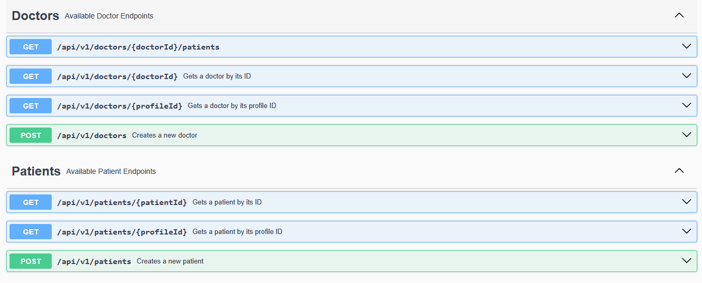

# Capítulo V: Product Imp lementation, Validation & Deployment

## 5.1. Software Configuration Management.

En esta sección se muestran las decisiones y convenciones que permitirán mantener consistencia durante el ciclo de vida del proyecto.

### 5.1.1. Software Development Environment Configuration.

En esta sección, se incluirá los productos de software que se usaron en el proyecto.
Los enlaces a cada una de las herramientas se encuentran disponibles en los anexos.

##### Project Management:
- Trello: Herramienta de gestión de proyectos basada en Kanban, utilizada para planificar tareas y asignar responsabilidades al equipo.

##### Product UX/UI Design:
- Figma: Herramienta colaborativa para crear prototipos interactivos de interfaces.
- Lucidchart: Para creación de diagramas de flujo.
- Uxpressia: Para elaboración de mapas de empatía y recorridos del usuario.
- Structurizr: Para modelado de arquitectura de software.

#### Software Development
- IntelliJ IDEA: IDE para desarrollo backend en Java. Para el primer y segundo sprint se utilizó para la redacción del informe del proyecto.
- WebStorm: IDE especializado para el desarrollo frontend. Se utilizó para el desarrollo de la Landing Page y frontend de la aplicación.
- Visual Studio Code: Editor utilizado únicamente para la exportación del reporte de formato markdown a PDF.
- GitHub: Plataforma de control de versiones y colaboración.

#### Software Deployment
- GitHub Pages: Servicio de despliegue de aplicaciones web estáticas desde repositorios GitHub.
- Netlify: Plataforma de despliegue continuo que permite publicar aplicaciones web estáticas y JAMstack. Fue utilizada para el despliegue del frontend.

### 5.1.2. Source Code Management.

**Gestión del Proyecto en GitHub**:
En este proyecto, utilizamos GitHub como plataforma principal para el control de versiones y gestión colaborativa del código fuente bajo una organización dedicada.

**Repositorios** en GitHub
- **Organización**: [https://github.com/HelpMom-AppWeb](https://github.com/HelpMom-AppWeb)
- **Landing Page**: [https://github.com/HelpMom-AppWeb/landing-page](https://github.com/HelpMom-AppWeb/landing-page)
- **Informe Final**: [https://github.com/HelpMom-AppWeb/final-report](https://github.com/HelpMom-AppWeb/final-report)
- **Frontend**: [https://github.com/HelpMom-AppWeb/HelpMom-frontend.git](https://github.com/HelpMom-AppWeb/HelpMom-frontend.git)
- **Backend**: [https://github.com/HelpMom-AppWeb/HelpMom-Platform.git](https://github.com/HelpMom-AppWeb/HelpMom-Platform.git)

#### Modelo de ramificación: GitFlow

Para el modelo de desarrollo, se decidió usar GitFlow como modelo de ramificación. Este modelo permite una gestión eficiente de las ramas y facilita la colaboración entre los desarrolladores.

Para el repositorio del informe final se crearon las siguientes ramas:
- **dev:** Rama principal de desarrollo, donde se integrarán todas las características y correcciones de errores.
- **chapter-1:** Rama para el desarrollo del capítulo 1 del informe.
- **chapter-2:** Rama para el desarrollo del capítulo 2 del informe.
- **chapter-3:** Rama para el desarrollo del capítulo 3 del informe.
- **chapter-4:** Rama para el desarrollo del capítulo 4 del informe.
- **chapter-5:** Rama para el desarrollo del capítulo 5 del informe.

Para el repositorio de Landing Page se crearon las siguientes ramas:
- **main:** Rama principal de desarrollo, donde se integrarán todas las características y correcciones de errores.

Para el repositorio del Fronted se crearon las siguientes ramas:
- **develop**: Rama principal donde una vez concluida la programación de un bounded context se hace un merge a esta rama.
- **feature/patient-management**: Rama donde se desarrolla el bounded context
- **feature/medication**: Rama donde se desarrolla el bounded context
- **feature/baby-monitoring**: Rama donde se desarrolla el bounded context
- **feature/chat**: Rama donde se desarrolla el bounded context
- **feature/appointments**: Rama donde se desarrolla el bounded context

Para el repositorio del backend se crearon las siguientes ramas:
- **main**: Rama principal de desarrollo, donde se integrarán todas las características y correcciones de errores.
- **develop**: Rama de desarrollo donde se integrarán las nuevas características y correcciones de errores antes de ser fusionadas a la rama principal.
- **appointments**: Rama donde se desarrolla el bounded context de citas médicas.
- **chats**: Rama donde se desarrolla el bounded context de chats.
- **health-monitoring**: Rama donde se desarrolla el bounded context de monitoreo de salud.
- **medications**: Rama donde se desarrolla el bounded context de medicamentos.
- **patient-management**: Rama donde se desarrolla el bounded context de gestión de pacientes.
- **user-management**: Rama donde se desarrolla el bounded context de gestión de usuarios.
#### Estilo de commits: Conventional Commits
Para asegurar mensajes de commits claros y estandarizados, se seguirá la convención [Conventional Commits](https://www.conventionalcommits.org/en/v1.0.0/). Algunos ejemplos:

- `feat: add search by name functionality`
- `fix: correct form validation error`
- `docs: update installation instructions`
- `refactor: simplify calculation logic`

El prefijo de categorías se define de la siguiente forma:
- `feat`: A new feature
- `fix`: A bug fix
- `docs`: Documentation only changes
- `style`: Changes that do not affect the meaning of the code (formatting, missing semicolons, etc.)
- `refactor`: A code change that neither fixes a bug nor adds a feature
- `test`: Adding missing tests or correcting existing ones
- `chore`: Changes to the build process or auxiliary tools

### 5.1.3. Source Code Style Guide & Conventions.

Establecemos las siguientes convenciones para garantizar consistencia y calidad en el desarrollo del proyecto, aplicables a todos los lenguajes y tecnologías utilizados (HTML, CSS, JavaScript, Vue.js, C# y Gherkin). Todas las nomenclaturas seguirán el idioma inglés y estándares reconocidos.

1. **HTML y CSS**

   **Estándares**:
      - Basados en recomendaciones del **W3C** y **Google Style Guide**
      - Identación: **2 espacios**
      - Comillas: **Dobles** para atributos HTML
      - Comentarios: Descriptivos y en inglés

   **Metodología**:
      - **BEM** (Block-Element-Modifier) para clases CSS
      - **HTML semántico**: Uso correcto de etiquetas (`<header>`, `<section>`, etc.)
   
      **Vue.js**:
     - Componentes: **PascalCase** (ej. `UserProfile.vue`)
     - Props/Métodos: **camelCase**

2. **JavaScript**

   **Guías**:
   - Según **MDN** y **Google JavaScript Style Guide**
   - Variables/funciones: **camelCase** (ej. `calculateTotal`)
   - Declaración: Siempre `const` o `let` (nunca `var`)
   - Literales: Comillas **simples** (`'texto'`)
   - Funciones: Preferir **arrow functions**

3. **Vue.js**

   **Convenciones**:
   - Directivas abreviadas: `@` para `v-on`, `:` para `v-bind`
   - Organización:
      - Componentes en carpetas por funcionalidad
      - Ciclo de vida ordenado (`created()`, `mounted()`, etc.)

4. C# (ASP.NET Core)

   **Estilo Microsoft**:
   - Clases/Métodos: **PascalCase** (ej. `UserService`)
   - Variables/parámetros: **camelCase**
   - Documentación: Comentarios **XML** (`/// 
`)

   **ASP.NET Core**:
   - Inyección de dependencias (DI)
   - Separación clara de capas (MVC)
   - Uso de **ViewModels**

5. Gherkin (.feature)

   **Prácticas**:
   - Keywords: **Given-When-Then** (ej. `Given a logged-in admin`)
   - Lenguaje: **Claro y no técnico**
   - Estructura:
      - Escenarios modulares
      - Pasos reutilizables

**Buenas Prácticas Generales**
- **Modularidad** y reutilización de código
- **Legibilidad** (nombres descriptivos, indentación consistente)
- **Optimización** de rendimiento
- **Seguridad** integrada en el diseño

Estas convenciones aseguran coherencia, mantenibilidad y calidad en todo el código del proyecto.

### 5.1.4. Software Deployment Configuration.

A continuación se detallan los pasos para desplegar cada componente de nuestra solución:

**Pasos para el despliegue**
1. Landing Page:
- Clonar o descargar el repositorio desde GitHub.
- Configurar el servidor web para alojar la Landing Page.
- Copiar los archivos HTMLS, CSS y JavaScript en el directorio correspondiente del servidor.
- Configurar cualquier dependencia adicional, como bibliotecas de JavaScript o imágenes.
- Verificar que la Landing Page se cargue correctamente en el navegador.

 🔗 Enlace al repositorio de la Landing Page: https://github.com/HelpMom-AppWeb/landing-page

 🔗 Enlace a la Landing Page desplegada: https://helpmom-appweb.github.io/landing-page/

2. Web Services (API):
- Preparar el código fuente del servicio web, asegurando que esté correctamente estructurado y documentado.
- Configurar un entorno de desarrollo o pruebas para realizar pruebas exhaustivas del servicio antes del despliegue.
- Desplegar el código en un servidor adecuado para el entorno de producción.
- Configurar la seguridad y la autenticación según los requisitos del sistema.
- Documentar la API utilizando OpenAPI Specification para facilitar su integración y uso por parte de otros sistemas.

3. Frontend Web Applications:
- Clonar repositorio desde GitHub.
- Compilar y empaquetar las aplicaciones frontend. En nuestro caso, utilizamos el framework Vue.js, por lo que se debe ejecutar los comandos de construcción (`npm run build`) para generar los archivos estáticos.
- Una vez empaquetadas, las Frontend Web Applications se pueden servir utilizando un servidor de aplicaciones compatible con archivos estáticos, como Nginx o incluso GitHub Pages para proyectos estáticos más simples.
- Si es necesario, se deben configurar las rutas en el servidor de aplicaciones para que coincidan con las rutas esperadas por las aplicaciones frontend.
  re redacta esto siguiendo el mismo formato

 🔗 Enlace al repositorio de la Landing Page: https://github.com/HelpMom-AppWeb/HelpMom-frontend

 🔗 Enlace al Frontend desplegado: https://helpmom.netlify.app/

4. Backend Web Applications:
- Clonar el repositorio desde GitHub.
- Configurar el entorno de desarrollo o producción, asegurando que todas las dependencias estén instaladas y configuradas correctamente.
- Compilar el código fuente del backend, asegurándose de que no haya errores de compilación.
- Desplegar el código compilado en un servidor adecuado, como un servidor web o un contenedor Docker.
- Configurar la base de datos y cualquier otro servicio necesario para el funcionamiento del backend.

 🔗 Enlace al repositorio del Backend: https://github.com/HelpMom-AppWeb/HelpMom-Platform.git

 🔗 Enlace al Backend desplegado: https://help-mom-platform.azurewebsites.net

 🔗 Enlace al host de la base de datos del Backend: https://help-mom.cfwowsciyx5s.us-east-2.rds.amazonaws.com

## 5.2. Landing Page, Services & Applications Implementation.
En esta sección se detalla y evidencia la implementación de cada entregable de HelpMom.

#### Landing page:
La landing page fue realizada de manera grupal y desplegada debidamente con la herramienta GitHub Pages.
A continuación las siguientes imágenes sirven de referencia para evidencia la implementación de la Landing Page.

#### Frontend:
El frontend fue realizado de manera grupal utilizando el framework Vue.
A continuación las siguientes imágenes sirven de referencia para evidencia la implementación del frontend.

#### Backend:
El backend fue realizado de manera grupal utilizando el framework ASP.NET Core.
A continuación las siguientes imágenes sirven de referencia para evidencia la implementación del backend.

### 5.2.1. Sprint 1

#### 5.2.1.1. Sprint Planning 1.

Para este primer sprint nos enfocaremos en los tasks para la
elaboración de la Landing Page. Nos dividiremos entre nosotros cada
una de las tareas identificadas para el sprint.
<table>
<tr>
    <th colspan="5">Sprint 1</th>
    <th colspan="9">Sprint 1</th>
  </tr>
      <tr>
    <td colspan="13">Sprint Planning Background</td>
  </tr>
  <tr>
    <td colspan="5">Date</td>
    <td colspan="8">2025-04-07</td>
</tr>
  <tr>
    <td colspan="5">Time</td>
    <td colspan="8">8:30 PM</td>
  </tr>
  <tr>
    <td colspan="5">Location</td>
    <td colspan="8">Via Discord</td>
<tr>
    <td colspan="5">Prepared By</td>
    <td colspan="8">Gabriel Alejandro Rivera Ayala</td>
</tr>
<tr>
    <td colspan="5">Attendees (to planning meeting)</td>
    <td colspan="8">Romina Guadalupe Maita Falckenheiner, Gabriel Cristian Mamani Marca, Camila Asuncion Reyes Menacho, Gabriel Alejandro Rivera Ayala, Stephano Jose Espinoza Cueva</td>
</tr>
<tr>
    <td colspan="5">Sprint  1 Review Summary</td>
    <td colspan="8">En esta primera sección se planteo el desarrollo de la Landing Page y planeación de aplicación para el proyecto de HelpMom.</td>
</tr>
<tr>
    <td colspan="5">Sprint 1 Retrospective Summary</td>
    <td colspan="8">En esta sección todos los integrantes mencionaron tener aciertos en partes del codigo y en otras partes poder mejorar sus habilidades realizando la Landing Page</td>
</tr>
<tr>
    <td colspan="13">Sprint Goal & User Stories</td>
</tr>
<tr>
    <td colspan="5">Sprint 1 Goal</td>
    <td colspan="8">
Desarrollar y desplegar una landing page que presente información a los usuarios a través de imágenes y texto. La página debe ser completamente adaptable a cualquier tipo de dispositivo que utilicen los usuarios, garantizando una experiencia de usuario fluida y responsiva.</td>
</tr>
<tr>
    <td colspan="5">Sprint 1 Velocity</td>
    <td colspan="8">7 story points</td>
</tr>
<tr>
    <td colspan="5">Sum of Story Points</td>
    <td colspan="8">7 Story Points</td>
</tr>
</table>

#### 5.2.1.2. Aspect Leaders and Collaborators.
Con la finalidad de mejorar la colaboración en equipo a cada integrante se asignó un rol de líder por cada aspecto. Los aspectos están relacionados con los entregables.

| Team member (LastName, First Name) | GitHub UserName | Aspect 1: Landing Page Leader (L) / Collaborator (C) | Aspect 2: Diseños Figma: Leader (L) / Collaborator (C) | Aspect 3: Reporte (L) / Collaborator (C) |
|------------------------------------|-----------------|------------------------------------------------------|--------------------------------------------------------|------------------------------------------|
| Rivera Gabriel                     | guestwhoo       | C                                                    | C                                                      | L                                        |
| Reyes Camila                       | dakuma-ai       | L                                                    | C                                                      | L                                        |
| Cueva Stephano                     | Stephanoescu    | L                                                    | C                                                      | L                                        |
| Maita Romina                       | RominaMaita     | C                                                    | L                                                      | L                                        |
| Mamani Gabriel                     | Gabrlel0105     | C                                                    | C                                                      | L                                        |

#### 5.2.1.3. Sprint Backlog 1.

<table   border="1">
  <tr>
    <th colspan="3">Sprint 1</th>
    <th colspan="10">Sprint 1</th>
  </tr>
  <tr>
    <td colspan="3">User Story</td>
    <td colspan="10">Work-Item/Task</td>
  </tr>
  <tr>
    <td colspan="1">ID</td>
    <td colspan="2">Title</td>
    <td colspan="1">ID</td>
    <td colspan="2">Title</td>
    <td colspan="3">Description</td>
    <td colspan="1">Estimation</td>
    <td colspan="2">Assigned to</td>
    <td colspan="1">Status (To-do / InProcess / To-Review / Done)</td>
  </tr>
  <tr>
    <td colspan="1">US01</td>
    <td colspan="2">Visualizar la información de la startup</td>
    <td colspan="1">UT01</td>
    <td colspan="2">Redactar el contenido informativo de la startup</td>
    <td colspan="3">Crear o recopilar el texto que describe la misión, visión, historia y valores de la startup.</td>
    <td colspan="1">2h</td>
    <td colspan="2">Gabriel Rivera</td>
    <td colspan="1">Done</td>
  </tr>
  <tr>
    <td colspan="1"></td>
    <td colspan="2"></td>
    <td colspan="1">UT02</td>
    <td colspan="2">Implementar visualización de la información de la startup</td>
    <td colspan="3">Diseñar e integrar la sección de presentación de la empresa en el sitio, asegurando buena legibilidad y diseño responsive.</td>
    <td colspan="1">2h</td>
    <td colspan="2">Gabriel Rivera</td>
    <td colspan="1">Done</td>
  </tr>
  <tr>
    <td colspan="1">US02</td>
    <td colspan="2">Visualizar la foto de la startup</td>
    <td colspan="1">UT03</td>
    <td colspan="2">Seleccionar y preparar la imagen de la startup</td>
    <td colspan="3">Escoger una imagen representativa de la empresa, optimizarla para web (peso y resolución).</td>
    <td colspan="1">2h</td>
    <td colspan="2">Camila</td>
    <td colspan="1">Done</td>
  </tr>
  <tr>
    <td colspan="1"></td>
    <td colspan="2"></td>
    <td colspan="1">UT04</td>
    <td colspan="2">Integrar la imagen de la startup en la web</td>
    <td colspan="3">Mostrar la imagen en la sección de "Sobre Nosotros" o similar, cuidando su ubicación y estilo visual.</td>
    <td colspan="1">1h</td>
    <td colspan="2">Camila</td>
    <td colspan="1">Done</td>
  </tr>
   <tr>
    <td colspan="1">US03</td>
    <td colspan="2">Visualizar la información del producto</td>
    <td colspan="1">UT05</td>
    <td colspan="2">Redactar la descripción del producto</td>
    <td colspan="3">Crear el contenido textual que explica qué es el producto, qué beneficios ofrece y cómo funciona.</td>
    <td colspan="1">4h</td>
    <td colspan="2">Camila</td>
    <td colspan="1">Done</td>
  </tr>
  <tr>
    <td colspan="1"></td>
    <td colspan="2"></td>
    <td colspan="1">UT06</td>
    <td colspan="2">Diseñar e implementar la sección del producto</td>
    <td colspan="3">Integrar el contenido del producto en el sitio, utilizando un diseño atractivo e intuitivo.</td>
    <td colspan="1">4h</td>
    <td colspan="2">Camila</td>
    <td colspan="1">Done</td>
  </tr>
  <tr>
    <td colspan="1">US04</td>
    <td colspan="2">Visualizar la foto del producto</td>
    <td colspan="1">UT07</td>
    <td colspan="2">Preparar imagen destacada del producto</td>
    <td colspan="3">Seleccionar una o más imágenes del producto, optimizarlas para distintos dispositivos.</td>
    <td colspan="1">4h</td>
    <td colspan="2">Camila</td>
    <td colspan="1">Done</td>
  </tr>
  <tr>
    <td colspan="1"></td>
    <td colspan="2"></td>
    <td colspan="1">UT08</td>
    <td colspan="2">Preparar Implementar visualización de imágenes del producto</td>
    <td colspan="3">Añadir las imágenes al sitio en una galería o sección destacada del producto.</td>
    <td colspan="1">3h</td>
    <td colspan="2">Camila</td>
    <td colspan="1">Done</td>
  </tr>
  <tr>
    <td colspan="1">US06</td>
    <td colspan="2">Visualizar la información de los planes</td>
    <td colspan="1">UT09</td>
    <td colspan="2">Definir contenido de los planes/membresías</td>
    <td colspan="3">Ingresar la información sobre los distintos planes, precios, características y condiciones.</td>
    <td colspan="1">3h</td>
    <td colspan="2">Romina</td>
    <td colspan="1">Done</td>
  </tr>
  <tr>
    <td colspan="1"></td>
    <td colspan="2"></td>
    <td colspan="1">UT10</td>
    <td colspan="2">Implementar sección de comparación de planes</td>
    <td colspan="3">Diseñar una tabla o cards informativas que permitan comparar fácilmente los planes.</td>
    <td colspan="1">3h</td>
    <td colspan="2">Romina</td>
    <td colspan="1">Done</td>
  </tr>
   <tr>
    <td colspan="1">US07</td>
    <td colspan="2">Ver preguntas frecuentes (FAQs)</td>
    <td colspan="1">UT11</td>
    <td colspan="2">Redactar listado de preguntas y respuestas frecuentes</td>
    <td colspan="3">Crear un listado claro de las dudas más comunes y sus respuestas.</td>
    <td colspan="1">2h</td>
    <td colspan="2">Gabriel Mamani</td>
    <td colspan="1">Done</td>
  </tr>
   <tr>
    <td colspan="1"></td>
    <td colspan="2"></td>
    <td colspan="1">UT12</td>
    <td colspan="2">Desarrollar componente visual de preguntas frecuentes</td>
    <td colspan="3">Implementar la sección en la web, preferiblemente con acordeones o collapsibles para mejor experiencia de usuario.</td>
    <td colspan="1">2h</td>
    <td colspan="2">Gabriel Mamani</td>
    <td colspan="1">Done</td>
  </tr>
   <tr>
    <td colspan="1">US09</td>
    <td colspan="2">Enviar datos de contacto</td>
    <td colspan="1">UT13</td>
    <td colspan="2">Diseñar e implementar el formulario de contacto</td>
    <td colspan="3">Crear un formulario con campos para nombre, correo electrónico y mensaje del usuario.</td>
    <td colspan="1">3h</td>
    <td colspan="2">Stephano</td>
    <td colspan="1">Done</td>
  </tr>
   <tr>
    <td colspan="1"></td>
    <td colspan="2"></td>
    <td colspan="1">UT14</td>
    <td colspan="2">Programar validación y envío del formulario</td>
    <td colspan="3">Asegurar que los datos ingresados sean válidos y se envíen correctamente a un correo o base de datos.</td>
    <td colspan="1">3h</td>
    <td colspan="2">Stephano</td>
    <td colspan="1">Done</td>
  </tr>

</table>

#### 5.2.1.4. Development Evidence for Sprint Review.
En esta sección se demuestran los commits relacionados con los principales avances en la implementación.
Estos commits provienen del repositorio del Landing Page de la organización de GitHub.

 🔗 Enlace al repositorio de la Landing Page: https://github.com/HelpMom-AppWeb/landing-page

| Repository                   | Branch | Commit Id                                 | Commit Message                                  | Commit Message Body | Commited on (Date) |
|------------------------------|--------|-------------------------------------------|-------------------------------------------------|---------------------|--------------------|
| HelpMom-AppWeb/landing-page  | main   | d822c4402e13fc950c43f25a2915f0f30c59cde3  | feat: added pricing plans.                      |                     | 20/04/2025         |
| HelpMom-AppWeb/landing-page  | main   | 2db6b4c16b4cf4efe120070ad03a8cb6a181377c  | feat: added products, logo, fonts, banner image |                     | 20/04/2025         |
| HelpMom-AppWeb/landing-page  | main   | 50756f6abfdd6d3649061387d2c5281548dda5fe  | feat: add contact.                              |                     | 20/04/2025         |
| HelpMom-AppWeb/landing-page  | main   | e44f89b6f219466c6b48796457b9a890b4b7a777  | feat: added about us section with images        |                     | 20/04/2025         |
| HelpMom-AppWeb/landing-page  | main   | a2d38d2dacd1732a2e1a48d8b888e2f2a1cf9eaf  | feat: add FAQ.                                  |                     | 20/04/2025         |

#### 5.2.1.5. Execution Evidence for Sprint Review.

Durante el desarrollo del sprint se lograron completar todos los puntos planteados.
A continuación se muestran evidencias del landing page logrado.

 

#### 5.2.1.6. Services Documentation Evidence for Sprint Review.

Como se mencionó previamente, Este sprint solo tuvo como objetivo el desarrollo de Landing Page. Aún no se han implementado ni documentado Endpoints con OpenAPI, ya que el desarrollo de los servicios web está planificado para los siguientes Sprints, conforme al roadmap del proyecto.

#### 5.2.1.7. Software Deployment Evidence for Sprint Review.

Durante este Sprint, se completó el desarrollo de la Landing Page y se realizó su despliegue utilizando GitHub Pages como plataforma de publicación gratuita. El objetivo fue contar con una primera versión accesible en línea del producto digital para revisión y retroalimentación.

Actividades realizadas:
Se creó el repositorio en GitHub: https://github.com/HelpMom-AppWeb/landing-page

Se subió el código fuente de la Landing Page, incluyendo los archivos HTML, CSS necesarios.

Se configuró GitHub Pages desde la pestaña Settings > Pages, seleccionando la rama principal y la carpeta raíz.

Se verificó la correcta publicación de la Landing Page en la siguiente URL:

 🔗 Landing Page desplegada: https://helpmom-appweb.github.io/landing-page/

**Evidencia del despliegue:**

#### 5.2.1.8. Team Collaboration Insights during Sprint.
En esta sección se evidencia la colaboración de cada integrante en el repositorio de la Landing Page.

 🔗 Repositorio de Landing Page: https://github.com/HelpMom-AppWeb/landing-page

#### Capturas de Insights del repositorio:

### 5.2.2. Sprint 2
#### 5.2.2.1. Sprint Planning 2.
Para este segundo sprint nos enfocaremos en los tasks para la
elaboración del frontend. Nos dividiremos entre nosotros cada
una de las tareas identificadas para el sprint.

<table>
<tr>
    <th colspan="5">Sprint 2</th>
    <th colspan="9">Sprint 2</th>
  </tr>
      <tr>
    <td colspan="13">Sprint Planning Background</td>
  </tr>
  <tr>
    <td colspan="5">Date</td>
    <td colspan="8">2025-05-05</td>
</tr>
  <tr>
    <td colspan="5">Time</td>
    <td colspan="8">8:30 PM</td>
  </tr>
  <tr>
    <td colspan="5">Location</td>
    <td colspan="8">Via Discord</td>
<tr>
    <td colspan="5">Prepared By</td>
    <td colspan="8">Gabriel Alejandro Rivera Ayala</td>
</tr>
<tr>
    <td colspan="5">Attendees (to planning meeting)</td>
    <td colspan="8">Romina Guadalupe Maita Falckenheiner, Gabriel Cristian Mamani Marca, Camila Asuncion Reyes Menacho, Gabriel Alejandro Rivera Ayala, Stephano Jose Espinoza Cueva</td>
</tr>
<tr>
    <td colspan="5">Sprint  2 Review Summary</td>
    <td colspan="8">En este segundo sprint todos los integrantes estuvieron presentes y aceptaron la asignación de tareas de cada uno para las correcciones con respecto al primer entregable. Así mismo, también se establecieron los alcances que tendrá la primera versión del frontend.</td>
</tr>
<tr>
    <td colspan="5">Sprint 2 Retrospective Summary</td>
    <td colspan="8">Los integrantes mencionaron contar con las capacidades, habilidades y tiempo necesarias para desempeñar sus responsabilidades en el tiempo establecido. Siendo el domingo 12/05/2025 la fecha máxima para culminar cada uno su aporte al frontend. </td>
</tr>
<tr>
    <td colspan="13">Sprint Goal & User Stories</td>
</tr>
<tr>
    <td colspan="5">Sprint 2 Goal</td>
    <td colspan="8">
Desarrollar y desplegar una primera versión del frontend con las características más fundamentales con relación al negocio, con la finalidad de que los usuarios puedan interactuar con una interfaz funcional, validar los flujos principales del sistema y brindar retroalimentación temprana que permita ajustar el desarrollo de las siguientes iteraciones. </td>
</tr>
<tr>
    <td colspan="5">Sprint 2 Velocity</td>
    <td colspan="8">7 story points</td>
</tr>
<tr>
    <td colspan="5">Sum of Story Points</td>
    <td colspan="8"> 7 Story Points</td>
</tr>
</table>

#### 5.2.2.2. Aspect Leaders and Collaborators.
Con la finalidad de mejorar la colaboración en equipo a cada integrante se asignó un rol de líder por cada aspecto. Los aspectos están relacionados con los entregables.

| Team member (LastName, First Name) | GitHub UserName | Aspect 1: Landing Page Leader (L) / Collaborator (C) | Aspect 2: UX/UI Leader (L) / Collaborator (C) | Aspect 3: Report Leader (L) / Collaborator (C) | Aspect 4: Frontend Leader (L) / Collaborator (C) | Aspect 5: Videos (L) / Collaborator (C) |
|------------------------------------|-----------------|------------------------------------------------------|-----------------------------------------------|------------------------------------------------|--------------------------------------------------|-----------------------------------------|
| Rivera Gabriel                     | guestwhoo       | C                                                    | L                                             | C                                              | C                                                | C                                       |
| Reyes Camila                       | dakuma-ai       | C                                                    | C                                             | C                                              | C                                                | L                                       |
| Cueva Stephano                     | Stephanoescu    | C                                                    | C                                             | L                                              | C                                                | C                                       |
| Maita Romina                       | RominaMaita     | C                                                    | C                                             | C                                              | L                                                | C                                       |
| Mamani Gabriel                     | Gabrlel0105     | L                                                    | C                                             | C                                              | C                                                | C                                       |

#### 5.2.2.3. Sprint Backlog 2.
| User Story |                                           | Work-item/task |                                 |                                                                                                                                         |            |                   |                |
|------------|-------------------------------------------|----------------|---------------------------------|-----------------------------------------------------------------------------------------------------------------------------------------|------------|-------------------|----------------|
| ID         | Title                                     | ID             | Title                           | Description                                                                                                                             | Estimation | Assigned to       | Status (To-do) |
| HU20       | Seguimiento de signos vitales             | UT01           | Formulario de ingreso de datos  | Crear un formulario con los campos requeridos (ritmo cardiaco, temperatura, peso, saturación de oxígeno) y validar ingreso de los datos | 1h         | Romina            | Done           |
|            |                                           | UT02           | Diseño de tarjeta de resumen    | Mostrar la información que el paciente ingresa a través de un card.                                                                     | 1h         | Romina            | Done           |
|            |                                           |                |                                 |                                                                                                                                         |            |                   |                |
| HU23       | Gestión de citas medicas de los doctores  | UT03           | Formulario de ingreso de citas  | Crear un formulario donde el doctor pueda agregar y editar citas para distintos pacientes                                               | 2h         | Camila Reyes      | Done           |
| HU24       | Gestión de citas medicas de los pacientes | UT04           | Calendario de citas médicas     | Mostrar las citas próximas del paciente                                                                                                 | 3h         | Camila Reyes      | Done           |
| HU17       | chat entre obstetra y madre               | UT05           | Envío de mensaje                | Como madre, quiero enviar un mensaje a una doctora para comunicarme con ella.                                                           | 2H         | Gabriel Mamani    | Done           |
|            |                                           |                |                                 |                                                                                                                                         |            |                   |                |
| HU10       | Ingreso de recetas médicas                | UT06           | Formulario de ingreso de receta | como obstetra quiero dar una receta a la paciente                                                                                       | 2h         | Stephano Espinoza | Done           |
| HU11       | Añadir instrucciones                      | UT06           | Campo de instrucciones médicas  | Permitir al obstetra añadir instrucciones especificas en la receta medica                                                               | 1h         | Stephano Espinoza | Done           |
| HU12       | Historial de recetas                      | UT06           | Modulo de historial de recetas  | Mostrar un historial de todas las recetas emitidas a cada paciente                                                                      | 2h         | Stephano Espinoza | Done           |

#### 5.2.2.4. Development Evidence for Sprint Review.
En esta sección se demuestran los commits relacionados con los principales avances en la implementación.
Estos commits provienen del repositorio del frontend de la organización de GitHub.

 🔗 Enlace al repositorio de la Landing Page: https://github.com/HelpMom-AppWeb/HelpMom-frontend

| Repository                       | Branch                     | Commit Id                                 | Commit Message                                            | Commit Message Body | Commited on (Date) |
|----------------------------------|----------------------------|-------------------------------------------|-----------------------------------------------------------|---------------------|--------------------|
| HelpMom-AppWeb/HelpMom-frontend  | feature/patient-management | e3bf8e78879fb3d11a25920253f0770fc2530ca3  | feat: added add-patient component                         |                     | 10/05/2025         |
| HelpMom-AppWeb/HelpMom-frontend  | feature/medication         | a6f7b56924f4d7005f1de8a18908464ab556b21f  | feat: Medication front                                    |                     | 10/05/2025         |
| HelpMom-AppWeb/HelpMom-frontend  | feature/chat               | 76872b9d5f18d330513296116f34a15f26940273  | feat:chat mother                                          |                     | 10/05/2025         |
| HelpMom-AppWeb/HelpMom-frontend  | feature/baby-monitoring    | e12f1dab0cf585c8ef8332889951edbc8819e115  | feat(health-monitoring): add health monitoring component. |                     | 10/05/2025         |
| HelpMom-AppWeb/HelpMom-frontend  | feature/appointments       | 8cca0766099d592ed644d436b48bc7290a4586bc  | feat: add: patient appointments                           |                     | 10/05/2025         |

#### 5.2.2.5. Execution Evidence for Sprint Review.
Durante el desarrollo del segundo sprint se desarrolló los componentes principales con respecto al negocio.
A continuación se muestran evidencias del frontend.

#### 5.2.2.6. Services Documentation Evidence for Sprint Review.

Durante este Sprint, se completó la implementación de funcionalidades clave en el frontend, y se procedió con el despliegue del mismo utilizando Netlify como plataforma de publicación gratuita. Este paso tuvo como objetivo poner a disposición una versión funcional del sistema en un entorno accesible para el equipo y los stakeholders, permitiendo su revisión continua y retroalimentación oportuna.

Actividades realizadas:
Se creó una cuenta en Netlify y se vinculó el repositorio del proyecto para automatizar los despliegues desde la rama principal.

Se subió el código fuente del frontend al repositorio de GitHub:
 🔗 Repositorio: https://github.com/HelpMom-AppWeb/HelpMom-frontend

Se configuró el despliegue automático desde Netlify seleccionando la rama develop del repositorio, definiendo los comandos de build y la carpeta de salida (dist generada por Angular).

Se verificó el despliegue exitoso del sistema en la siguiente URL pública:

 🔗 Frontend desplegado en Netlify: http://helpmom.netlify.app/

Se realizaron pruebas de verificación en la versión desplegada para validar la correcta carga de componentes y funcionalidades básicas como navegación, visualización de datos y responsividad.

#### Evidencias de despliegue:

#### 5.2.2.8. Team Collaboration Insights during Sprint.
En esta sección se evidencia la colaboración de cada integrante en el repositorio del frontend.

 🔗 Repositorio: https://github.com/HelpMom-AppWeb/HelpMom-frontend

#### Capturas de Insights del repositorio:

### 5.2.3. Sprint 3
En este tercer sprint nos enfocaremos en los tasks para la elaboración de la Landing Page, Frontend y Backend. Nos dividiremos entre nosotros cada una de las tareas identificadas para el sprint.
#### 5.2.3.1. Sprint Planning 3.
A continuación se muestra el acta de la reunión de planificación del tercer sprint, donde se establecieron los objetivos y tareas a realizar.

<table>
<tr>
    <th colspan="5">Sprint 2</th>
    <th colspan="9">Sprint 2</th>
  </tr>
      <tr>
    <td colspan="13">Sprint Planning Background</td>
  </tr>
  <tr>
    <td colspan="5">Date</td>
    <td colspan="8">2025-06-06</td>
</tr>
  <tr>
    <td colspan="5">Time</td>
    <td colspan="8">3:30 PM</td>
  </tr>
  <tr>
    <td colspan="5">Location</td>
    <td colspan="8">Via Discord</td>
<tr>
    <td colspan="5">Prepared By</td>
    <td colspan="8">Romina Maita Falckenheiner</td>
</tr>
<tr>
    <td colspan="5">Attendees (to planning meeting)</td>
    <td colspan="8">Romina Guadalupe Maita Falckenheiner, Gabriel Cristian Mamani Marca, Camila Asuncion Reyes Menacho, Gabriel Alejandro Rivera Ayala, Stephano Jose Espinoza Cueva</td>
</tr>
<tr>
    <td colspan="5">Sprint  3 Review Summary</td>
    <td colspan="8">En esta tercera entrega se detalló cuáles serán las tareas de cada uno y cuáles serían las fechas de plazo máximo para cada tarea, además que se explicó de manera general cómo desarrollar backend. Por último, se realizó una promesa de mantener comunicación constante con el equipo y tener confianza de hacer consultas en caso de errores o problemas de desarrollo.</td>
</tr>
<tr>
    <td colspan="5">Sprint 3 Retrospective Summary</td>
    <td colspan="8">Los integrantes mencionaron contar con las capacidades, habilidades y tiempo necesarias para desempeñar sus responsabilidades en el tiempo establecido.</td>
</tr>
<tr>
    <td colspan="13">Sprint Goal & User Stories</td>
</tr>
<tr>
    <td colspan="5">Sprint 3 Goal</td>
    <td colspan="8">
Nuestro enfoque está en desarrollar una plataforma integral que facilite la interacción entre doctores y pacientes a través de funcionalidades clave como chat en tiempo real, gestión de recetas médicas, control de citas y monitoreo de salud. En el módulo de chat, buscamos permitir el envío, visualización y eliminación de mensajes, facilitando una comunicación fluida entre los usuarios. En la gestión de recetas médicas, tanto desde el frontend como desde el backend, implementamos interfaces intuitivas y endpoints robustos para que doctores y pacientes puedan crear, actualizar, visualizar y eliminar recetas, medicamentos, prescripciones y notas asociadas, asegurando validaciones estrictas y un control adecuado del estado de las recetas (abiertas o cerradas). En el módulo de citas médicas, proporcionamos endpoints para agendar, modificar, cancelar y visualizar consultas, optimizando la organización y garantizando disponibilidad y flexibilidad. Finalmente, en el módulo de monitoreo de salud, ofrecemos una interfaz para registrar y consultar signos vitales, junto a endpoints que permitan almacenar y recuperar esta información, lo cual mejora el seguimiento del estado de salud de las madres durante la gestación. Todo esto se confirmará cuando cada funcionalidad permita registrar y gestionar sus datos correctamente, brinde retroalimentación clara ante errores, y ofrezca una experiencia de usuario coherente, segura y eficaz. </td>
</tr>
<tr>
    <td colspan="5">Sprint 3 Velocity</td>
    <td colspan="8">8 story points</td>
</tr>
<tr>
    <td colspan="5">Sum of Story Points</td>
    <td colspan="8">8  Story Points</td>
</tr>
</table>

#### 5.2.3.2. Aspect Leaders and Collaborators.
Con la finalidad de mejorar la colaboración en equipo a cada integrante se asignó un rol de líder por cada aspecto. Los aspectos están relacionados con los entregables.

| Team member (LastName, First Name) | GitHub UserName | Aspect 1: Health Monitoring (L) / Collaborator (C) | Aspect 2: Appointments (L) / Collaborator (C) | Aspect 3: Medication (L) / Collaborator (C) | Aspect 4: Patient Management (L) / Collaborator (C) | Aspect 5: Chat (L) / Collaborator (C) | 
|------------------------------------|-----------------|----------------------------------------------------|-----------------------------------------------|---------------------------------------------|-----------------------------------------------------|---------------------------------------|
| Rivera Gabriel                     | guestwhoo       | C                                                  | C                                             | C                                           | L                                                   | C                                     | 
| Reyes Camila                       | dakuma-ai       | C                                                  | L                                             | C                                           | C                                                   | C                                     |
| Cueva Stephano                     | Stephanoescu    | C                                                  | C                                             | L                                           | C                                                   | C                                     | 
| Maita Romina                       | RominaMaita     | L                                                  | C                                             | C                                           | C                                                   | C                                     |
| Mamani Gabriel                     | Gabrlel0105     | C                                                  | C                                             | C                                           | C                                                   | L                                     |

#### 5.2.3.3. Sprint Backlog 3.
A continuación se muestra el Sprint Backlog del tercer sprint, donde se detallan las historias de usuario y los tasks asignados a cada integrante del equipo.

| User Story |                                                                                                                           | Work-item/task |                                                               |                                                                                                                                                                                                                                                                                                                    |            |                   |                |
|------------|---------------------------------------------------------------------------------------------------------------------------|----------------|---------------------------------------------------------------|--------------------------------------------------------------------------------------------------------------------------------------------------------------------------------------------------------------------------------------------------------------------------------------------------------------------|------------|-------------------|----------------|
| ID         | Title                                                                                                                     | ID             | Title                                                         | Description                                                                                                                                                                                                                                                                                                        | Estimation | Assigned to       | Status (To-do) |
| TS1        | Agregar signos vitales a través de un RESTful API                                                                         | TSK1           | Crear modelo de datos para signos vitales                     | Diseñar y definir la entidad Signos Vitales con los campos: ritmo cardiaco, temperatura, peso, saturación de oxígeno, y la relación con la entidad madre o bebé a través de los id. Asegurar la validación de tipos y rangos básicos en el modelo.                                                                 | 2h         | Romina            |                |
|            |                                                                                                                           | TSK2           | Crear endpoint POST /api/v1/vital-signs                       | Implementar el endpoint RESTful que permita recibir una solicitud POST con datos de signos vitales y los almacene correctamente. Asegurarse de devolver una respuesta 201 Created con el recurso creado incluyendo su id y los datos enviados.                                                                     | 4h         | Romina            |                |
|            |                                                                                                                           | TSK3           | Validar campos obligatorios                                   | Agregar validaciones para que campos como ritmoCardiaco, temperatura, peso y saturacionOxigeno sean obligatorios. En caso de ausencia de algún campo, retornar una respuesta 400 Bad Request con un mensaje descriptivo como: "El campo ritmoCardiaco es obligatorio."                                             | 3h         | Romina            |                |
|            |                                                                                                                           | TSK4           | Validar existencia del bebé o madre                           | Antes de registrar los signos vitales, verificar que el babyId o madreId existe en el sistema. Si no se encuentra, retornar una respuesta 404 Not Found con el mensaje: "Bebé no encontrado." o "Madre no encontrada." según corresponda.                                                                          | 3h         | Romina            |                |
| TS2        | Actualizar signos vitales a través de un RESTful API                                                                      | TSK5           | Implementar endpoint PUT /api/v1/vital-signs/{id}             | Desarrollar el endpoint que reciba una solicitud PUT para actualizar un registro de signos vitales existente. Este endpoint debe buscar el recurso por id, actualizar los valores recibidos (ritmo cardiáco, temperatura, peso, saturación de oxígeno) y devolver una respuesta 200 OK con el recurso actualizado. | 4h         | Romina            |                |
|            |                                                                                                                           | TSK6           | Validar existencia del registro a actualizar                  | Verificar que el id de signos vitales recibido en la URL corresponde a un registro existente. Si no existe, retornar una respuesta 404 Not Found con el mensaje "Signos vitales no encontrados."                                                                                                                   | 3h         |                   |                |
|            |                                                                                                                           | TSK7           | Validar campos obligatorios al actualizar                     | Asegurar que todos los campos requeridos (ritmoCardiaco, temperatura, peso, saturacionOxigeno) estén presentes en la solicitud PUT. Si falta alguno, retornar 400 Bad Request con un mensaje como: "El campo temperatura es obligatorio."                                                                          | 3h         | Romina            |                |
| TS3        | Agregar metodo  de comunicacion entre  doctora y mujer en gestacion, mediente un chat a traves de un Restful API | TSK8           | Crear modelo de datos para el chat                            | Diseñar y definir las entidades necesarias para el sistema de mensajería, que facilite la comunicación entre doctoras y madres en gestación.                                                                                                                                                                       | 6h         | Gabriel Mamani    |                |
| TS4        |                                                                                                                           | TSK9           | Crear Endpoint POST /api/v1/chat/messages                     | Crear un endpoint para que tanto la doctora y paciente tengan las posibilidad de enviar mensajes entre si                                                                                                                                                                                                          | 7h         | Gabriel Mamani    |                |
| TS5        |                                                                                                                           | TSK10          | Crear Endpoint GET /api/v1/chat/conversations/{user_id}       | Obtener todas las conversaciones en las que participa un usuario (ya sea doctora o madre). Este endpoint permite listar las conversaciones activas del usuario, mostrando información clave como el ID de la conversación, los participantes y el último mensaje enviado.                                          | 8h         | Gabriel Mamani    |                |
| TS6        |                                                                                                                           | TSK11          | Crear endpoint PUT /api/v1/chat/messages/{id}/read            | Marcar un mensaje específico como leído. Es útil para actualizar el estado de lectura una vez que el receptor ha visto el mensaje en la interfaz.                                                                                                                                                                  | 9h         | Gabriel Mamani    |                |
| TS7        | Agregar cita médica a través de RESTful API                                                                               | TSK12          | Crear modelo de datos para citas médicas                      | Diseñar entidad Cita con campos: id, fechaHora, duracion, motivo, embarazadaId, doctorId, estado (activa/cancelada). Validar tipos y relaciones.                                                                                                                                                                   | 3h         | Camila Reyes      |                |
| TS8        |                                                                                                                           | TSK13          | Crear modelo de datos para citas médicas                      | Crear endpoint para registrar citas, con validaciones de campos obligatorios y formato correcto. Retornar 201 Created con datos de la cita creada.                                                                                                                                                                 | 5h         | Camila Reyes      |                |
| TS9        |                                                                                                                           | TSK14          | Validar disponibilidad del doctor                             | Verificar que el doctor no tenga citas superpuestas en la misma fecha/hora. Si hay conflicto, retornar 409 Conflict con mensaje: "El doctor ya tiene una cita programada en ese horario."                                                                                                                          | 4h         | Camila Reyes      |                |
| TS10       |                                                                                                                           | TSK15          | Validar existencia de embarazada y doctor                     | Antes de crear la cita, verificar que embarazadaId y doctorId existan en la base de datos. Si no, retornar 404 Not Found con mensaje correspondiente.                                                                                                                                                              | 3h         | Camila Reyes      |                |
| TS11       | Eliminar cita médica a través de RESTful API                                                                              | TSK16          | Implementar endpoint DELETE /api/v1/appointments/{id}         | Desarrollar lógica para eliminar citas (soft delete o borrado físico). Retornar 204 No Content si es exitoso.                                                                                                                                                                                                      | 4h         | Camila Reyes      |                |
| TS12       |                                                                                                                           | TSK17          | Validar estado de la cita antes de eliminar                   | Si la cita ya está cancelada, retornar 410 Gone con mensaje: "La cita ya fue cancelada anteriormente."                                                                                                                                                                                                             | 2h         | Camila Reyes      |                |
| TS13       |                                                                                                                           | TSK18          | Manejar errores de ID inválido                                | Validar que el id en DELETE sea un UUID válido. Si no, retornar 400 Bad Request con mensaje: "ID de cita inválido."                                                                                                                                                                                                | 2h         | Camila Reyes      |                |
| TS14       |                                                                                                                           | TSK19          | Actualizar calendario en tiempo real                          | Integrar WebSocket o notificaciones para reflejar cambios (añadir/eliminar citas) en el frontend sin necesidad de recargar.                                                                                                                                                                                        | 6h         | Camila Reyes      |                |
| TS15       | Visualizar informacion de un paciente a traves de un RESTful API                                                          | TSK20          | Implementar endpoint GET /api/v1/patients/{id}                | Desarrollar el endpoint que permita acceder a la informacion de un paciente según su Id, asegurarse de recibir una respuesta con código 200 y los datos del paciente.                                                                                                                                              | 6h         | Gabriel Rivera    |                |
| TS16       | Visualizar lista de paciente a traves de un RESTful API                                                                   | TSK21          | Implementar endpoint GET /api/v1/patients                     | Desarrollar el endpoint que permita acceder a la informacion de una lista de pacientes, asegurarse de recibir una respuesta con código 200 y los datos de todos los recursos disponibles en el endpoint.                                                                                                           | 6h         | Gabriel Rivera    |                |
| TS17       | Agregar Paciente a traves de un RESTful API                                                                               | TSK22          | Implementar endpoint POST /api/v1/patients/add                | Desarrollar el endpoint que permita recibir una operación POST y almacene los datos de un paciente. Asegurarse de recibir un código 201 Created.                                                                                                                                                                   | 4h         | Gabriel Rivera    |                |
| TS18       | Agregar receta a traves de un RESTful API                                                                                 | TSK23          | Crear modelo de datos para Recetas                            | Diseñar y definir la entidad Receta con los campos necesarios como: medicamentos, instrucciones, IdPaciente (para relacionar con un paciente). Asegurar la validación de tipos y rangos básicos en el modelo.                                                                                                      | 4h         | Stephano Espinoza |                |
| TS19       |                                                                                                                           | TSK24          | Crear endpoint POST /api/v1/recipes                           | Implementar el endpoint RESTful que permita recibir una solicitud POST con datos de una receta y los almacene correctamente en la base de datos. Asegurarse de devolver una respuesta con el recurso creado, incluyendo su id y los datos enviados.                                                                | 6h         | Stephano Espinoza |                |
| TS20       |                                                                                                                           | TSK25          | Validar campos obligatorios en Receta                         | Agregar validaciones para que campos como, medicamentos, prescripción sean obligatorios. En caso de ausencia de algún campo, retornar una respuesta 400 Bad Request con un mensaje descriptivo como: "El campo Prescripción es obligatorio."                                                                       | 3h         | Stephano Espinoza |                |
| TS21       |                                                                                                                           | TSK26          | Validar existencia del paciente en Receta                     | Antes de registrar una receta, verificar que el idPaciente proporcionado existe en el sistema. Si no se encuentra, retornar una respuesta 404 Not Found con el mensaje: "Paciente no encontrado                                                                                                                    |            | Stephano Espinoza |                |
| TS22       | Eliminar una receta a traves de un RESTful API                                                                            | TSK27          | Crear endpoint DELETE /api/v1/recipes/{id}                    | Implementar el endpoint RESTful que permita recibir una solicitud DELETE con el id de una receta y la elimine de la base de datos. En caso de éxito, devolver una respuesta 204 No Content.                                                                                                                        | 4h         | Stephano Espinoza |                |
| TS23       |                                                                                                                           | TSK28          | Validar existencia de la receta a eliminar                    | Antes de intentar eliminar una receta, verificar que el id proporcionado corresponde a una receta existente. Si no se encuentra, retornar una respuesta 404 Not Found con el mensaje: "Receta no encontrada."                                                                                                      | 2h         | Stephano Espinoza |                |
| TS24       | Agregar medicamento a traves de un RESTful API                                                                            | TSK29          | Crear modelo de datos para Medicamentos                       | Diseñar y definir la entidad Medicamento con los campos:, Preescripcion, dosisRecomendada, unidadDosis,. Asegurar la validación de tipos y rangos básicos en el modelo.                                                                                                                                            | 4h         | Stephano Espinoza |                |
| TS25       |                                                                                                                           | TSK30          | Crear endpoint POST /api/v1/medications                       | mplementar el endpoint RESTful que permita recibir una solicitud POST con datos de un medicamento y los almacene correctamente. Asegurarse de devolver una respuesta 201 Created con el recurso creado incluyendo su id y los datos enviados.                                                                      | 6h         | Stephano Espinoza |                |
| TS26       |                                                                                                                           | TSK31          | Validar campos obligatorios en Medicamento                    | Agregar validaciones para que campos como dosisRecomendada sean obligatorios. En caso de ausencia de algún campo, retornar una respuesta 400 Bad Request con un mensaje descriptivo como: "El campo nombre es obligatorio."                                                                                        | 3h         | Stephano Espinoza |                |
| TS27       | Eliminar medicamento a traves de un RESTful api                                                                           | TSK32          | Crear endpoint DELETE /api/v1/medications/{id}                | Implementar el endpoint RESTful que permita recibir una solicitud DELETE con el id de un medicamento y lo elimine de la base de datos. En caso de éxito, devolver una respuesta 204 No Content.                                                                                                                    | 4h         | Stephano Espinoza |                |
| TS28       |                                                                                                                           | TSK33          | Validar existencia del medicamento a eliminar                 | Antes de intentar eliminar un medicamento, verificar que el id proporcionado corresponde a un medicamento existente. Si no se encuentra, retornar una respuesta 404 Not Found con el mensaje: "Medicamento no encontrado."                                                                                         | 2h         | Stephano Espinoza |                |
| TS29       | Agregar preescripcion de medicamento a traves de un RESTful API                                                           | TSK34          | Crear modelo de datos para Prescripción de Medicamento        | Diseñar y definir la entidad PrescripcionMedicamento con los campos: idMedicamento, idPaciente, dosisPrescrita, frecuencia, duracionDias. Asegurar la validación de tipos y rangos básicos en el modelo.                                                                                                           | 5h         | Stephano Espinoza |                |
| TS30       |                                                                                                                           | TSK35          | Crear endpoint POST /api/v1/prescriptions                     | mplementar el endpoint RESTful que permita recibir una solicitud POST con datos de una prescripción de medicamento y los almacene correctamente. Asegurarse de devolver una respuesta 201 Created con el recurso creado incluyendo su id y los datos enviados.                                                     | 7h         | Stephano Espinoza |                |
| TS31       |                                                                                                                           | TSK36          | Validar campos obligatorios en Prescripción                   | Agregar validaciones para que campos como idMedicamento, idPaciente, dosisPrescrita y frecuencia sean obligatorios. En caso de ausencia de algún campo, retornar una respuesta 400 Bad Request con un mensaje descriptivo como: "El campo idMedicamento es obligatorio."                                           | 4h         | Stephano Espinoza |                |
| TS32       |                                                                                                                           | TSK37          | Validar existencia del medicamento y paciente en Prescripción | Antes de registrar una prescripción, verificar que idPaciente existe en el sistema. Si alguno no se encuentra, retornar una respuesta 404 Not Found con el mensaje correspondiente: "Medicamento no encontrado." o "Paciente no encontrado."                                                                       | 4h         | Stephano Espinoza |                |
| TS33       | Agregar una Nota a traves de un RESTful API                                                                               | TSK38          | Crear modelo de datos para Notas                              | Diseñar y definir la entidad Nota con los campos:, contenido . Asegurar la validación de tipos y rangos básicos en el modelo.                                                                                                                                                                                      | 4h         | Stephano Espinoza |                |
| TS34       |                                                                                                                           | TSK39          | Crear endpoint POST /api/v1/notes                             | Implementar el endpoint RESTful que permita recibir una solicitud POST con datos de una nota y los almacene correctamente. Asegurarse de devolver una respuesta 201 Created con el recurso creado incluyendo su id y los datos enviados.                                                                           | 6h         | Stephano Espinoza |                |

#### 5.2.3.4. Development Evidence for Sprint Review.
En esta sección se demuestran los commits relacionados con los principales avances en la implementación.
Estos commits provienen del repositorio del frontend de la organización de GitHub.

 🔗 Enlace al repositorio del backend: https://github.com/HelpMom-AppWeb/HelpMom-Platform 

| Repository         | Branch                      | Commit Id                                 | Commit Message                                                    | Commit Message Body | Commited on (Date) |
|--------------------|-----------------------------|-------------------------------------------|-------------------------------------------------------------------|---------------------|--------------------|
| HelpMom-Platform   | feature/medication          | 514b8a21b6df95918990c3939d28a4265f2b6a44  | feat: add CreatePrescription command.                             |                     | 16/06/2025         |
| HelpMom-Platform   | feature/chat                | 9387afa10f54608c7bdc7a4b735fee73b0736e34  | feat:add GetMessagesByPatientIdQueryService                       |                     | 15/06/2025         |
| HelpMom-Platform   | feature/health-monitoring   | 1100a84a23748f07f766c623c0f627b52d7d4d26  | feat(health-monitoring): add health data controller.              |                     | 15/07/2025         |
| HelpMom-Platform   | feature/appointments        | 5b8cdc824f608721c4ac49a28ececb117708caa4  | feat: add appointment command service interface and db context    |                     | 15/07/2025         |
| HelpMom-Platform   | feature/patient-management  | 2bf1a0bb0f5a97851991d79434225340f1c3ccbf  | feat: added Controllers for Patients, Doctors and ListOfPatients  |                     | 19/07/2025         |

#### 5.2.3.5. Execution Evidence for Sprint Review.
Se demuestra que la aplicación y su base de datos están funcionando correctamente. Se observan consultas de datos exitosas y la consola del servidor confirma que el sistema está activo.

#### 5.2.3.6. Services Documentation Evidence for Sprint Review.
Se presenta la documentación técnica de la API del sistema. La imagen muestra una lista clara de todos los servicios disponibles y sus funciones, facilitando su uso y integración.

#### 5.2.3.7. Software Deployment Evidence for Sprint Review.
Se muestra la prueba de que el software fue desplegado exitosamente en el ambiente de producción. Se incluye tanto la confirmación del despliegue como el registro técnico del proceso.
- Deployment  frontend

- Deployment  backend

#### 5.2.3.8. Team Collaboration Insights during Sprint.
En esta sección se muestran los insights de colaboración del equipo durante el sprint, obtenidos a través de la herramienta de gestión de proyectos utilizada por el equipo.

- Reporte insights de colaboración del equipo durante el sprint:

- Frontend insights de colaboración del equipo durante el sprint:

- backend insights de colaboración del equipo durante el sprint:

### 5.3. Validation Interviews

Para poder hacer una validación de nuestras entrevistas se empleará los siguientes recursos:

#### Landing Page

#### FrontEnd Web Application

#### 5.3.1. Diseño de entrevistas

Preguntas que se realizaran a los entrevistados:

1. Después de ver nuestra Landing Page, ¿te dio curiosidad nuestro producto?
2. ¿Te parece que la interfaz es amigable y fácil de usar?
3. ¿Qué puntos o secciones de la página web llamaron más tu atención?
4. ¿Qué aspectos del producto o de la página crees que se podrían mejorar?
5. Para finalizar, ¿cuál es el mayor atractivo de nuestro producto para ti?

#### 5.3.2. Registro de entrevistas

Entrevista 1:

      Entrevistada: Valeria Reyes
        Fecha: 17 de Junio de 2025
        Hora: 8:00 PM
        Tuvimos la oportunidad de entrevistar a una madre usuaria de nuestro producto, quien destacó aspectos clave de su experiencia. Encontró la interfaz amigable y dinámica, con colores y diseño adecuados para el público materno.
        Valoró especialmente funciones como el registro del peso del bebé y el calendario de citas médicas, que facilitan el seguimiento del embarazo. Sugirió añadir notificaciones personalizadas ("¿Cómo te sientes?") con posibilidad de interacción médica, lo que mejoraría el acompañamiento.
        Destacó que la aplicación es accesible para madres de todas las edades y reúne en un solo lugar todas las herramientas necesarias. Agradecemos sus comentarios, que nos ayudarán a seguir mejorando el producto.
        Nota clave: La usuaria enfatizó la importancia de un diseño intuitivo y funciones que brinden seguridad y organización durante el embarazo.

Entrevista 2:

      Entrevistada: Laura Mendez
        Fecha: 18 de Junio de 2025
        Hora: 8:00 PM
         Se entrevisto a Laura Méndez, ginecóloga de 35 años, quien evaluó nuestra plataforma desde su perspectiva profesional. Destacó el enfoque integrado del producto, diseñado para facilitar el manejo del cuidado parental y el seguimiento médico durante el embarazo.
         La doctora encontró la interfaz intuitiva y bien organizada, resaltando funcionalidades clave como los gráficos de desarrollo fetal, la gestión de citas médicas y la trazabilidad completa de los controles prenatales. Estas herramientas, según mencionó, optimizan el tiempo de los profesionales y mejoran la atención clínica.
         Como sugerencias de mejora, propuso incorporar videoconsultas integradas y alertas más detalladas basadas en protocolos médicos, lo que enriquecería la experiencia tanto para médicos como para pacientes.
         Agradecemos sus valiosos comentarios, que nos ayudarán a seguir perfeccionando la plataforma.
         Nota clave: La profesional destacó la importancia de una plataforma eficiente, con herramientas claras y organizadas, que permitan a los médicos dedicar más tiempo a la atención directa de sus pacientes.

**Video de validación de entrevista:**: [link](https://upcedupe-my.sharepoint.com/:v:/g/personal/u201921442_upc_edu_pe/EXcncLBZFmNMmkwecAqRMlcB4tYEFfjvY8jIbK6ybQJQZA?e=fbKYMU&nav=eyJyZWZlcnJhbEluZm8iOnsicmVmZXJyYWxBcHAiOiJTdHJlYW1XZWJBcHAiLCJyZWZlcnJhbFZpZXciOiJTaGFyZURpYWxvZy1MaW5rIiwicmVmZXJyYWxBcHBQbGF0Zm9ybSI6IldlYiIsInJlZmVycmFsTW9kZSI6InZpZXcifX0%3D)
#### 5.3.3. Evaluaciones según heurísticas

##### SITE A EVALUAR:

Help-Mom

##### TAREAS A EVALUAR:
El alcance de esta evaluación incluye la revisión de la usabilidad de las siguientes tareas:

1. Visualización de página. 
2. Manejo de la página.
3. Registro de datos del embarazo
4. Uso de la sección "Seguimiento fetal"
5. Programación y gestión de citas prenatales
6. Chat entre doctores y pacientes
7. Registro de recetas médicas
8. Registro de pacientes nuevos

##### ESCALA DE SEVERIDAD:
Los errores serán puntuados tomando en cuenta la siguiente escala de severidad

| Nivel | Descripción                                                                                                                                                                                |
|-------|--------------------------------------------------------------------------------------------------------------------------------------------------------------------------------------------|
| 1     | Problema superficial: Fácilmente superable por el usuario o de ocurrencia mínima. No requiere corrección inmediata.          |
| 2     | Problema menor: Frecuencia moderada o dificultad baja para el usuario. Prioridad baja en próximas actualizaciones.|
| 3     | Problema mayor: Frecuente o difícil de resolver para el usuario. Prioridad alta para corrección.     |
| 4     | Problema crítico: Impide el flujo del usuario. Debe corregirse antes del lanzamiento.           |

##### TABLA RESUMEN:

| # | Problema                                        | Escala de severidad | Heurística/Principio violado(a)                                                                                        |
|---|-------------------------------------------------|---------------------|------------------------------------------------------------------------------------------------------------------------|
| 1 | El calendario de citas no sincroniza con Google Calendar/Outlook. | 3                   |    Compatibilidad con el mundo real   |
| 2 | El chat médico no notifica mensajes no leídos.               | 3                   |Retroalimentación |
| 3 | El registro de pacientes nuevos no valida datos en tiempo real | 3                   | Control y libertad del usuario                                                                                                                       |
| 4 | El sistema no valida cruce de horarios al agendar citas | 3                   |               Control y libertad del usuario|

##### DESCRIPCIÓN DE PROBLEMAS:

**Problema N°1:**

Descripción: El calendario de citas no se sincroniza con herramientas externas (Google Calendar).
Severidad: 3
Heurística violada: Compatibilidad con el mundo real (Integración con flujos existentes).
Recomendación:
* Implementar integración con Google Calendar y Outlook.

**Problema N°2:**

Descripción: El chat médico no muestra notificaciones de mensajes no leídos.
Severidad: 3
Heurística violada: Retroalimentación (Usuarios deben saber cuándo hay respuestas).
Recomendación:
* Notificaciones en tiempo real (sonido, badge en el ícono del chat).
* Historial de conversaciones con marca de "leído/no leído".

**Problema N°3:**

Descripción: El registro de pacientes nuevos no valida datos críticos (correo duplicado, RFC inválido).
Severidad: 3
Heurística violada: Control y libertad del usuario (Evitar errores irreversibles).
Recomendación:
* Validación en tiempo real con base de datos.
* Mensajes claros: "Este correo ya está registrado".

**Problema N°4:**

Descripción: El sistema no valida el cruce de horarios al agendar citas médicas.
Severidad: 3
Heurística violada: Control y libertad del usuario (Evitar errores irreversibles).
Recomendación:
* Implementar lógica de validación de horarios.
* Mensaje claro: "El doctor ya tiene una cita programada en ese horario".

# Conclusiones 

1. Alta demanda y pertinencia social: Existe una necesidad creciente de soluciones tecnológicas en salud materna, y HelpMom responde eficazmente a este contexto, con potencial de expansión a otras áreas de la salud digital.

2. Propuesta diferenciada frente a competidores: A diferencia de muchas soluciones actuales, HelpMom ofrece un sistema integral con manejo eficiente de datos médicos, comunicación directa con especialistas y herramientas de seguimiento clínico.

3. Base académica con visión tecnológica clara: Desarrollado por estudiantes universitarios, el proyecto se sustenta en una visión clara: empoderar mediante la tecnología a mujeres gestantes y primerizas, en situaciones muchas veces vulnerables.

4. Investigación centrada en el usuario: A lo largo del proceso, se demostró una preocupación genuina por entender a fondo las necesidades de usuarias y médicos, lo que guió decisiones clave de diseño y funcionalidad.

5. Funcionalidades prácticas y bien priorizadas:

- Registro y visualización de signos vitales.

- Gestión de citas médicas desde ambas perspectivas (médico y paciente).

- Comunicación en tiempo real con obstetras.

- Emisión y seguimiento de recetas médicas.

6. Desarrollo ágil y planificado: Se aplicó la metodología Scrum con una buena distribución de user stories por sprint, permitiendo entregas ordenadas, evitando sobrecargas y mejorando el ritmo de desarrollo.

7. Uso efectivo de herramientas tecnológicas: El uso de GitHub y Vue.js permitió una colaboración fluida, control de versiones eficiente y una arquitectura escalable basada en Domain Driven Design (DDD).

8. Consistencia visual y experiencia de usuario: El proyecto mantuvo una coherencia visual sólida gracias al uso de guías de estilo, lo que contribuye a una experiencia más intuitiva y confiable para los usuarios.

9. Compromiso y cumplimiento del equipo: Todas las tareas fueron ejecutadas dentro del tiempo previsto, lo que refleja una planificación realista, responsabilidad compartida y un ambiente de trabajo colaborativo.

10. Adaptabilidad y escalabilidad: HelpMom no solo cumple su propósito inicial, sino que puede evolucionar fácilmente para abordar nuevas problemáticas o integrarse con otros sistemas de salud.

11. Retroalimentación y mejora continua: Las reuniones periódicas y validaciones constantes permitieron incorporar mejoras durante el desarrollo, ajustando tanto aspectos técnicos como funcionales en función de la experiencia de los usuarios.

12. Gestión de imprevistos y tareas pendientes: Se mostró capacidad de adaptación ante tareas no planificadas, estimando tiempos adicionales sin comprometer la entrega global del proyecto.
## Recomendaciones:

Para optimizar el desempeño del equipo en el proyecto, es crucial adoptar una estrategia de comunicación efectiva. Realizar llamadas regulares y videoconferencias permite mantener al equipo alineado y facilita la resolución de problemas en tiempo real. Este enfoque asegura que todos los miembros estén informados y comprometidos con el progreso del proyecto.

La organización también es clave. Establecer un calendario claro desde el inicio, con hitos bien definidos y plazos específicos, ayuda a cada miembro del equipo a gestionar su tiempo de manera eficiente. Utilizar herramientas de gestión de proyectos facilita la visualización de tareas pendientes y completadas, lo que permite un mejor seguimiento del avance y la identificación temprana de posibles retrasos o cuellos de botella.

Además, es importante realizar revisiones periódicas del trabajo en conjunto. Estas revisiones deben ser constructivas y orientadas a la mejora continua. Cada miembro del equipo debe tener la oportunidad de ofrecer y recibir retroalimentación, lo que no solo ayuda a corregir errores, sino que también promueve un ambiente de respeto y aprendizaje mutuo. Esta práctica mejora la calidad del trabajo entregado y refuerza la cohesión del equipo, creando una atmósfera de colaboración efectiva y apoyo constante.

# Video About-the-Team.
El grupo realizó una recopilación en formato video con relación a sus outcomes y lo logrado en esta entrega.

 🔗 Enlace al video: https://acortar.link/W2KQVa

## Bibliografía

- Instituto Nacional de Estadística e Informática. (2023). *Estadísticas Vitales: Nacimientos, Defunciones, Matrimonios y Divorcios, 2022. Registros Administrativos*. [https://www.inei.gob.pe](https://www.inei.gob.pe)

- Instituto Nacional de Estadística e Informática. (2021). *Salud Materna*. En D. Bonnet (Ed.), *Encuesta Demográfica y de Salud Familiar*. [https://www.inei.gob.pe](https://www.inei.gob.pe)

- Vue.js. (2024). *Vue.js - The Progressive JavaScript Framework*. [https://vuejs.org/guide/introduction.html](https://vuejs.org/guide/introduction.html)

- PrimeVue. (2024). *PrimeVue - UI Component Library for Vue 3*. [https://www.primevue.org/](https://www.primevue.org/)

- Brown, S. (2020). *The C4 Model for Visualising Software Architecture*. [https://c4model.com](https://c4model.com)

- Evans, E. (2004). *Domain-Driven Design: Tackling Complexity in the Heart of Software*. Addison-Wesley. [https://domainlanguage.com/ddd/](https://domainlanguage.com/ddd/)

- Vernon, V. (2013). *Implementing Domain-Driven Design*. Addison-Wesley. [https://www.oreilly.com/library/view/implementing-domain-driven/9780133039900/](https://www.oreilly.com/library/view/implementing-domain-driven/9780133039900/)

- Netlify. (2024). *Netlify Documentation*. [https://docs.netlify.com/](https://docs.netlify.com/)

- W3Schools. (2025). *C# Tutorial*. https://www.w3schools.com/cs/index.php

# Anexos

### VIDEOS:

| Título                  | Descripción                                        | Enlace                                                                                                                                                                                                                                                                                                                                                                        |
|-------------------------|----------------------------------------------------|-------------------------------------------------------------------------------------------------------------------------------------------------------------------------------------------------------------------------------------------------------------------------------------------------------------------------------------------------------------------------------|
| Video de exposición TB1 | Video explicativo de los avances de la entrega TB1 | https://upcedupe-my.sharepoint.com/personal/u202220659_upc_edu_pe/_layouts/15/stream.aspx?id=%2Fpersonal%2Fu202220659_upc_edu_pe%2FDocuments%2Fupc-pre-202510-1asi0730-4395-webexperts-expo-tb1%2Emp4&nav=eyJyZWZlcnJhbEluZm8iOnsicmVmZXJyYWxBcHAiOiJTdHJlYW1XZWJBcHAiLCJyZWZlcnJhbFZpZXciOiJTaGFyZURpYWxvZy1MaW5rIiwicmVmZXJyYWxBcHBQbGF0Zm9ybSI6IldlYiIsInJlZmVycmFsTW9kZSI6InZpZXcifX0&ga=1&referrer=StreamWebApp%2EWeb&referrerScenario=AddressBarCopied%2Eview%2E6f410bfd-87bb-4d31-bcc6-00010b70203d |
| Video de exposición TP  | Video explicativo de los avances de la entrega TP  | https://upcedupe-my.sharepoint.com/:v:/g/personal/u202220659_upc_edu_pe/EaKJm3yMbr1Hjs1ISZUNhQkB_Htp8AnBuX3x71Bw7ap7WQ?e=e9ZcA6&nav=eyJyZWZlcnJhbEluZm8iOnsicmVmZXJyYWxBcHAiOiJTdHJlYW1XZWJBcHAiLCJyZWZlcnJhbFZpZXciOiJTaGFyZURpYWxvZy1MaW5rIiwicmVmZXJyYWxBcHBQbGF0Zm9ybSI6IldlYiIsInJlZmVycmFsTW9kZSI6InZpZXcifX0%3D                                                        |  
| Video de exposición TB2 | Video explicativo de los avances de la entrega TB2 | https://upcedupe-my.sharepoint.com/:v:/g/personal/u202220659_upc_edu_pe/EdnGZx9vVOpErYCqNaX2OmwBrA_AyVKFbpJMpaJJxHx-Uw?nav=eyJyZWZlcnJhbEluZm8iOnsicmVmZXJyYWxBcHAiOiJTdHJlYW1XZWJBcHAiLCJyZWZlcnJhbFZpZXciOiJTaGFyZURpYWxvZy1MaW5rIiwicmVmZXJyYWxBcHBQbGF0Zm9ybSI6IldlYiIsInJlZmVycmFsTW9kZSI6InZpZXcifX0%3D&e=VbIxw4                                                                                                                                                                                  |
| Video de entrevistas    | Video recopilatorio de todas las entrevistas       | https://upcedupe-my.sharepoint.com/:v:/g/personal/u201921442_upc_edu_pe/Ea1-sHUw_xtAj4xC2PxGiJUBTjxDKf_RDPQxwtaCJiJtew?e=FSuHrp&nav=eyJyZWZlcnJhbEluZm8iOnsicmVmZXJyYWxBcHAiOiJTdHJlYW1XZWJBcHAiLCJyZWZlcnJhbFZpZXciOiJTaGFyZURpYWxvZy1MaW5rIiwicmVmZXJyYWxBcHBQbGF0Zm9ybSI6IldlYiIsInJlZmVycmFsTW9kZSI6InZpZXcifX0%3D                                                        |  

### DIAGRAMAS:
**Anexo B: Diagrama de clases** 

| Título                    | Descripción                                                 | Enlace                       |
|---------------------------|-------------------------------------------------------------|------------------------------|
| Diagrama de base de datos | Enlace al diagrama de base de datos realizado en Lucidchart | https://acortar.link/TOZzG4  | 
| Diagrama de clases        | Enlace al diagrama clases realizado en Lucidchart           | https://acortar.link/TOZzG4  | 

### UX/UI
| Título | Descripción                                                                                                | Enlace                                                                                                 |
|--------|------------------------------------------------------------------------------------------------------------|--------------------------------------------------------------------------------------------------------|
| Figma  | Enlace hacia el documento de Figma con todos los diseños planteados para tanto Frontend como Landing Page. | https://www.figma.com/design/CgL9dyaLJIA5rMKlIDgF4v/UX-UI-DESIGN-WEB?node-id=0-1&t=7P3YK776qURrpcW3-1  | 

### GITHUB

| Título       | Descripción                            | Enlace                                             |
|--------------|----------------------------------------|----------------------------------------------------|
| Organización | Enlace al la organización HelpMom      | https://github.com/HelpMom-AppWeb/final-report     |
| Reporte      | Enlace al repositorio del reporte      | https://github.com/HelpMom-AppWeb/final-report     |
| Landing Page | Enlace al repositorio del Landing Page | https://github.com/HelpMom-AppWeb/HelpMom-frontend |
| Frontend     | Enlace al repositorio del frontend     | https://github.com/HelpMom-AppWeb/landing-page     |
